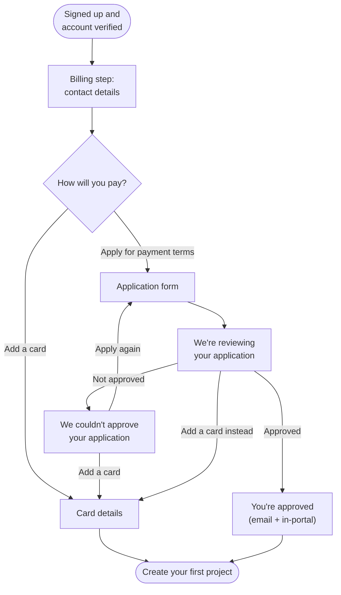
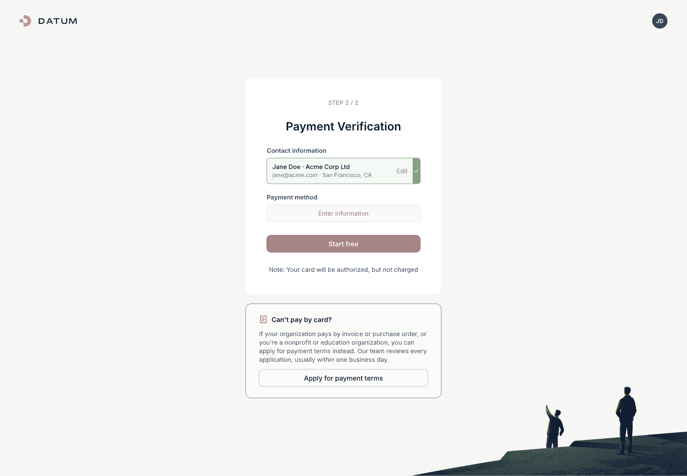
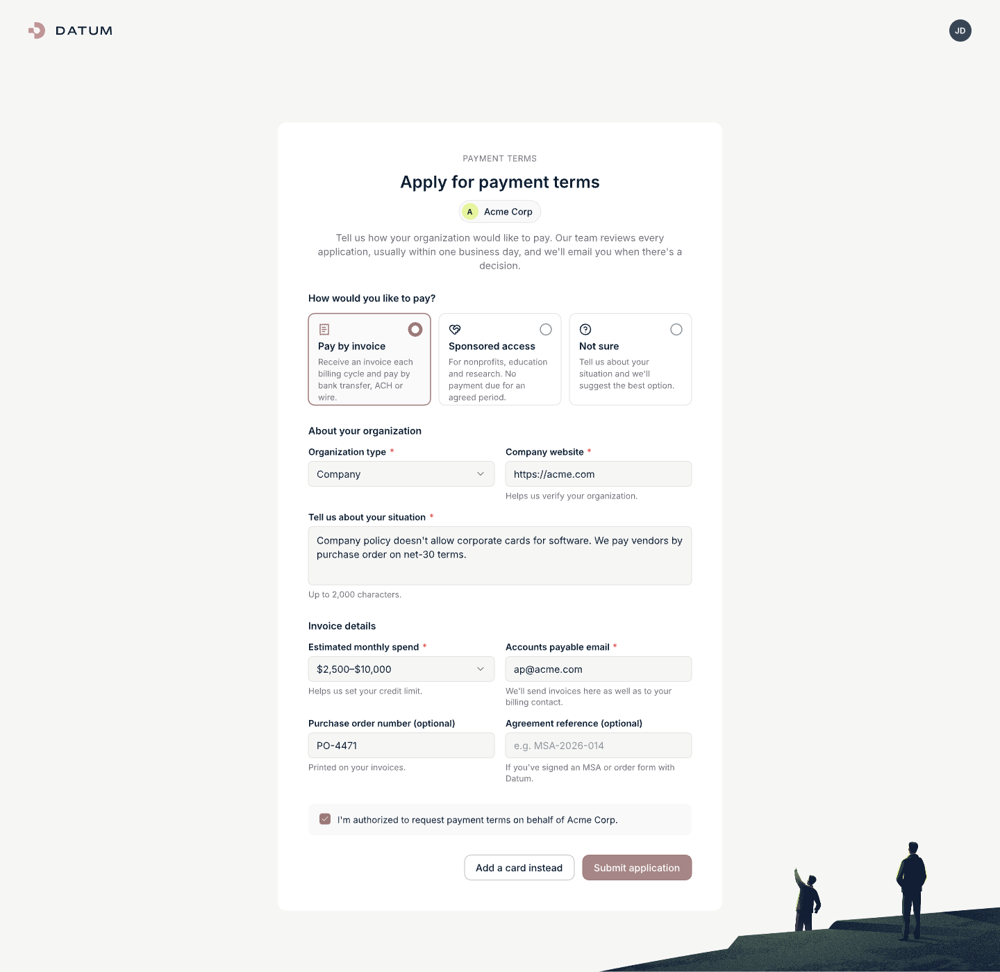
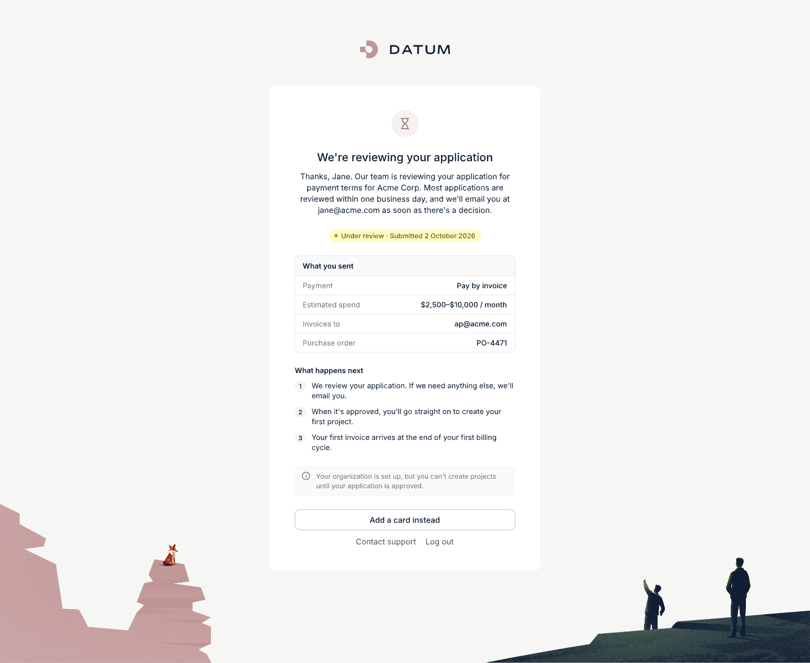
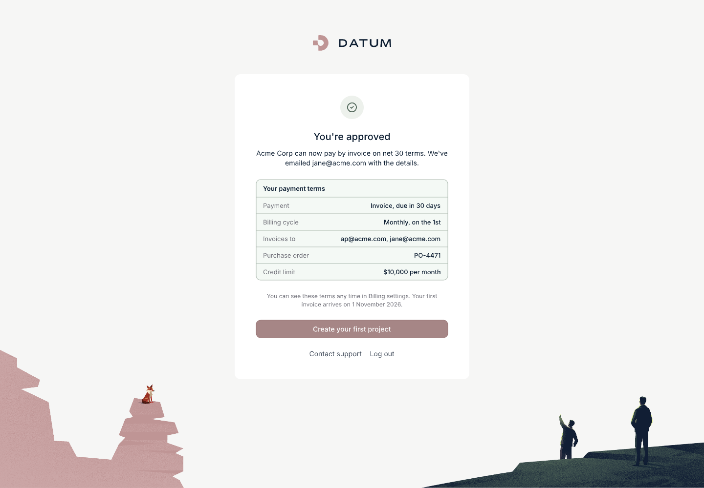
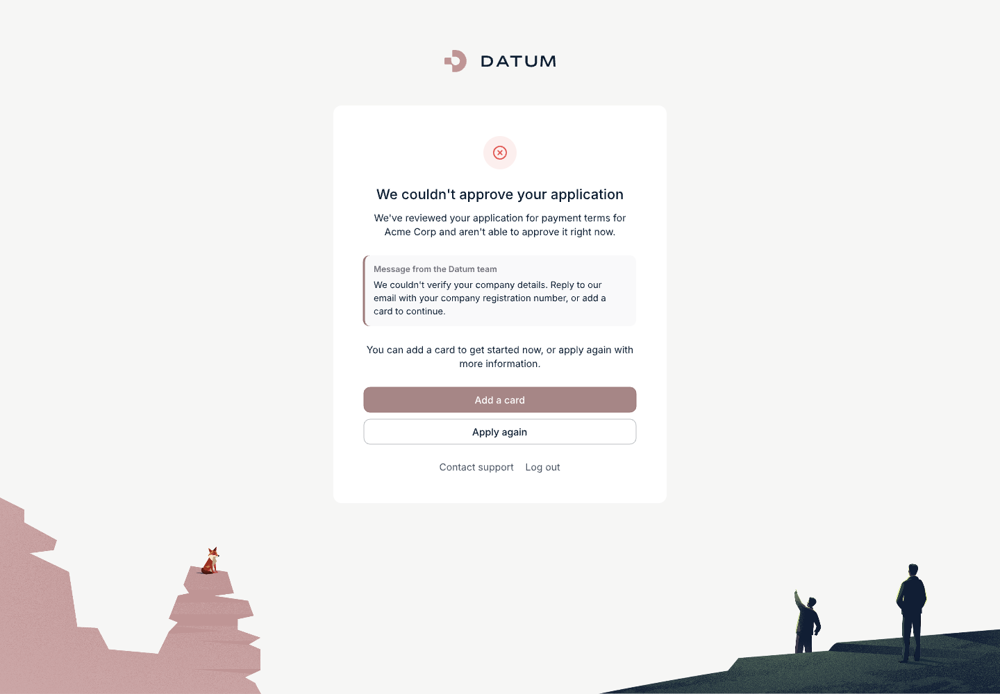
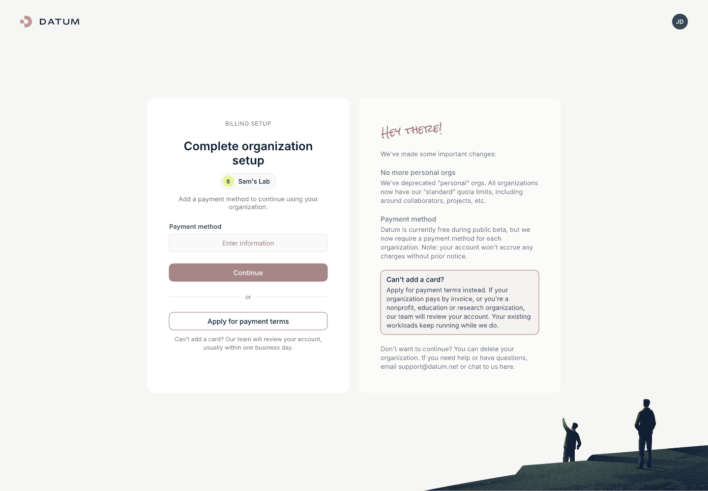
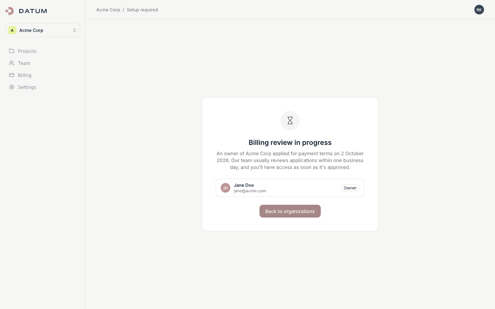
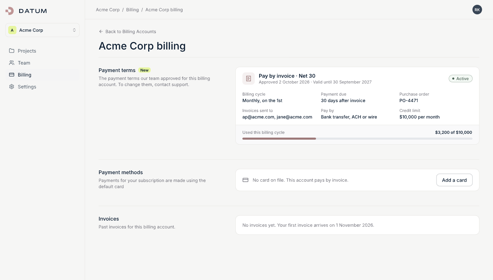
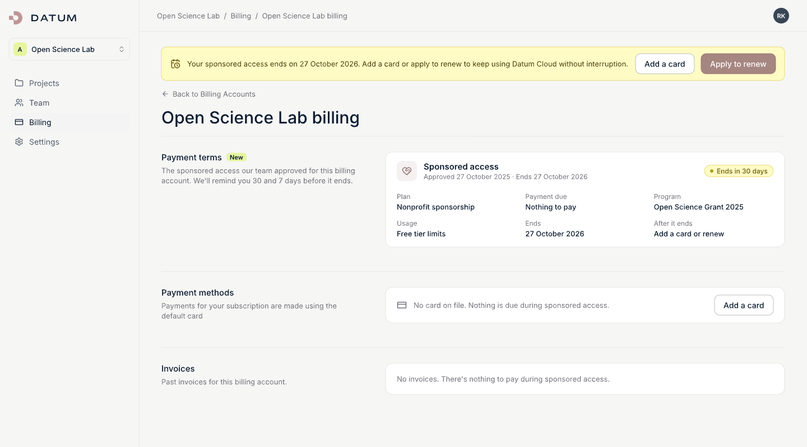

<!-- omit from toc -->
# Billing Arrangements: Onboarding Without a Credit Card

- [Summary](#summary)
- [Motivation](#motivation)
  - [Goals](#goals)
  - [Non-Goals](#non-goals)
- [Who This Is For](#who-this-is-for)
- [The Decision for the First Path](#the-decision-for-the-first-path)
- [The Customer Experience](#the-customer-experience)
  - [Journey](#journey)
  - [Screens](#screens)
  - [Emails](#emails)
- [The Staff Experience](#the-staff-experience)
- [Joining Your Company's Organization](#joining-your-companys-organization)
- [Policy and Guardrails](#policy-and-guardrails)
- [How Other Platforms Do This](#how-other-platforms-do-this)
- [Implementation Notes](#implementation-notes)
- [Delivery Plan](#delivery-plan)
- [Open Questions](#open-questions)
  - [Decisions Made](#decisions-made)
  - [Still Open](#still-open)
- [Implementation History](#implementation-history)
- [Future Work](#future-work)
- [Alternatives](#alternatives)
- [References](#references)

## Summary

Every new organization on Datum Cloud must add a credit card before it can do
anything. That works for self-service developers. It blocks everyone whose
organization doesn't buy software that way:

- enterprises and partners on a negotiated MSA or purchase order;
- nonprofits and education customers on grant or PO funding;
- developers who signed up before the card requirement existed;
- developers whose company already uses Datum.

This enhancement gives those customers a second way through the billing step:
**"Apply for payment terms"**. The customer tells us how they want to pay and
why. Our team reviews the application, and if it's approved the customer
carries on into the product with no card on file. Staff can also grant terms
directly to a customer they already know, for example after a sales call.

Two kinds of payment terms are offered:

- **Invoice terms.** The customer receives an invoice each billing cycle and
  pays it by bank transfer, ACH or wire within an agreed number of days
  (for example, net 30), often against a purchase order.
- **Sponsored access.** No payment is due for a fixed period. This is for
  nonprofits, education and other sponsored customers.

The first path is **request and approve**. Letting customers skip the card
without a review was ruled out on the issue, because card entry at signup is a
key part of our fraud analysis ([comment][issue-1501-decision]). The fourth
group, developers joining their company's existing organization, is split into
its own milo enhancement.

## Motivation

Tracking issue: [datum-cloud/cloud-portal#1501][issue-1501].

For a customer who can't use a card, the billing step is a dead end. Today
their only options are to add a card they can't or won't use, delete their
organization, or email support. Each of those either loses us the customer or
turns into manual, untracked work for our team.

The customers hitting this are often the ones we most want: companies that
will spend more, pay on terms, and bring colleagues with them.

### Goals

- A customer who can't pay by card can apply for payment terms from wherever
  they get stuck: onboarding, the "finish setting up" screen for older
  accounts, and billing settings.
- The application asks only for what our team needs to decide, and the
  customer always knows what happens next and roughly how long it takes.
- Our team has one queue of applications with enough context to decide
  quickly, and a record of every decision.
- Approved customers get into the product straight away, and their invoices
  reflect the terms they agreed (net days, PO number, accounts payable
  contact).
- Every non-card account has a limit: a credit limit for invoice terms, an end
  date for sponsored access.

### Non-Goals

- **Contracts.** We record a reference to a signed MSA or order form. We don't
  store, generate or e-sign contracts.
- **Automated approval or credit checks.** A person reviews every application
  in v0.
- **Automated invoicing in v0.** Finance raises invoices for these accounts by
  hand until usage billing moves to OpenMeter.
- **Hard spending caps.** v0 alerts staff as an account nears its credit limit.
  Automatically stopping usage is future work.
- **Bulk exemptions for older accounts.** Each locked-out customer applies
  individually.
- **Joining a company's organization by email domain.** Covered here only to
  show where it fits. See
  [Joining Your Company's Organization](#joining-your-companys-organization).

## Who This Is For

These are the stories from the issue, plus the two internal stories they
imply.

**(a) Partner or enterprise customer.** "I want to accept our negotiated terms
(MSA, PO) instead of entering a credit card, so I can get set up the way my
organization actually buys things."

> On the payment step, they choose **Apply for payment terms**, pick
> **Pay by invoice**, and fill in their estimated spend, accounts payable email
> and (optionally) a PO number and MSA reference. They see a "we're reviewing
> your application" page. When it's approved, they get an email and go
> straight on to create their first project. Invoices arrive by email with the
> PO number on them, due in the agreed number of days.

**(b) Nonprofit or education customer.** "We run on grant funding and pay by
PO. We can't use a corporate card, and we may qualify for sponsored access."

> Same application, choosing **Sponsored access** (or **Pay by invoice** for
> PO-based billing). If sponsored access is approved, nothing is due until the
> end date. They're reminded 30 and 7 days before it ends, and they can add a
> card or apply to renew. Service is never silently switched to paid usage.

**(c) Developer who signed up before the card requirement.** "I'm locked out
until I add a card, and I can't or won't."

> The "finish setting up" screen gets a third option next to "add a card" and
> "delete your organization": **Apply for payment terms**. Our team can grant
> time-limited sponsored access (the free tier with no billable usage), grant
> invoice terms, or decline with a reason. Members who aren't owners see that
> an owner has applied, instead of a dead end.

**(d) Developer at an existing customer.** "I signed up with my @company.com
address. I should join my company's organization, not create a new one and add
a card." Split out; see
[Joining Your Company's Organization](#joining-your-companys-organization).

**Sales or account manager.** "I've already signed this customer. I want to
grant their terms so they don't have to apply."

> Staff open the customer's billing account in the staff portal and choose
> **Grant payment terms**. The customer's billing step clears immediately.

**Reviewer.** "I want one queue of applications, with enough context to decide
quickly, and a record of what I decided and why."

## The Decision for the First Path

The issue asked which path comes first ([comment][issue-1501-paths]):

- **Option A:** the customer signs up with email or social login and is allowed
  to register without a card up front.
- **Option B:** the customer doesn't want to enter a card, clicks a button to
  request terms, and waits. Staff approve, and then they continue through
  registration.

**Decided: option B. Option A is ruled out.** Card entry at signup is a key
part of our fraud analysis and prevention ([comment][issue-1501-decision]).
Letting customers skip it by choice would remove that signal with nothing in
its place. With option B, a person's review takes the card's place as the
control.

This matches every platform we looked at: invoicing is never self-granted. It
also covers stories (a), (b) and (c) with a single flow and a single button.

Staff granting terms to a customer they already know is **not** option A. It's
still a person's decision, made on better information than a card check.

**While an application is under review, the customer waits.** Their
organization exists, but they can't create projects until there's a decision.
This works like the existing "we're verifying your account" page. We aim to
decide within one business day.

## The Customer Experience

Each screen below has a mockup built from the portal's current onboarding
and billing styles. The source is
[`billing-arrangements/mockups/billing-arrangements.pen`](./billing-arrangements/mockups/billing-arrangements.pen)
(open it in Pencil). The copy is a starting point for design, not final
wording.

### Journey

Customers who signed up before the card requirement enter the same flow from
the "finish setting up" screen, and card customers can apply later from
billing settings.

### Screens

#### 1. Payment choice (onboarding billing step)

The existing "Payment Verification" step is unchanged and card entry stays
the default. Below the card, a clearly secondary panel:

> **Can't pay by card?**
> If your organization pays by invoice or purchase order, or you're a
> nonprofit or education organization, you can apply for payment terms
> instead. Our team reviews every application, usually within one business
> day.
>
> [ Apply for payment terms ]

The contact details the customer already entered on this step are kept, so
they aren't asked twice.

#### 2. Apply for payment terms (the form)

One page, with fields that appear depending on the choice at the top.

**How would you like to pay?** (required, choice cards)

| Option | Description shown |
|---|---|
| **Pay by invoice** | Receive an invoice each billing cycle and pay by bank transfer, ACH or wire. |
| **Sponsored access** | For nonprofits, education and research. No payment due for an agreed period. |
| **Not sure** | Tell us about your situation and we'll suggest the best option. |

**About your organization** (always shown)

| Field | Required | Input | Help text |
|---|---|---|---|
| Organization type | Yes | Select: Company · Partner or reseller · Nonprofit · Education or research · Other | |
| Company website | Yes | URL | Helps us verify your organization. |
| Tell us about your situation | Yes | Text area, up to 2,000 characters | Placeholder: "For example: our company pays software vendors by purchase order on net-30 terms." |

**Invoice details** (shown for "Pay by invoice")

| Field | Required | Input | Help text |
|---|---|---|---|
| Estimated monthly spend | Yes | Select: Under $500 · $500–$2,500 · $2,500–$10,000 · Over $10,000 · Not sure yet | Helps us set your credit limit. |
| Accounts payable email | Yes | Email | We'll send invoices here as well as to your billing contact. |
| Purchase order number | No | Text | Printed on your invoices. |
| Agreement reference | No | Text | If you've signed an MSA or order form with Datum, enter its reference. |

**Sponsorship details** (shown for "Sponsored access")

| Field | Required | Input | Help text |
|---|---|---|---|
| Program or grant | No | Text | For example, a grant name or a Datum program you were referred by. |
| Expected usage | Yes | Text | What you plan to run on Datum, in a sentence or two. |

**Confirm** (required checkbox): "I'm authorized to request payment terms on
behalf of *{Organization name}*."

Actions: **Submit application** (primary), **Add a card instead** (secondary,
back to the card form).

Applications from a personal email domain (gmail.com, outlook.com and so on)
are allowed, but they're flagged for reviewers.

#### 3. We're reviewing your application (holding page)

Shown after submitting, and whenever an owner signs in while the application
is under review. It follows the layout of the existing "we're verifying your
account" page.

> **We're reviewing your application**
>
> Thanks, {first name}. Our team is reviewing your application for payment
> terms for **{Organization name}**. Most applications are reviewed within one
> business day, and we'll email you at **{email}** as soon as there's a
> decision.
>
> **What you sent** · Pay by invoice · Estimated spend $2,500–$10,000/month ·
> Invoices to ap@acme.com · PO-4471 · Submitted 2 October 2026
>
> **What happens next**
> 1. We review your application. If we need anything else, we'll email you.
> 2. When it's approved, you'll go straight on to create your first project.
> 3. Your first invoice arrives at the end of your first billing cycle.
>
> Your organization is set up, but you can't create projects until your
> application is approved.
>
> [ Add a card instead ] · [ Contact support ]

"Add a card instead" withdraws the application after a confirmation ("Your
application will be withdrawn. You can apply again later from billing
settings.").

#### 4. You're approved

The customer gets an email, and the next time they open the portal:

> **You're approved**
>
> **{Organization name}** can now pay by invoice on **net 30** terms. We've
> emailed {email} with the details.
>
> **Your payment terms** · Invoice, due in 30 days · Monthly, on the 1st ·
> Invoices to ap@acme.com · PO-4471 · Credit limit $10,000 per month
>
> [ Create your first project ]

For sponsored access: "**{Organization name}** has sponsored access until
**30 September 2027**. There's nothing to pay during that time. We'll remind
you before it ends."

#### 5. We couldn't approve your application

> **We couldn't approve your application**
>
> *Message from the Datum team:* "We couldn't verify your company details.
> Reply to our email with your company registration number, or add a card to
> continue."
>
> You can add a card to get started now, or apply again with more information.
>
> [ Add a card ] · [ Apply again ]

The reviewer writes the message. Internal reviewer notes are never shown.

#### 6. Finish setting up (older accounts)

The existing "Complete organization setup" screen for accounts created before
the card requirement gets two additions:

- Under **Continue**, an "or" divider and an **Apply for payment terms**
  button: "Can't add a card? Our team will review your account, usually
  within one business day."
- In the "Hey there!" panel, a highlighted item: "**Can't add a card?** Apply
  for payment terms instead. If your organization pays by invoice, or you're
  a nonprofit, education or research organization, our team will review your
  account. Your existing workloads keep running while we do."

The option to delete the organization stays in the panel's closing
paragraph.

Existing workloads keep running while an application is reviewed.

#### 7. Setup required (members who aren't owners)

When an owner has applied, the existing "Billing setup required" page
changes to:

> **Billing review in progress**
> An owner of {Organization name} applied for payment terms on 2 October
> 2026. Our team usually reviews applications within one business day, and
> you'll have access as soon as it's approved.

The owner list and "Back to organizations" button stay as they are.

#### 8. Billing settings: payment terms

A new "Payment terms" section at the top of the billing account page.

- **Invoice terms:** "Pay by invoice · Net 30", invoices sent to, PO number,
  credit limit with a usage bar ("$3,200 of $10,000 used this cycle"), valid
  until.
- **Sponsored access:** "Sponsored access", ends on, and a reminder of what
  happens when it ends.
- **Card customers:** "Want to pay by invoice? **Apply for payment terms**."
- **Application under review:** the same summary as the holding page.

#### 9. Ending soon banner

Shown to owners across the org 30 and 7 days before sponsored access or
invoice terms end:

> Your sponsored access ends on **27 October 2026**. Add a card or apply to
> renew to keep using Datum Cloud without interruption. [ Add a card ]
> [ Apply to renew ]

When terms end, the customer sees the billing step again with an explanation
("Your sponsored access ended on 30 September 2027"). Running workloads are
not stopped automatically.

### Emails

| When | To | Subject | Gist |
|---|---|---|---|
| Application submitted | Applicant | We've received your application | What they sent, expected turnaround, how to add a card instead |
| Application submitted | Reviewers | New payment terms application: {Org} | Link to the queue |
| Approved | Applicant, org owners | You're approved for payment terms | The terms granted, and a link back to the portal |
| Not approved | Applicant, org owners | About your payment terms application | The reviewer's message, and how to add a card or apply again |
| Ending in 30 and 7 days | Owners, billing contact | Your {sponsored access / payment terms} end on {date} | What happens next, how to renew or add a card |
| Ended or withdrawn by staff | Owners, billing contact | Your payment terms have ended | What they need to do to keep using Datum Cloud |
| Nearing credit limit (80% and 100%) | Staff (owners at 100%) | {Org} is at 80% of its credit limit | Usage and limit |

These are sent by milo's existing email system, alongside the waitlist and
invitation emails.

## The Staff Experience

- **Applications queue.** One list of pending applications, oldest first. Each
  one shows:
  - what was asked for and the customer's own words;
  - organization age and number of members;
  - the applicant's email domain, with a flag for personal domains;
  - their fraud review result from signup;
  - any existing usage, previous applications and previous terms.
- **Approve.** Pre-filled from the application and editable: invoice terms
  (net days, credit limit, PO, end date) or sponsored access (end date, and
  optionally a sponsored plan or credit).
- **Decline.** A reason, a message to the customer, and internal notes the
  customer never sees.
- **Grant payment terms.** On any billing account, with no application needed
  (the sales-led path).
- **Change or end terms.** Amend, end early, and see the history of every
  decision.
- **Invoice-terms accounts (for finance).** Every account on invoice terms or
  sponsored access with its billing cycle, usage and spend, net days, PO,
  accounts payable email and credit used. Exportable as CSV. This is the v0
  worklist finance invoices from by hand.

## Joining Your Company's Organization

Story (d) is a different problem: the developer shouldn't be in the billing
step at all. The first issue comment covers it ([comment][issue-1501-invite]):
invited users already skip the card step, because accepting an invitation
puts them in an organization that already pays. What's missing is *detecting*
a developer from an existing customer at signup and moving them from the "new
user" flow into that "invite to organization" flow.

The intended experience:

1. The developer signs up with dev@acme.com and verifies their email.
2. Instead of "create your organization", they see: "**Your company already
   uses Datum.** Request to join *Acme Corp*, or create your own organization."
3. An Acme owner gets an email and approves the request.
4. The developer lands in Acme's organization with no billing step.

Rules from the research:

- Only **verified** email addresses match, and only domains the company has
  proven it owns.
- Organizations opt in to being discoverable, so we never reveal which
  companies are customers.
- Personal email domains never match.
- The developer can always choose to create their own organization instead.

This needs domain verification and join requests in milo, so it gets its own
milo enhancement and can be built alongside the work here.

## Policy and Guardrails

| Concern | How we handle it |
|---|---|
| People apply for terms to get around the card's fraud check | Every application is reviewed by a person. Applicants must have a verified email and have passed signup fraud review. Personal email domains are flagged. The reviewer sees the signup fraud result |
| An approved customer runs up a large bill and doesn't pay | Every invoice-terms account has a credit limit. Staff are alerted at 80% and 100%. Staff can end terms or suspend projects. Contractual late fees apply |
| Sponsored access ends and the customer loses access by surprise | Reminders at 30 and 7 days. When it ends, the customer is asked to add a card or renew, but running workloads aren't stopped automatically |
| Sponsored customers get a surprise bill | Sponsored access never turns into paid usage silently |
| The review queue becomes a bottleneck | A one-business-day target, alerts to a staff channel, and enough context in the queue to decide quickly. Automatic approval is considered only once volume justifies it and the fraud team agrees |
| A customer gives themselves longer payment terms | Customers can't grant or change terms. Only staff can |

## How Other Platforms Do This

| Platform | Who can pay by invoice | How it's granted | Joining your company |
|---|---|---|---|
| **AWS** | Unpublished | Support case or account manager. ACH unlocks after payment history | The organization's management account pays for member accounts |
| **Google Cloud** | ≥ 1 year, ≥ $40k/yr spend | Application form | Verified domain, admin invites users |
| **Azure** | ≥ 6 months as a customer, spend threshold | In-portal "request approval", credit check if needed. One-way switch | Entra tenant |
| **Cloudflare, Vercel, GitHub Enterprise** | Contract | Sales | Identity provider. GitHub's verified domain gives no auto-join |
| **Datadog** | Annual plans | "Request invoicing" on the plan page, reviewed by staff | – |
| **Snowflake, Railway, Supabase** | Sales or prepay | Ticket or sales. No-card trials with a hard cap | – |
| **Slack, Atlassian** | – | – | Approved domains: auto-join or request to join. Atlassian blocks personal email domains |

What they have in common:

1. **Invoicing is never self-granted.** Every provider ends in a person's
   decision. Azure's in-portal "request approval" and Datadog's "request
   invoicing" are the closest to what we're proposing.
2. **Every non-card account has a limit:** a credit limit, a deposit, or a
   history requirement.
3. **Joining your company's account replaces a personal card.** AWS
   Organizations, Heroku collaborators and Slack approved domains all work
   this way.
4. **Sponsored and nonprofit access expires,** usually after 12 months, and
   doesn't silently convert to paid.
5. **Introduce card requirements gently.** Fly.io's sudden card requirement
   drew complaints. The better pattern keeps existing resources running and
   gives people a way forward.

## Implementation Notes

A full technical design follows once the product direction here is agreed.
The outline:

- **Three new billing resources.** An *application* the customer creates, an
  *arrangement* holding the terms staff granted (which is also the approval
  record), and a *decline* record whose internal notes customers can't read.
  Customers can create applications but never arrangements or declines.
- **One "can this account be billed?" signal.** Today the portal, milo and the
  staff portal each check "has a card" in slightly different ways. They will
  all read one billing account condition that is true for a working card *or*
  approved terms, so an exemption can't drift between them.
- **Terms flow to invoicing.** Net days, PO, accounts payable email and credit
  limit are published on the billing account. Finance reads them in v0; the
  OpenMeter invoicing pipeline reads them later.

| Repo | What changes |
|---|---|
| billing | New resources, the shared signal, reviewer permissions |
| cloud-portal | Payment choice, application form, review/approved/declined screens, older-account and member screens, billing settings card, ending-soon banner |
| staff-portal | Applications queue, approve/decline, grant and end terms, finance worklist |
| milo | Onboarding reads the shared signal; application and terms emails. (Story d: domain join) |
| infra | Reviewer role and staff alert channel |
| OpenMeter pipeline | Later: automated invoices for invoice-terms accounts |

## Delivery Plan

1. **Phase 1: staff can grant terms.** Staff grant invoice terms or sponsored
   access from the staff portal, the portal lets those customers through, and
   finance invoices them by hand.
   *Outcome:* support can unblock sales-led enterprise customers and
   individual older accounts right away.
2. **Phase 2: customers can apply.** "Apply for payment terms" in onboarding,
   the older-account screen and billing settings; the review, approved and
   declined screens; the staff queue; the emails.
   *Outcome:* stories (a), (b) and (c) are self-serve.
3. **Phase 3: automated invoicing,** delivered with the OpenMeter migration,
   plus credit-limit alerts.
4. **Phase 4: extras.** Sponsored plans and credits applied automatically, and
   a fraud-service check on each application.
5. **Parallel: joining your company's organization** (story d), as its own milo
   enhancement.

## Open Questions

### Decisions Made

| # | Question | Decision |
|---|---|---|
| 1 | Which first path: register without a card (option A), or request and approve (option B)? | Option B, as "Apply for payment terms" with staff review. Option A is ruled out because card entry at signup is a key part of fraud analysis and prevention ([comment][issue-1501-decision]) |
| 2 | What does a customer get while their application is under review? | A holding page. They can't create projects until there's a decision |
| 3 | How are older, locked-out accounts handled? | One application at a time through "Apply for payment terms". No bulk exemption |
| 4 | Who raises invoices for invoice-terms customers? | Finance, by hand, in v0. Automated later through OpenMeter |
| 5 | Is story (d) in scope? | Split into its own milo enhancement ([comment][issue-1501-paths]), handing off to the existing invite flow ([comment][issue-1501-invite]) |
| 6 | Who sends the emails? | milo's existing email system |

### Still Open

1. **What review turnaround do we promise?** The copy says "usually within one
   business day". Who staffs the queue, and what about weekends?
2. **What eligibility guidance do we show before someone applies?** For
   example a minimum monthly spend or company age, like Google Cloud and
   Azure. Showing it reduces applications we'll decline anyway.
3. **Default terms.** Default and maximum net days, default credit limits by
   spend band, and late-fee terms.
4. **Standard terms without an MSA.** Which document does a customer accept
   when there's no negotiated agreement?
5. **Can an invoice-terms customer switch back to paying by card themselves?**
   Azure makes the switch one-way.
6. **How long does sponsored access last by default,** and can it be renewed
   by applying again?
7. **Should a fraud-service check run on each application in phase 2** rather
   than phase 4, given how much weight the card carries in fraud review today?

## Implementation History

- 2026-09-25: Initial draft, based on cloud-portal#1501, a review of the
  current billing, portal, milo and staff-portal code, and research into other
  platforms.
- 2026-09-25: First review pass. Decided on the review holding page, manual v0
  invoicing, handling older accounts individually, and email ownership.
- 2026-09-27: Aligned with the issue comments: option B ("Apply for payment
  terms") decided and option A ruled out for fraud reasons; story (d) hands
  off to the existing invite flow.
- 2026-09-27: Refocused on the product and customer experience. Added screen
  copy, form fields, emails and mockups. API detail moved out to the
  technical design.

## Future Work

- **Limited access while under review.** Let customers in with no billable
  services while their application is reviewed. This lets people in before
  either a card or a review, so it needs fraud-team sign-off.
- **Automatic approval** for low-risk applications (for example, verified
  `.edu` domains applying for sponsored access). This removes the human review
  that replaces the card, so it also needs fraud-team sign-off.
- **Terms granted with a platform invitation,** so a customer signed by sales
  never sees the card step. Needs fraud-team sign-off for the same reason.
- **Enforced credit limits** and a policy for overdue invoices.
- **Prepaid credit by bank transfer,** for customers who can't use a card and
  don't qualify for terms.

## Alternatives

- **Let everyone skip the card with a capped trial** (Snowflake, Railway). This
  is option A. Rejected for the fraud reasons above.
- **A per-organization "no card needed" switch for staff.** Almost no work, but
  it carries no terms, no end date and no reason, and invoicing can't see it.
  Useful only as a stop-gap before phase 1.
- **Treat "invoice" as another kind of payment method.** It fits the existing
  card flow, but paying by invoice is a way of being billed, not something you
  pay with, and sponsored access has no payment method at all.
- **Let customers choose "pay by invoice" in their own settings.** Customers
  could grant themselves terms. Rejected.

## References

- [cloud-portal#1501][issue-1501]: Non-Stripe flow for users exempt from
  credit-card entry
- [payment-methods.md](./payment-methods.md), [invoicing.md](./invoicing.md)
- `enhancements/platform/identity-and-access-management/unified-organizations/README.md`:
  the card requirement, and its drop-off risk
- `enhancements/platform/waitlist/README.md`: staff approval precedent
- Research (accessed 2026-09-25):
  [AWS purchase orders](https://docs.aws.amazon.com/awsaccountbilling/latest/aboutv2/manage-purchaseorders.html),
  [Google Cloud invoiced billing](https://docs.cloud.google.com/billing/docs/how-to/invoiced-billing),
  [Azure pay by invoice](https://learn.microsoft.com/en-us/azure/cost-management-billing/manage/pay-by-invoice),
  [Datadog billing](https://docs.datadoghq.com/account_management/billing/),
  [Fly.io card rollout thread](https://community.fly.io/t/suddenly-needing-to-add-a-credit-card-can-i-ensure-it-doesnt-get-charged/19245),
  [Slack approved domains](https://slack.com/help/articles/115004856503),
  [Atlassian approved domains](https://support.atlassian.com/user-management/docs/control-how-users-get-access-to-products/),
  [Stripe bank transfers on invoices](https://docs.stripe.com/invoicing/bank-transfer)

[issue-1501]: https://github.com/datum-cloud/cloud-portal/issues/1501
[issue-1501-invite]: https://github.com/datum-cloud/cloud-portal/issues/1501#issuecomment-5572502382
[issue-1501-paths]: https://github.com/datum-cloud/cloud-portal/issues/1501#issuecomment-5737118432
[issue-1501-decision]: https://github.com/datum-cloud/cloud-portal/issues/1501#issuecomment-5833846125
