<!-- omit from toc -->
# Billing Arrangements: Onboarding Without a Credit Card

- [Summary](#summary)
- [Motivation](#motivation)
  - [Goals](#goals)
  - [Non-Goals](#non-goals)
- [Background](#background)
  - [Where the Card Requirement Lives Today](#where-the-card-requirement-lives-today)
  - [What Already Exists That We Can Build On](#what-already-exists-that-we-can-build-on)
  - [How Other Platforms Do This](#how-other-platforms-do-this)
- [Proposal](#proposal)
  - [The Decision for the First Path](#the-decision-for-the-first-path)
  - [How It Works](#how-it-works)
  - [User Stories](#user-stories)
  - [Key Capabilities](#key-capabilities)
  - [Notes and Constraints](#notes-and-constraints)
  - [Risks and Mitigations](#risks-and-mitigations)
- [Design Details](#design-details)
  - [Resource Overview](#resource-overview)
  - [BillingTermsRequest Resource](#billingtermsrequest-resource)
  - [BillingTermsDenial Resource](#billingtermsdenial-resource)
  - [BillingArrangement Resource](#billingarrangement-resource)
  - [BillingAccount Changes: PaymentReady and Collection Method](#billingaccount-changes-paymentready-and-collection-method)
  - [Lifecycle State Machines](#lifecycle-state-machines)
  - [Gate Changes: One Source of Truth](#gate-changes-one-source-of-truth)
  - [Portal Experience](#portal-experience)
  - [Staff Portal Experience](#staff-portal-experience)
  - [Invoice Collection for Arranged Accounts](#invoice-collection-for-arranged-accounts)
  - [Sponsored Accounts and Credits](#sponsored-accounts-and-credits)
  - [Legacy Accounts Locked Out by the Billing Gate](#legacy-accounts-locked-out-by-the-billing-gate)
  - [Joining an Existing Organization by Email Domain](#joining-an-existing-organization-by-email-domain)
  - [Fraud and Risk Controls](#fraud-and-risk-controls)
  - [RBAC Boundaries](#rbac-boundaries)
  - [Notifications](#notifications)
- [Cross-Repo Impact](#cross-repo-impact)
- [Delivery Plan](#delivery-plan)
- [Open Questions](#open-questions)
  - [Decisions Made](#decisions-made)
  - [Still Open](#still-open)
- [Implementation History](#implementation-history)
- [Future Work](#future-work)
- [Drawbacks](#drawbacks)
- [Alternatives](#alternatives)
  - [Invoice Terms as a PaymentMethodClass Provider](#invoice-terms-as-a-paymentmethodclass-provider)
  - [A Staff-Toggled Feature Flag That Bypasses the Gate](#a-staff-toggled-feature-flag-that-bypasses-the-gate)
  - [Customer-Editable Collection Method on BillingAccount Spec](#customer-editable-collection-method-on-billingaccount-spec)
  - [No-Card Limited Trial for Everyone](#no-card-limited-trial-for-everyone)
- [References](#references)

## Summary

Today every organization must attach an active credit card before it can use
Datum Cloud. That blocks customers whose procurement does not work that way:
enterprises and partners on a negotiated MSA or purchase order, nonprofits and
education customers on grant or PO funding, developers who signed up before
the billing gate existed, and developers whose company already has a Datum
organization.

This enhancement introduces a **billing arrangement**: a staff-approved,
non-card way for a billing account to settle its charges. Three resources are
added to `billing.miloapis.com`:

- **`BillingTermsRequest`**: the customer's application ("pay by invoice",
  "we're a nonprofit", "I can't add a card"). Customers create it; staff decide
  it.
- **`BillingArrangement`**: the terms staff granted, such as invoice with
  net-30, a credit limit, PO details and an expiry, or a sponsored account with
  no payment due. Only staff can create it, and it is also the approval record.
- **`BillingTermsDenial`**: the staff record of a declined request, with a
  message to the customer. It follows the pattern of milo's
  `PlatformAccessRejection`.

A new provider-agnostic `PaymentReady` condition on `BillingAccount` becomes
the **single** signal for "this account can be billed". It is True when there
is a ready default card **or** an active arrangement. The portal's onboarding
gate and milo's `OnboardingComplete` condition are changed to read it, instead
of each checking for an active card in their own way.

**The first path is request-and-approve.** A customer who can't or won't add a
card chooses **"Apply for payment terms"**, and the request goes to staff for
review. Letting customers register without a card up front was ruled out on the
issue, because card entry at signup is a key part of our fraud analysis (see
[The Decision for the First Path](#the-decision-for-the-first-path)). The same
model also lets staff grant an arrangement directly, for example after a sales
call. That is still a staff decision, not a way around review.

The fourth story, joining an existing organization by email domain, is a milo
identity feature rather than a billing one. This document explains how it fits
into onboarding and proposes it as a separate milo enhancement.

## Motivation

Tracking issue: [datum-cloud/cloud-portal#1501][issue-1501].

The billing gate works as intended for self-service developers. For every other
kind of customer it is a dead end. Their only options today are to add a card
they cannot or will not use, delete their organization, or email support. Each
of those loses us a customer or turns into manual, untracked work for staff.

The gate is also enforced inconsistently. The portal checks for "any
`PaymentMethod` with `phase: Active` on the default billing account". Milo
checks for "any billing account with `DefaultPaymentMethodReady=True`". The
staff portal's onboarding timeline uses reason strings that match neither. Any
exemption we bolt on today would have to be copied into all three places.

### Goals

- Let a customer use Datum Cloud without a credit card when staff have approved
  a non-card arrangement for their billing account.
- Give customers a self-serve way to ask for such an arrangement from the
  places they get stuck: onboarding, the legacy lock-out screen, and billing
  settings.
- Give staff one queue to review, approve, deny, amend, expire and revoke
  arrangements, with an audit trail of who decided what and why.
- Support these arrangement types:
  - **Invoice**: net terms paid by bank transfer, ACH or wire, with a credit
    limit and an optional PO.
  - **Sponsored**: no payment due, backed by an Offer and/or credits, with an
    expiry.
- Replace the three divergent "is billing set up?" checks with one
  provider-agnostic `BillingAccount` condition that the portal and milo both
  read.
- Carry negotiated terms (net days, PO number, AP contact) through to
  invoicing so arranged accounts receive an invoice to pay rather than an
  automatic charge. In v0 finance raises these invoices by hand; automation
  comes with the OpenMeter migration.
- Keep arrangements customer-readable but not customer-writable.

### Non-Goals

- **Contract lifecycle management.** We record a reference to the signed MSA or
  order form. We do not store, generate or e-sign contracts.
- **Automated credit checks or KYB integrations.** Staff review is the control
  in v0. Automated eligibility checks are future work.
- **Hard spend enforcement against the credit limit.** v0 alerts and gives
  staff tools to act. Enforcement through quota or suspension is future work.
- **Dunning and past-due suspension policy.** Deferred to the future-work item
  already listed in [invoicing.md][invoicing].
- **Automated invoice generation for arranged accounts in v0.** Finance raises
  and sends these invoices manually until the OpenMeter-based invoicing
  pipeline can do it (see
  [Invoice Collection](#invoice-collection-for-arranged-accounts)).
- **Bulk grandfathering of legacy accounts.** Locked-out legacy users are
  handled one request at a time.
- **Domain verification and join requests.** Covered here for flow context
  only. The API design belongs in a milo enhancement (see
  [Joining an Existing Organization by Email Domain](#joining-an-existing-organization-by-email-domain)).
- **Reseller or consolidated billing across organizations.** Out of scope.
  `BillingAccountBinding` already lets one account pay for many projects.

## Background

### Where the Card Requirement Lives Today

The billing service itself does **not** require a card.
`BillingAccount` converges to `Ready` without one, and bindings are accepted
for any `Ready` account ([payment-methods.md][payment-methods], "Billing
Account Side Effects"). The requirement is enforced further out:

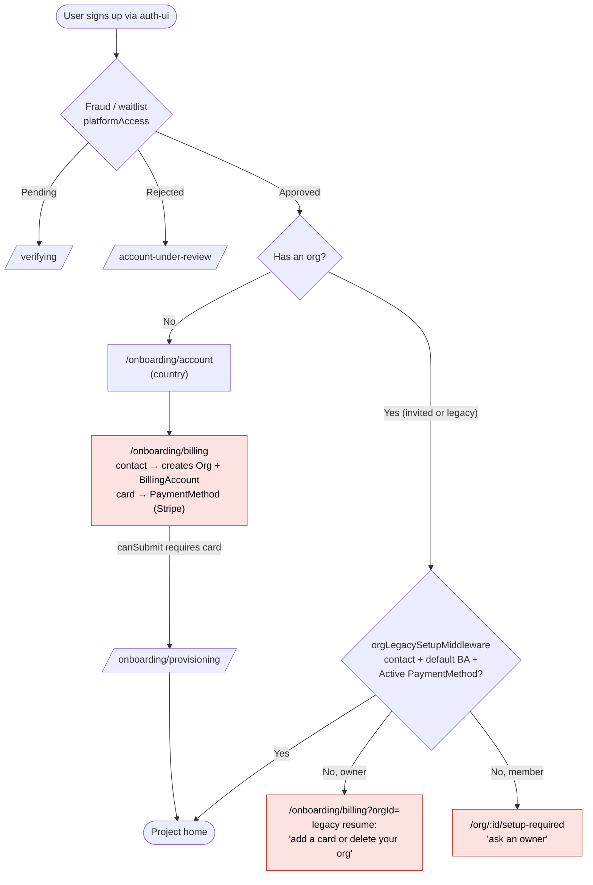

| Location | What it checks | Enforced? |
|---|---|---|
| `cloud-portal/app/features/onboarding/legacy-setup/org-setup-status.ts` (`evaluateOrgSetupComplete`) | Org contact complete, a default BA, and any `PaymentMethod` with `status.phase == Active` for that BA | **Yes.** This is the hard gate, applied by `legacy-setup.middleware.ts` on every org and project route |
| `cloud-portal/app/features/organization/billing/org-billing-setup-form.tsx` (`canSubmit`) | Contact complete **and** card collected | **Yes.** The onboarding submit button needs a card. The same form is reused for every new org |
| `milo/internal/controllers/resourcemanager/organization_onboarding.go` | Contact complete and any BA with `DefaultPaymentMethodReady=True` → `OnboardingComplete` | No. Only informational (staff portal, graphql-gateway, datumctl, metrics) |
| `staff-portal/app/features/organization/lib/onboarding-steps.ts` | Maps `OnboardingComplete` reasons | No, and its reason strings are out of sync with milo |

Invited users skip this only as a side effect. Accepting an invitation gives
them an org, so the "no orgs → onboarding" redirect never fires, and the
inviting org already has a card.

### What Already Exists That We Can Build On

| Building block | Where | How we use it |
|---|---|---|
| `BillingAccount.spec.paymentTerms` (`netDays`, `invoiceFrequency`, `invoiceDayOfMonth`) | `billing/api/v1alpha1/billingaccount_types.go` | `invoiceFrequency` and `invoiceDayOfMonth` define the billing cycle that the portal and staff-portal usage views draw (`cloud-portal/app/modules/billing/billing-cycle.ts`). `netDays` is not read anywhere. The arrangement becomes the authoritative source for net days (see [Notes](#notes-and-constraints)) |
| `BillingAccount` `Suspended` phase | same | Exists but nothing sets it. Available for later past-due enforcement |
| `Offer` + `BillingEntitlement` (staff can switch offers) | billing + service-catalog | How a sponsored or education account gets a different tier |
| `PlatformAccessApproval` / `PlatformAccessRejection` | milo IAM | Precedent: staff-created approval and rejection objects as the decision records |
| Waitlist and invitation email controllers | milo IAM | Sends the billing arrangement notifications (see [Notifications](#notifications)) |
| `ServiceConsumer` `PendingApproval` + approvals tab | service-catalog + staff-portal | Precedent for the staff approval queue UI |
| `PlatformInvitation` (staff invite that bypasses the waitlist) | milo IAM | Possible hook for granting terms at invite time (future work, needs fraud sign-off) |
| `Document` / `DocumentAcceptance` | `enhancements/platform/agreement` | Recording acceptance of standard invoice terms |
| `ProjectSuspension` | milo | Staff tool for revoked or past-due arrangements |

### How Other Platforms Do This

The research looked at hyperscalers, developer platforms, Stripe's own
primitives, and collaboration tools that let users join by email domain. The
full notes are in the [References](#references).

| Platform | Who gets invoicing | How it's granted | Rails and terms | Risk controls | Joining your company |
|---|---|---|---|---|---|
| **AWS** | Unpublished | Billing support case or account manager | Invoice. ACH only after 60 days, one paid invoice and $100 paid. Self-serve PO manager | Payment-history gates, sales review | Organizations: the management account pays for member accounts, so members need no card |
| **Google Cloud** | Registered ≥ 1 year, ≥ $40k/yr spend, supported country | Application form | "Invoiced billing account": check or wire, monthly | Org hygiene rules, review. Approval also raises quotas | Verified domain (DNS TXT). Admin invites or transfers existing users |
| **Azure** | ≥ 6 months as a customer, spend threshold, no balance owing | In-portal "request approval" (MCA) or ticket. Credit check if needed | Wire, ACH | KYB documents, credit check, deposit or letter of credit. **One-way switch** | Entra tenant |
| **Cloudflare / Vercel / GitHub Enterprise** | Contract | Sales-led | Net terms, ACH or wire, PO field on invoice | Contract, 1.5%/month late fees (Cloudflare) | IdP provisioning. GitHub's verified domain gives **no** auto-join |
| **Heroku** | Enterprise contract | Sales | Invoiced by Salesforce | A card is required only for specific actions | People without a card work as collaborators under a paying owner |
| **Fly.io** | n/a | n/a | Card **or** prepaid credits. Linked orgs share one invoice | Card pre-auth | Linked orgs |
| **Datadog** | Annual plans | "Request invoicing" on the Plan page, handled by staff | Check, ACH, wire | Staff review | n/a |
| **Snowflake / Railway / Supabase** | Sales or large prepay | Ticket or sales | Prepay, custom invoice | No-card trials with a hard cap and suspension, spend caps | n/a |
| **Slack / Atlassian** | n/a | n/a | n/a | Atlassian **blocks public email domains** | Approved domains: auto-join or request-to-join approved by an admin. Sign-in shows "workspaces you can join" |

Patterns that come up again and again:

1. **Invoicing is never self-granted.** Every provider ends in a human or sales
   decision. Azure's in-portal "request approval" button is the best
   self-serve example.
2. **"Invoiced" is a property of the billing account, not a payment
   instrument.** GCP has invoiced billing accounts and Stripe has
   `collection_method=send_invoice`. The instrument (wire, ACH, bank
   transfer) is how the invoice gets paid.
3. **Every non-card account has a limit.** Examples are credit limits,
   deposits, prepay, and history-based unlocks.
4. **Paying through an organization replaces a personal card.** AWS
   Organizations, Heroku collaborators and Fly linked orgs all do this. It is
   the strongest precedent for story (d).
5. **Grandfather deliberately.** Fly.io's sudden card requirement is the
   example to avoid. The better pattern keeps existing resources running,
   gates only new cost-creating actions, and announces a date.
6. **Sponsored and nonprofit credit expires**, usually after 12 months. Azure
   and Snowflake stop service when credit runs out; they do not silently
   convert to pay-as-you-go.

## Proposal

### The Decision for the First Path

The issue asked which path comes first
([comment][issue-1501-paths]):

1. **Pre-emptive (option A).** The customer signs up with email or social login
   and is allowed to register without a card up front.
2. **Request and approve (option B).** The customer doesn't want to enter a
   card, clicks a button to request terms, and waits. Staff approve, and then
   they continue through registration.

**Decided: request and approve. Option A is ruled out.** Card entry at signup
is a key part of our fraud analysis and prevention
([comment][issue-1501-decision]). The card is the main signup-time fraud signal
today (`BillingPaymentMethodAttached` in the fraud service). Letting customers
skip it by choice would remove that signal with nothing to replace it. The
customer instead chooses **"Apply for payment terms"**, and the application
comes in as a request for staff to review.

- Every platform we looked at works this way. Human review replaces the card as
  the control.
- One flow covers stories (a), (b) and (c). Onboarding, the legacy lock-out
  screen and billing settings all get the same "Apply for payment terms" entry
  point.
- **Staff-initiated grants are not option A.** A `BillingArrangement` that staff
  create without a customer request, for example after a sales call, is still a
  staff decision. It uses the same resource, so it needs no separate model.
  Granting terms *before* the org exists (an arrangement template on a
  `PlatformInvitation`) would skip the card step at signup. For that reason it
  is future work that needs fraud sign-off, not part of this delivery plan.
- Story (d) is independent and is split out, as the issue comment suggests. It
  is the largest piece of new work (domain verification plus join requests in
  milo) and does not depend on any of this.

**Decided: while a request is pending, the customer waits on a holding page.**
The org and billing account exist, but the gate stays closed until staff
decide. This works the same way as the `/verifying` page for fraud review and
matches the issue. Staff aim to decide within an agreed SLA (e.g. one business
day). Limited access while pending was considered: it would mean granting no
billable services through `BillingEntitlement` / service-catalog quota gating.
It would also let people in before either a card or a review, which is the
option-A risk. It is deferred until we see request volume and the fraud team
signs off (see [Future Work](#future-work)).

### How It Works

End-to-end for the most common case: a new enterprise user who pays by invoice.

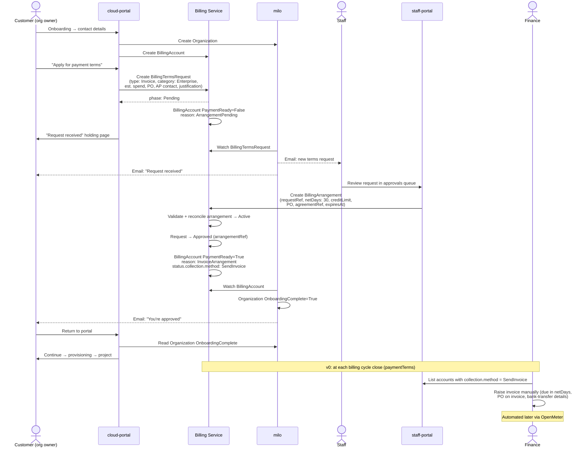

### User Stories

**(a) As a partner or enterprise customer**, I want to accept our negotiated
terms (MSA, PO) instead of entering a credit card, so I can be provisioned the
way my organization actually buys things.

*Experience:* On the payment step, the user picks "Apply for payment terms"
instead of entering a card, and chooses invoice terms. They enter an estimated monthly spend, a PO number if they
have one, an accounts-payable email, and an optional MSA or order-form
reference, then submit. They see a holding page that says what happens next
and how long it usually takes. When staff approve, they get an email and
continue straight into provisioning. Invoices arrive by email with the PO
number and bank-transfer details, due in the agreed number of days. In v0
finance raises them by hand; in v1 OpenMeter generates them.

**(a′) As a sales rep or account manager**, I want to grant invoice terms to a
customer I have already signed, so they don't have to request anything.

*Experience:* Staff open the customer's billing account in the staff portal and
choose "Grant arrangement". They fill in the negotiated terms and save. The
customer's gate clears straight away. The customer still signs up normally
first. Attaching terms to a platform invitation, so the customer never sees
the card step, is future work that needs fraud sign-off.

**(b) As a nonprofit or education customer**, I want to be sponsored or billed
against a grant or PO, so I can use the platform without a corporate card.

*Experience:* Same request flow, with category `Nonprofit` or `Education` and
type `Sponsored` or `Invoice`. Staff can approve it as:

- **Sponsored**: no payment due. The account goes on a sponsored Offer and/or
  gets credits, with an expiry. The customer is warned before it expires.
- **Invoice**: PO-based terms, as for enterprise.

**(c) As a developer who signed up before the billing gate**, I am locked out
until I add a card, and I can't or won't add one.

*Experience:* The legacy-resume screen offers a third choice alongside "add a
card" and "delete your org": "Apply for payment terms". This creates a request
with category `Legacy`. Staff can:

- grant a time-limited `Sponsored` arrangement, which keeps the free tier with
  no billable usage;
- grant invoice terms; or
- deny with a reason.

Members who aren't owners see "An owner has requested alternative billing, it
is under review" instead of a dead end.

**(d) As a developer at an existing customer**, signing up with my
@company.com address, I want to request to join my company's org instead of
creating a new one and adding a card.

*Experience:* After verifying their email, the user sees "Your company already
uses Datum: request to join *Acme Corp*". An org owner approves, and the user
lands in the company org with no billing step. They can still choose to create
their own org. See
[Joining an Existing Organization by Email Domain](#joining-an-existing-organization-by-email-domain).

**As a staff member**, I want one queue of pending terms requests, with enough
context to decide quickly (org age, fraud score, email domain, estimated spend,
existing usage), and a record of every decision.

**As a backend service author** (the OpenMeter invoicing pipeline, milo onboarding), I want
one condition that tells me whether an account can be billed, and a field that
tells me how to collect, so I don't need to know about cards or arrangements.

### Key Capabilities

- **One payment-readiness signal.** `BillingAccount` condition `PaymentReady`
  is True for a ready default card *or* an active arrangement. The portal and
  milo read only this.
- **Customers request, staff decide.** Customers can create a
  `BillingTermsRequest` but never a `BillingArrangement` or
  `BillingTermsDenial`. The arrangement is both the approval record and the
  source of the terms. The denial records why a request was declined.
- **Staff-initiated grants.** Staff can create an arrangement with no request,
  which gives us the sales-led path without new UI. This is still a staff
  decision, so it is not the ruled-out option A.
- **Terms that flow through.** Net days, PO, AP contact and credit limit are
  projected onto `BillingAccount.status.collection`. Invoicing uses them to
  send an invoice rather than charge a card: finance reads them from the staff
  portal in v0, and the OpenMeter pipeline reads them later.
- **Bounded risk.** Every arrangement has a credit limit (Invoice) or an expiry
  or credit amount (Sponsored). Staff are alerted as usage approaches the
  limit.
- **Reversible.** Arrangements can be amended, expired or revoked. The account
  then falls back to needing a card, and the portal shows the gate again with
  an explanation. Running workloads are not touched automatically.

### Notes and Constraints

- **At most one Active arrangement per BillingAccount.** Validated by webhook.
  Amending terms means updating the arrangement (new generation) or superseding
  it with a new one. The same pattern as `BillingAccountBinding` supersession.
- **`spec.paymentTerms` keeps defining the billing cycle, but the arrangement
  owns net days.**
  - `invoiceFrequency` and `invoiceDayOfMonth` stay as they are. The portal
    and staff-portal usage views already use them to work out cycle windows.
  - `netDays` is read nowhere today, and customers can write it. When an
    arrangement is Active, the controller projects the arrangement's
    `invoice.netDays` to `status.collection.netDays`, and invoicing reads that
    field rather than `spec.paymentTerms.netDays`. Card accounts are charged
    automatically, so net days don't apply to them.
  - An arrangement may optionally pin `invoiceFrequency` (e.g. Quarterly for a
    negotiated deal). If it does, the pinned value is also projected to
    `status.collection`, and consumers should prefer it over spec.
  - Customers can still change their own billing cycle through spec. Whether
    that should be locked for arranged accounts is left to
    [Open Questions](#open-questions).
- **A card can coexist with an arrangement.** If an account has both, the
  arrangement decides the collection method, so it gets an invoice rather than
  an automatic charge. The invoice can still be paid by card from the hosted
  invoice page.
- **Arrangements are namespaced** to the billing account's namespace
  (`organization-<org>`). That lets customers read them with existing billing
  viewer permissions and lets them be cleaned up with the org.
- **`BillingTermsRequest` is immutable once decided.** A denied customer creates
  a new request. The webhook rate-limits this to one open request per billing
  account.
- **`DefaultPaymentMethodReady` is unchanged.** It keeps its current meaning
  ("the default card is usable"), so existing consumers keep working while they
  migrate to `PaymentReady`.

### Risks and Mitigations

| Risk | Mitigation |
|---|---|
| Losing the card as a fraud signal lets abusers ask for "invoice terms" to skip it | Requests need a verified email and pass the existing `UserCreated` fraud evaluation first. Enterprise, Partner and Invoice requests from public email domains are flagged in the queue. Every approval is a human decision. The fraud service can evaluate `BillingTermsRequest` as a trigger event (future) |
| An approved invoice customer runs up a large bill and doesn't pay | Credit limit on every Invoice arrangement. Usage-vs-limit alerts to staff at 80% and 100%. `InvoicingReady=False/PastDue` shows in the staff portal. Staff can revoke the arrangement or suspend projects. Contractual late fees |
| The request queue grows and becomes a support bottleneck | Staff SLA and notifications. Queue shows fraud score, domain and usage context. Auto-approval rules (e.g. for `.edu` Sponsored) are listed as future work. We only add them once volume justifies it and the fraud team agrees |
| Customers edit `spec.paymentTerms.netDays` to give themselves longer terms | The arrangement's `netDays` is authoritative. Invoicing (finance in v0, OpenMeter later) reads `status.collection` only |
| The portal, milo and staff portal drift apart again | All three read `PaymentReady` / `OnboardingComplete`. The portal-side `evaluateOrgSetupComplete` is removed rather than extended. The staff-portal reason map is regenerated from milo's constants |
| A sponsored account expires unnoticed and suddenly loses access | Expiry warnings at 30 and 7 days to owners and staff. On expiry the gate reappears but workloads are not suspended automatically. A grace period is configurable |
| Manual invoicing in v0 is missed, late or inconsistent | The staff portal lists every `SendInvoice` account with its cycle, net days, PO and AP email. Finance works from a runbook. Automation via OpenMeter is phase 3. Whether manual invoices are also recorded as `Invoice` resources is an [open question](#open-questions) |
| No Stripe Customer exists for a no-card account, so automated invoices (phase 3) cannot use Stripe payment rails | stripe-provider creates the customer from the BillingAccount when `status.collection.method` is `SendInvoice`, not only from a card flow (see [Invoice Collection](#invoice-collection-for-arranged-accounts)) |
| [invoicing.md][invoicing] marks invoices `PastDue` when `DefaultPaymentMethodReady=False`, which would make every invoice-terms account instantly past due | Amend that rule. Invoices are PastDue only after their `dueDate`. The "link/charge only when ready" pre-flight uses `PaymentReady` plus `collection.method` |

## Design Details

### Resource Overview

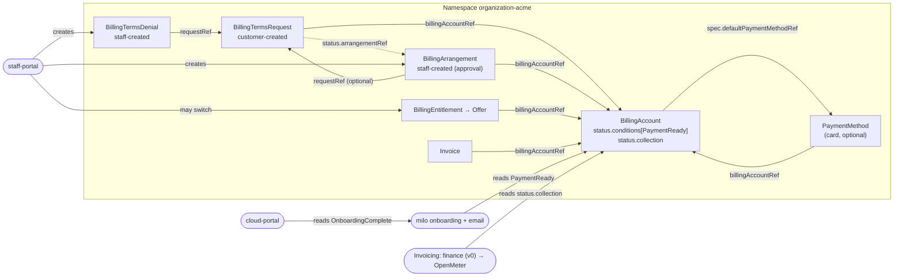

| Resource | Scope | Created by | Purpose |
|---|---|---|---|
| `BillingTermsRequest` | Namespace | Customer (billing admin / org owner) | Application for non-card billing, with the context staff need to decide |
| `BillingArrangement` | Namespace | Staff | The granted terms, which are also the approval record. Can be created with no request (a staff-initiated grant) |
| `BillingTermsDenial` | Namespace | Staff | Records that a request was declined, with a message to the customer |
| `BillingAccount` (changed) | Namespace | Customer | Gains the `PaymentReady` condition and `status.collection` |

### BillingTermsRequest Resource

```yaml
apiVersion: billing.miloapis.com/v1alpha1
kind: BillingTermsRequest
metadata:
  name: acme-invoice-terms
  namespace: organization-acme
spec:
  billingAccountRef:
    name: acme-billing
  # What the customer is asking for.
  type: Invoice                  # Invoice | Sponsored
  # Why. Drives queue routing and eligibility guidance.
  category: Enterprise           # Enterprise | Partner | Nonprofit | Education | Legacy | Other
  estimatedMonthlySpend:
    amount: "2500"
    currencyCode: USD
  purchaseOrder:
    number: "PO-4471"            # optional
  accountsPayableEmail: ap@acme.example
  agreementReference: "MSA-2026-014"   # optional; free text or Document ref
  justification: >
    Company policy prohibits corporate cards for SaaS; we pay via PO / net-30.
status:
  phase: Pending                 # Pending | Approved | Denied | Withdrawn
  submittedBy:                   # set by webhook from request user info
    userRef: { name: u-7f3c... }
    email: jane@acme.example
  decision:                      # set by controller from the arrangement / denial
    decidedAt: "2026-10-02T14:10:00Z"
    decidedBy: staff@datum.net
    message: ""                  # copied from BillingTermsDenial.spec.message
  arrangementRef:                # set when Approved
    name: acme-invoice-terms
  denialRef: null                # set when Denied
  conditions: []
```

**Spec fields**

| Field | Type | Description |
|---|---|---|
| `billingAccountRef.name` | string | Account the terms apply to. Immutable |
| `type` | enum | `Invoice` or `Sponsored` |
| `category` | enum | `Enterprise`, `Partner`, `Nonprofit`, `Education`, `Legacy`, `Other` |
| `estimatedMonthlySpend` | money | Required for `Invoice` |
| `purchaseOrder.number` | string | Optional |
| `accountsPayableEmail` | string | Required for `Invoice`. Invoices are sent here in addition to `contactInfo.invoiceEmails` |
| `agreementReference` | string | Optional reference to a signed MSA or order form |
| `justification` | string | Free text, max 2,000 characters |

The whole spec is immutable after create (CEL `self == oldSelf`). A customer
can withdraw a request by deleting it while it is `Pending`.

A request can have at most one decision. The webhook rejects a
`BillingArrangement` or `BillingTermsDenial` whose `requestRef` points at a
request that already has one.

### BillingTermsDenial Resource

Staff decline a request by creating a `BillingTermsDenial`. It follows milo's
`PlatformAccessRejection` pattern: approvals and rejections are separate kinds,
so a denial can never be mistaken for a grant of terms.

```yaml
apiVersion: billing.miloapis.com/v1alpha1
kind: BillingTermsDenial
metadata:
  name: acme-invoice-terms
  namespace: organization-acme
spec:
  requestRef:
    name: acme-invoice-terms
  reason: InsufficientInformation   # InsufficientInformation | NotEligible | SuspectedFraud | Other
  message: >                         # shown to the customer
    We couldn't verify your company details. Please reply to the email from
    billing@datum.net or add a card to continue.
  internalNotes: "Domain registered 3 days ago."   # staff only; never shown to the customer
status:
  deniedBy: staff@datum.net          # from admission user info
  deniedAt: "2026-10-02T14:10:00Z"
```

- The spec is immutable. A denial is final for that request, but the customer
  can submit a new request.
- `internalNotes` must never reach the customer, so customer roles have **no**
  read access to `BillingTermsDenial`. The controller copies `message` (and
  only `message`) to `BillingTermsRequest.status.decision.message`, which the
  portal shows.

### BillingArrangement Resource

```yaml
apiVersion: billing.miloapis.com/v1alpha1
kind: BillingArrangement
metadata:
  name: acme-invoice-terms
  namespace: organization-acme
spec:
  billingAccountRef:
    name: acme-billing
  requestRef:                     # optional: absent for staff-initiated grants
    name: acme-invoice-terms
  reason: "Signed MSA-2026-014; AP verified by sales."
  type: Invoice                   # Invoice | Sponsored
  invoice:                        # required when type == Invoice
    netDays: 30
    invoiceFrequency: Monthly     # optional: pins the cycle, overriding spec.paymentTerms
    creditLimit:
      amount: "10000"
      currencyCode: USD
    purchaseOrder:
      number: "PO-4471"
      validFrom: "2026-10-01"
      validUntil: "2027-09-30"
    accountsPayableEmail: ap@acme.example
  sponsored:                      # required when type == Sponsored
    offerRef: { name: nonprofit-2026 }     # optional: switch BillingEntitlement
    credit:                                # optional: credit grant
      amount: "2000"
      currencyCode: USD
  agreementRef: "MSA-2026-014"
  effectiveFrom: "2026-10-02T00:00:00Z"
  expiresAt: "2027-09-30T23:59:59Z"       # required for Sponsored; optional for Invoice
status:
  phase: Active                   # Scheduled | Active | Expired | Revoked | Superseded
  approvedBy: staff@datum.net     # from admission user info, not user-supplied
  conditions:
    - type: Ready
      status: "True"
      reason: Active
  observedGeneration: 1
```

**Validation (webhook and CEL)**

- The `billingAccountRef` must exist and be in the same namespace. It must
  match `requestRef`'s account if `requestRef` is set.
- `type` must match the block that is set.
- If `requestRef` is set, the request must be `Pending` and must not already
  have a denial.
- `invoice.creditLimit.currencyCode` must equal `BillingAccount.spec.currencyCode`.
- Only one arrangement per account may be `Active` or `Scheduled`. Creating a
  new one requires the old one to be revoked first, or the new one to set
  `spec.supersedes`.
- `status.approvedBy` is set by the webhook from the admission `userInfo`, so
  it cannot be forged.

**Revocation.** Staff set `spec.revoked: true` with a `reason`. The phase moves
to `Revoked` and `PaymentReady` is recomputed.

### BillingAccount Changes: PaymentReady and Collection Method

A new condition and a new status block on `BillingAccount`. Both are computed by
the billing controller.

```yaml
status:
  conditions:
    - type: DefaultPaymentMethodReady   # unchanged
      status: "False"
      reason: NotConfigured
    - type: PaymentReady                # new
      status: "True"
      reason: InvoiceArrangement
      message: "Invoice terms (net 30) active until 2027-09-30"
  collection:                           # new
    method: SendInvoice                 # ChargeAutomatically | SendInvoice | None
    netDays: 30
    arrangementRef: { name: acme-invoice-terms }
    purchaseOrderNumber: "PO-4471"
    accountsPayableEmail: ap@acme.example
    creditLimit: { amount: "10000", currencyCode: USD }
```

**`PaymentReady` evaluation, in order:**

| # | State | Status | Reason | `collection.method` |
|---|---|---|---|---|
| 1 | Active `Sponsored` arrangement | True | `SponsoredArrangement` | `None` |
| 2 | Active `Invoice` arrangement | True | `InvoiceArrangement` | `SendInvoice` |
| 3 | `DefaultPaymentMethodReady=True` | True | `DefaultPaymentMethod` | `ChargeAutomatically` |
| 4 | Pending `BillingTermsRequest` | False | `ArrangementPending` | (unset) |
| 5 | Last arrangement Expired or Revoked | False | `ArrangementExpired` / `ArrangementRevoked` | (unset) |
| 6 | Default PM exists but not Active | False | `PaymentMethodDegraded` | (unset) |
| 7 | Nothing | False | `NotConfigured` | (unset) |

The controller watches `BillingArrangement` and `BillingTermsRequest` (and
already watches `PaymentMethod`), and re-queues at `expiresAt` and
`effectiveFrom`.

### Lifecycle State Machines

**BillingTermsRequest**

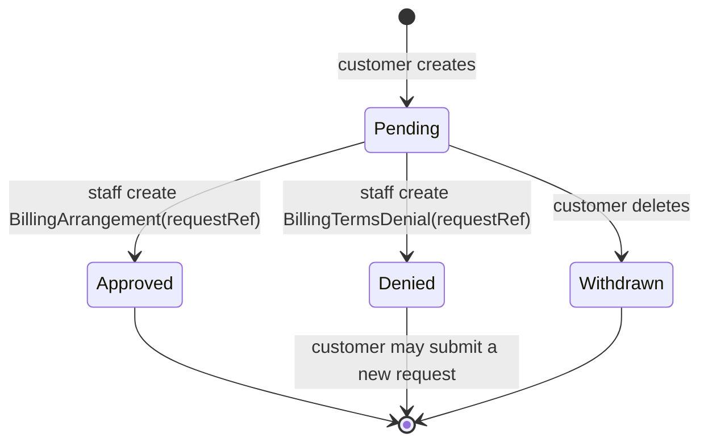

**BillingArrangement**

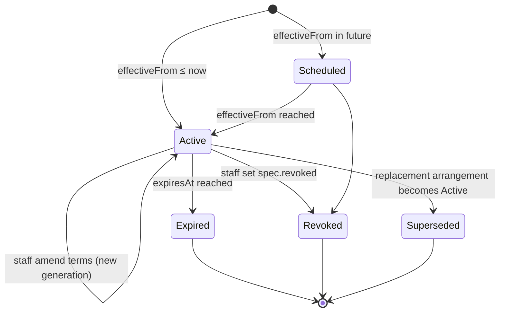

### Gate Changes: One Source of Truth

After this change:

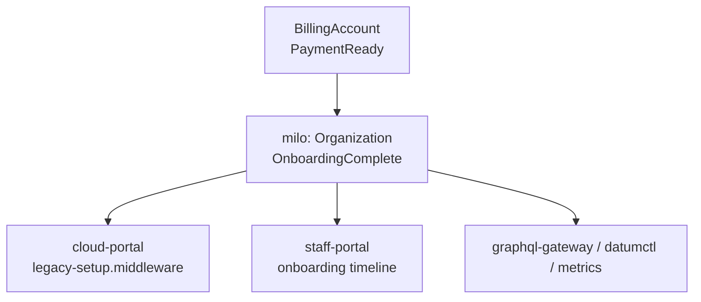

1. **milo** `organization_onboarding.go`: read `PaymentReady` instead of
   `DefaultPaymentMethodReady`. Add reasons `PaymentArrangementPending` and
   `PaymentArrangementExpired` next to `PaymentMethodNotReady`, so the portal
   can show the right screen.
2. **cloud-portal** `org-setup-status.ts`: **decided: the portal reads the
   Organization's `OnboardingComplete` condition**, which covers both contact
   completeness and payment readiness. It uses the condition's reason to choose
   the screen (card step, pending, denied or expired).
   - `evaluateOrgSetupComplete`'s own card check is removed.
   - Fallback: if the condition is missing or `Unknown`, for example because
     milo's `UnifiedOrganizations` feature gate is off in an environment, the
     portal reads the default BillingAccount's `PaymentReady` directly and
     keeps the current contact check.
   - The current fail-open behaviour on 401/403 is kept.
3. **staff-portal** `onboarding-steps.ts`: fix the reason map to milo's actual
   constants and add the new ones.

### Portal Experience

Onboarding and legacy-resume decision flow:

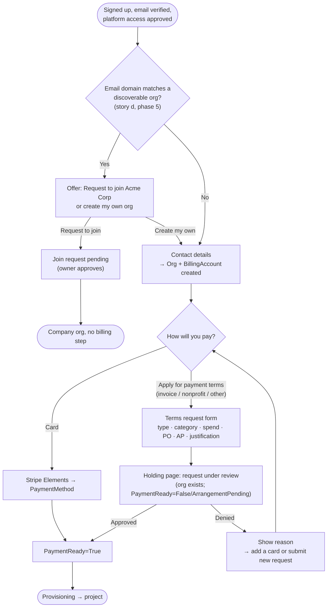

Screens to design (the issue is labelled `UX/UI-needed`):

| Screen | Where | Notes |
|---|---|---|
| Payment choice | `org-billing-setup-form.tsx` | Adds a secondary "Apply for payment terms" path next to Stripe Elements. `canSubmit` accepts *card collected* **or** *request submitted* |
| Terms request form | new, in `features/billing` | Fields change by type: Invoice needs spend and AP; Sponsored needs category and justification |
| Request pending | reuse the pattern from `/verifying` | Shows what was submitted, expected turnaround, a "withdraw and add a card instead" option, and a support link |
| Request denied | same route | Staff message, plus "add a card" or "submit a new request" |
| Legacy resume notice | `billing-legacy-resume-notice.tsx` | A third option: "Apply for payment terms" (category `Legacy`) |
| Setup required (non-owners) | `setup-required.tsx` | Shows "an owner has requested alternative billing" when a request is pending |
| Billing account detail | `routes/account/billing/detail.tsx` | New "Billing arrangement" card: type, net days, PO, credit limit and usage, expiry. The "Apply for payment terms" action is also available here for card customers |
| Expiry banner | org layout | Shown 30 and 7 days before a Sponsored or Invoice arrangement expires |

The `add-payment-method-dialog` already dispatches on the provider (the Stripe
module README). The request form is **not** a payment method, so it sits next
to that dialog rather than inside it.

### Staff Portal Experience

- **Terms requests queue** (`routes/admin/billing/terms-requests`), modelled on
  the service-catalog approvals tab. For each request it shows:
  - request details;
  - org age and member count;
  - the requester's email domain, with a public-domain flag;
  - fraud evaluation score and decision;
  - existing usage and invoices;
  - any previous requests and arrangements.
- **Decide dialog.** Approve (with pre-filled terms from the request, which
  staff can edit: net days, credit limit, PO, expiry, Offer or credit) or Deny
  (with a reason, a message to the customer and staff-only notes). Approve
  creates a `BillingArrangement`, and Deny creates a `BillingTermsDenial`.
- **Invoice-terms accounts** (for finance): every account with
  `collection.method: SendInvoice` or `None`, with its current cycle window,
  usage and spend, net days, PO, AP email, credit used, and sponsored credit
  remaining. Exportable to CSV. This is the v0 manual invoicing worklist.
- **Billing account detail**:
  - an "Arrangement" card with amend, revoke and history actions;
  - a "Grant arrangement" action when there is no request (a staff-initiated
    grant);
  - a usage-vs-credit-limit meter.
- **Organization onboarding timeline** shows the new reasons.

### Invoice Collection for Arranged Accounts

This is how `status.collection` becomes an invoice the customer can pay.

**v0: manual invoicing by finance.** Usage rating is moving from Amberflo to
OpenMeter, so arranged accounts are invoiced by hand at first. Everything
finance needs is already on the platform:

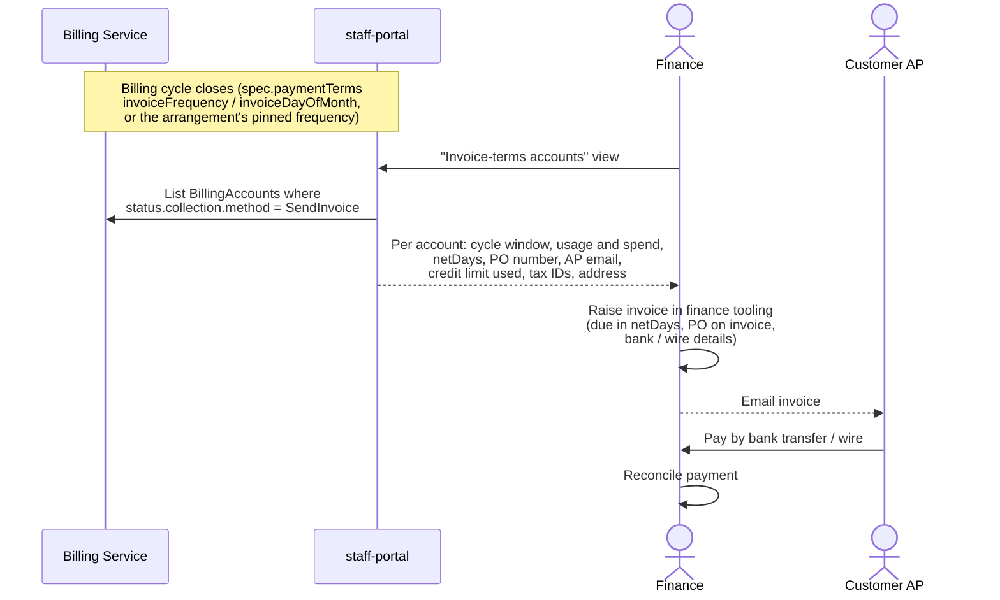

What v0 needs:

- **staff-portal:** an "Invoice-terms accounts" list with the cycle-window
  usage the portal already calculates (`billing-cycle.ts` / `usage.server.ts`)
  and the `status.collection` fields, exportable as CSV.
- **Runbook:** a finance runbook in `billing/docs/runbooks/` covering cycle
  dates, invoice contents (PO, tax IDs, net days), and chasing overdue
  payments.
- **Nothing in stripe-provider or the invoicing pipeline.**

**Later (phase 3): automated invoicing through OpenMeter.** When the
OpenMeter-based pipeline replaces Amberflo, it reads `status.collection`:

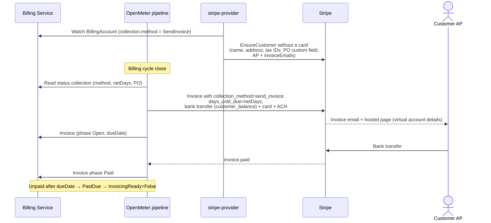

The diagram assumes OpenMeter pushes invoices into Stripe Invoicing.
OpenMeter's own invoicing, with Stripe used only for payment collection, is
equally possible, and the choice is made in the OpenMeter migration design,
not here. The contract this enhancement guarantees either way:

- **Consumers read `BillingAccount.status.collection`,** never
  `spec.paymentTerms.netDays`. That covers the method, net days, PO, AP email
  and credit limit.
- **Invoices for `SendInvoice` accounts are PastDue only after `dueDate`.**
  This amends the pre-flight rule in [invoicing.md][invoicing]: the "link or
  charge only when ready" check uses `PaymentReady` plus `collection.method`,
  not `DefaultPaymentMethodReady`.
- **stripe-provider must be able to create the Stripe Customer without a card**
  when Stripe is the payment rail. It also needs a customer-id lookup that
  doesn't depend on `StripePaymentMethod`.

Indicative Stripe costs, to check against current pricing: Invoicing is about
0.4–0.5% per paid invoice, ACH credit about $1 and wire about $8.

### Sponsored Accounts and Credits

A `Sponsored` arrangement sets `collection.method: None`, and at least one of
the following applies:

- **Offer switch.** When `sponsored.offerRef` is set, the billing controller
  switches the account's `BillingEntitlement` to that Offer. It uses the same
  mechanism the staff-portal offer switcher uses today (non-default
  entitlements are never overwritten by service-catalog seeding). On
  expiry or revocation it reverts to the service's `defaultOffer`.
- **Credit.** When `sponsored.credit` is set, the account gets that much credit
  for the arrangement's lifetime.
  - v0: finance tracks it by hand against cycle usage in the "Invoice-terms
    accounts" view.
  - Later: the OpenMeter pipeline applies it automatically. If Stripe is the
    rail, that is a Billing Credit Grant (`category: promotional`,
    `expires_at`), which applies only to meter-based prices.

When the credit is used up or `expiresAt` passes, `PaymentReady` goes False with
reason `ArrangementExpired`. The portal shows the gate with "Your sponsorship
ended: add a card or request renewal". Service is **not** silently converted
into paid usage. This follows Azure and Snowflake, and avoids surprise bills
for nonprofits.

### Legacy Accounts Locked Out by the Billing Gate

**Decided: legacy users are handled one request at a time.** There is no
bulk grant. A locked-out owner gets a self-serve way out of the dead end, and
each case goes through the normal staff review.

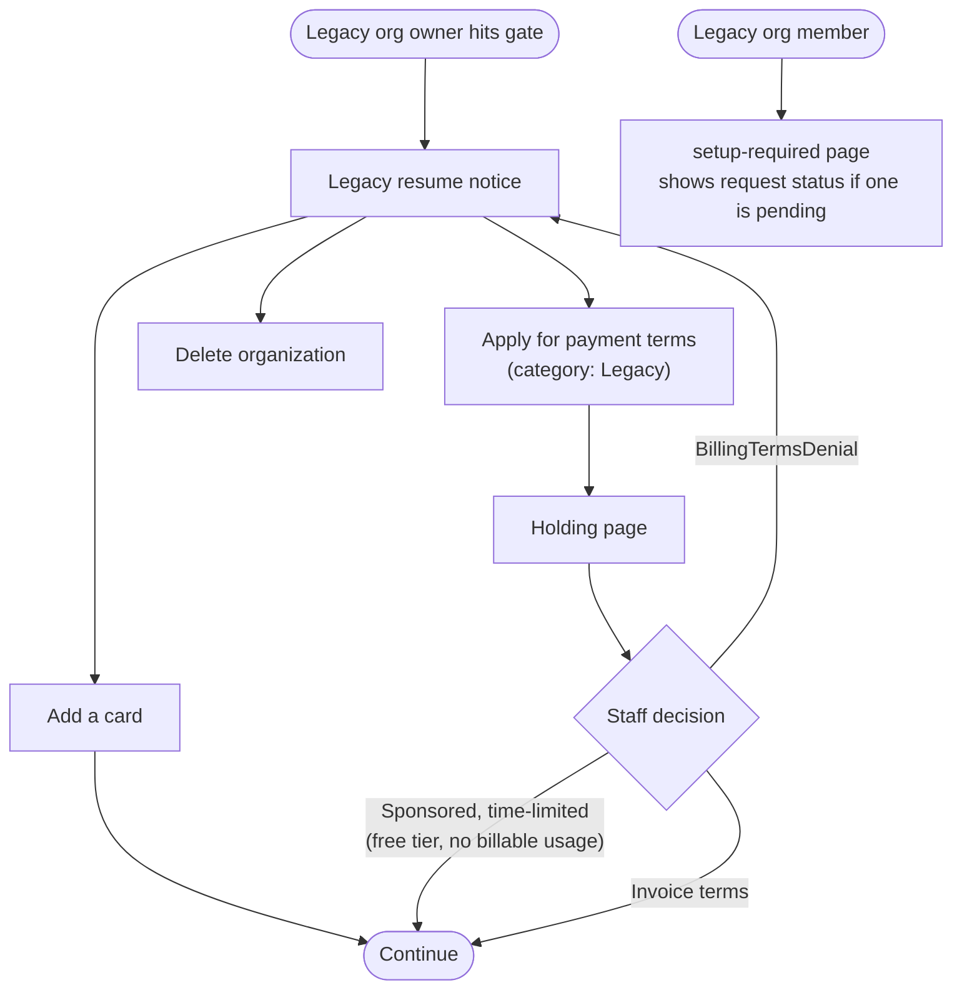

- The queue marks `Legacy` requests so staff can see the org's age and
  existing workloads next to the request.
- Typical outcomes:
  - a time-limited `Sponsored` arrangement, keeping the free tier with no
    billable usage;
  - invoice terms, for legacy orgs that are really businesses;
  - a denial telling the customer to add a card.
- Running workloads are left alone either way. The gate blocks the portal, not
  the workloads.

Mass outreach before the gate goes live is a product and comms decision,
outside this enhancement. Research on Fly.io's card rollout suggests it is
worth doing.

### Joining an Existing Organization by Email Domain

This is story (d). It is **not** a billing feature: it replaces "create a new
org and add a card" with "join an org that already pays". It should get its own
milo enhancement. The outline here fixes where it plugs into onboarding and
records what the research found.

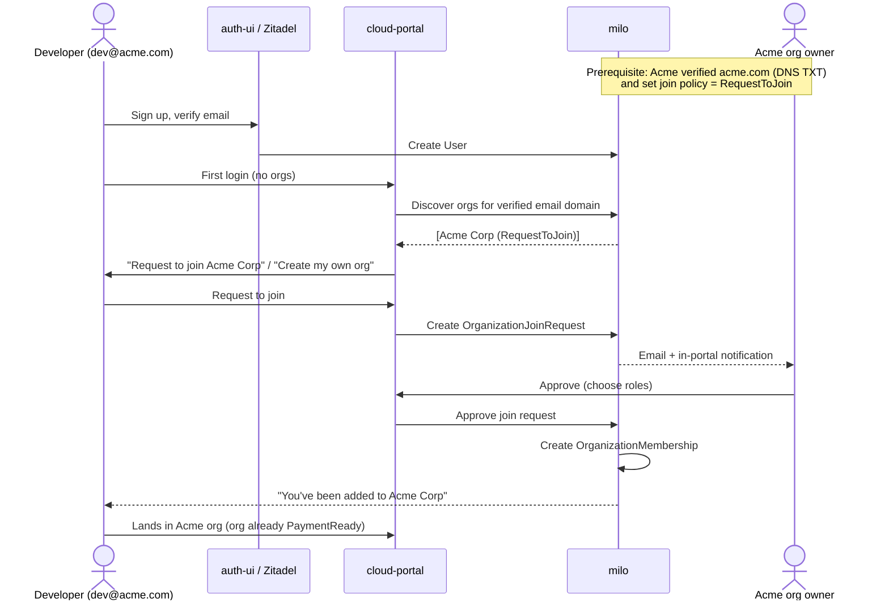

Proposed milo concepts, to be designed in the milo enhancement:

- **`OrganizationDomain`**: the org claims a domain and proves it with a DNS TXT
  record. It could reuse the verification approach of the existing `Domain`
  resource in network-services-operator. It has a join policy: `InviteOnly`
  (the default), `RequestToJoin` or `AutoJoin`.
- **`OrganizationJoinRequest`**: created by a user whose **verified** email
  matches a verified domain. Owners approve it. Approval should hand off to the
  existing invite-to-org flow, which already works for invited users
  ([comment][issue-1501-invite]). The user is moved out of the new-user signup
  flow and lands in the company org through the same path as accepting a
  `UserInvitation`, rather than a second membership path.
- **Discovery lookup**: a narrow, privileged lookup ("orgs that accept requests
  from my verified domain"). Only orgs that opted in are shown, which avoids
  leaking which companies are customers.

Rules taken from the research:

- **Block public email domains.** Atlassian does this for gmail, outlook and so
  on.
- **Only verified email addresses match.** The portal's email-verification gate
  (`EMAIL_VERIFICATION_GATE`) must be on for this flow.
- **Discovery is opt-in per org**, following Slack's "approved domains".
- **The user can always choose to create their own org.**

This is independent of the billing work above and can be scheduled in parallel.

### Fraud and Risk Controls

| Control | v0 | Later |
|---|---|---|
| Fraud evaluation on `UserCreated` (existing) must pass before any request | ✅ | |
| Verified email required to submit a request | ✅ | |
| Public-email-domain flag on Enterprise, Partner and Invoice requests | ✅ (shown in queue) | Auto-deny or require extra info |
| Human approval for every arrangement | ✅ | Auto-approve rules for low-risk categories, only with fraud-team sign-off |
| Credit limit on every Invoice arrangement | ✅ (alerts) | Enforce via quota or `BillingEntitlement` |
| Expiry required on Sponsored | ✅ | |
| `BillingTermsRequest` as a fraud-service trigger event | | ✅ (replaces `BillingPaymentMethodAttached` for no-card users) |
| KYB / tax-ID verification, credit checks for large limits | | ✅ |
| Prepay or deposit as an alternative for accounts that don't qualify for credit | | ✅ |

### RBAC Boundaries

| Role | `BillingTermsRequest` | `BillingArrangement` | `BillingTermsDenial` | `BillingAccount` status |
|---|---|---|---|---|
| Customer `billing.miloapis.com-admin` | create, get, list, watch, delete (while Pending) | get, list, watch | none | read |
| Customer `billing.miloapis.com-viewer` | get, list, watch | get, list, watch | none | read |
| Staff `billing-arrangement-approver` (new, in infra next to `staff-billing-entitlement-admin`) | get, list, watch | create, update, patch | create, get, list, watch | read |
| Staff `staff-billing-viewer` (existing) | get, list, watch | get, list, watch | get, list, watch | read |
| Billing controller | status | status | status | status |
| milo (notifications) | get, list, watch | get, list, watch | none | read |

Customer roles must **not** get create on `BillingArrangement` or
`BillingTermsDenial`, nor read on `BillingTermsDenial`. This is the core
security property of the design, and it needs an e2e test to guard it.

### Notifications

**Decided: milo's existing email machinery sends these**, alongside the
waitlist and invitation emails. Billing sends no email itself. It exposes
state (request phase, arrangement phase, `PaymentReady` reasons, expiry
timestamps) that milo watches.

Milo already imports billing types for `OnboardingComplete`, so this adds
watches rather than a new dependency. Staff alerts (new request, credit
limit) also go to a staff channel configured in infra.

| Event | Trigger milo watches | Recipients |
|---|---|---|
| Request submitted | `BillingTermsRequest` created | Staff (queue channel and email). Requester gets a confirmation |
| Request approved | Request `phase: Approved` | Requester and org owners |
| Request denied | Request `phase: Denied` (with `status.decision.message`) | Requester and org owners |
| Credit limit at 80% and 100% | Arrangement condition (phase 3, needs usage) | Staff. Owners at 100% |
| Arrangement expiring in 30 and 7 days | `BillingArrangement.spec.expiresAt` | Owners, billing contact, staff |
| Arrangement expired or revoked | Arrangement phase | Owners, billing contact |
| Join request created or decided (story d) | milo-native | Org owners, requester |

## Cross-Repo Impact

| Repo | Change | Phase |
|---|---|---|
| **billing** | `BillingTermsRequest`, `BillingArrangement` and `BillingTermsDenial` CRDs, webhooks, controllers. `PaymentReady` condition and `status.collection` on `BillingAccount`. RBAC roles. Amend [invoicing.md][invoicing]. Manual-invoicing runbook. E2E tests | 1–2 |
| **milo** | `OnboardingComplete` reads `PaymentReady`. New reasons. Notification emails for requests and arrangements. (Story d: `OrganizationDomain`, `OrganizationJoinRequest`, discovery) | 1–2, 5 |
| **cloud-portal** | Gate reads `OnboardingComplete` (falls back to `PaymentReady`). Payment choice, request form, pending and denied screens. Legacy notice option. Arrangement card. Expiry banner. (Story d: join step) | 1–2, 5 |
| **staff-portal** | Terms requests queue. Approve and deny dialogs. Grant, amend and revoke on the billing account. "Invoice-terms accounts" view for finance. Usage vs credit limit. Fix the onboarding reason map | 1–2 |
| **OpenMeter pipeline** (replacing Amberflo) | Read `status.collection`. `send_invoice` with `days_until_due`, bank transfer, PO. Credits for Sponsored | 3–4 |
| **stripe-provider** | Only if Stripe is the payment rail for automated invoices: create the Customer without a card, customer id not tied to `StripePaymentMethod`, PO custom field | 3 |
| **fraud** | `BillingTermsRequest` trigger event. Also rebase the stale `feat/billing-payment-method-fraud-trigger` branch onto the current billing API | 4 |
| **service-catalog** | None required. Offer switching reuses the `BillingEntitlement` behaviour | – |
| **infra** | Staff approver `PolicyBinding`. Staff alert channel | 1–2 |
| **graphql-gateway / datumctl** | Handle the new `OnboardingComplete` reasons | 1 |
| **docs** | `docs/platform/setup.mdx`: payment options and how to request invoicing | 2 |
| **enhancements** | Link from `unified-organizations` (which already calls the hard gate a drop-off risk). New milo doc for story d | 1, 5 |

## Delivery Plan

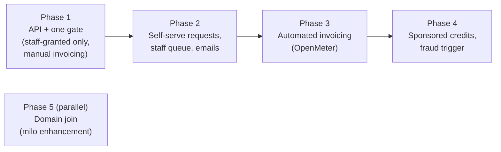

1. **Phase 1: staff-granted arrangements, one gate, manual invoicing.**
   - Ship `BillingArrangement` and `PaymentReady` / `status.collection`.
   - Switch milo and the portal to read them.
   - Staff portal: "grant arrangement" and the "Invoice-terms accounts" view.
   - Finance runbook.
   - *Outcome:* support can unblock sales-led enterprise customers and
     individual legacy users straight away. Finance invoices them by hand.
2. **Phase 2: self-serve requests.**
   - `BillingTermsRequest` and `BillingTermsDenial`.
   - Portal payment choice, request, pending and denied screens.
   - Legacy notice option.
   - Staff queue.
   - milo notification emails.
   - *Outcome:* stories (a), (b) and (c) are self-serve.
3. **Phase 3: automated invoicing, delivered with the OpenMeter migration.**
   - The pipeline reads `status.collection` and issues `send_invoice` invoices
     with bank transfer and a PO.
   - stripe-provider creates customers without a card, if Stripe is the rail.
   - PastDue and credit-limit alerts.
4. **Phase 4: extras.**
   - Sponsored credits and Offer auto-switch.
   - Fraud trigger.
5. **Phase 5 (parallel track): domain verification and join requests** (story
   d), as its own milo enhancement.

## Open Questions

### Decisions Made

| # | Question | Decision |
|---|---|---|
| 1 | What does a customer get while a request is pending? | A holding page. The gate stays closed until staff decide. Limited access is future work |
| 2 | Who issues `send_invoice` invoices? | Finance, by hand, in v0. Automated later through the OpenMeter pipeline, which replaces Amberflo |
| 3 | How are locked-out legacy users handled? | One request at a time through "Apply for payment terms". No bulk grant |
| 4 | What does the portal gate read? | Organization `OnboardingComplete`, falling back to the BillingAccount's `PaymentReady` |
| 5 | How are denials recorded? | A separate `BillingTermsDenial` kind, like `PlatformAccessRejection` |
| 6 | What happens to `spec.paymentTerms`? | It stays. `invoiceFrequency` and `invoiceDayOfMonth` keep defining the billing cycle used by the usage views. The arrangement owns `netDays` (and can optionally pin frequency) through `status.collection` |
| 7 | Who sends notifications? | milo's existing email machinery |
| 8 | Which first path: register without a card (option A), or request and approve (option B)? | Option B, as "Apply for payment terms" with staff review. Option A is ruled out because card entry at signup is a key part of fraud analysis and prevention ([comment][issue-1501-decision]) |
| 9 | Is story (d), joining an existing org by domain, in scope? | Split out into its own milo enhancement ([comment][issue-1501-paths]). It hands off to the existing invite-to-org flow ([comment][issue-1501-invite]) |

### Still Open

1. **Business:** can an invoice-terms customer switch back to automatic card
   billing, and if so, self-serve or through staff? (Azure makes the switch
   one-way.) Technically either works: revoking the arrangement falls back to
   `DefaultPaymentMethod` if a card is on file.
2. **Business:** eligibility guidance to show customers (minimum spend, company
   age), default credit limits, default and maximum net days, and late-fee
   terms.
3. **Business:** which document the customer accepts for standard invoice terms
   when there is no negotiated MSA. Could use `DocumentAcceptance` from the
   agreement enhancement.
4. Should manually raised v0 invoices also be recorded as `Invoice` resources,
   so the portal's invoice list and `InvoicingReady` cover arranged accounts?
   `Invoice` is provider-written today, so staff would need write access or an
   import tool.
5. Should customers be able to change `spec.paymentTerms` (their billing cycle)
   while an arrangement is Active, or should the webhook lock it?
6. In the OpenMeter design: does OpenMeter push invoices into Stripe Invoicing,
   or invoice directly and use Stripe only for payment collection?

## Implementation History

- 2026-09-25: Initial draft, based on cloud-portal#1501, a review of the
  current billing, portal, milo and staff-portal code, and research into other
  platforms.
- 2026-09-25: First review pass. Decided on the pending experience, manual v0
  invoicing, legacy handling, gate source, a separate denial kind,
  `paymentTerms` scope, and notification ownership.
- 2026-09-27: Aligned with the issue comments. Recorded request and approve
  ("Apply for payment terms") as decided and option A as ruled out for fraud
  reasons. Renamed staff grants without a request to "staff-initiated
  grants". Moved invite-with-terms out of phase 4 and into future work that
  needs fraud sign-off. Story (d) now hands off to the existing invite-to-org
  flow.

## Future Work

- **Limited access while pending.** Let a customer in with no billable
  services, using a dedicated Offer, while a request is reviewed.
- **Auto-approval rules** for low-risk requests (e.g. verified `.edu` domains
  for Sponsored education requests). These remove the human review that
  replaces the card as a fraud control, so they need fraud-team sign-off.
- **Credit limit enforcement** through quota or `BillingEntitlement`, and a
  past-due suspension policy shared with [invoicing.md][invoicing].
- **KYB, tax-ID verification and credit checks** for large credit limits, with
  deposit or prepay as fallbacks.
- **Prepaid credits** bought by bank transfer, as a self-serve route for
  customers who can't use a card and don't qualify for terms.
- **Signup with terms already granted** via an arrangement template on
  `PlatformInvitation`. Staff would decide before the account exists, so the
  card step is skipped at signup. Because that removes the signup fraud
  signal, it needs fraud-team sign-off before it is scheduled.

## Drawbacks

- **Three new kinds** plus a new condition is more API than a simple exemption
  flag. We accept this because the flag would not carry terms, would not be
  auditable, and would not reach invoicing.
- **Staff review costs staff time.** Every no-card customer needs a human
  decision until auto-approval rules exist.
- **The gate migration touches three repos at once** (billing, milo, portal),
  and must be rolled out in order: condition first, then consumers, keeping
  the fail-open fallback.

## Alternatives

### Invoice Terms as a PaymentMethodClass Provider

Add an `invoice` `PaymentMethodClass` with a small provider whose
`PaymentMethod` stays `AwaitingConfirmation` until staff approve, then becomes
`Active` with `details.type: invoice`.

- **Pro:** the existing portal gate, `DefaultPaymentMethodReady` and milo pass
  unchanged, and the design is already built for pluggable providers.
- **Con:** "pay by invoice" is a collection method, not an instrument. The
  customer who pays an invoice still does it with a wire, ACH or card, and
  modelling it as an instrument gets that wrong.
- **Con:** `PaymentMethod.spec` has nowhere to put request details (spend, PO,
  justification).
- **Con:** customers can create `PaymentMethod`s, so the webhook would need to
  restrict which classes they can pick.
- **Con:** Sponsored has no instrument at all.
- **Con:** it would still leave the three divergent gate checks in place.

Rejected, but it is the fallback if we need the smallest possible change.

### A Staff-Toggled Feature Flag That Bypasses the Gate

Add a `billing.miloapis.com/payment-method-exempt` Feature registration and
toggle it per org from the existing staff-portal feature-flags tab.

- **Pro:** almost no new code.
- **Con:** it carries no terms, no expiry and no audit reason.
- **Con:** it is invisible to invoicing, which would still try to
  charge a card or mark invoices PastDue.
- **Con:** it is a third definition of "setup complete".

It is useful only as a stop-gap before phase 1 ships.

### Customer-Editable Collection Method on BillingAccount Spec

Add `spec.collectionMethod: SendInvoice`. Customers hold
`billing.miloapis.com-admin` on their own `BillingAccount`, so they could grant
themselves invoice terms. Rejected.

### No-Card Limited Trial for Everyone

Drop the card at signup and grant a capped trial, as Snowflake and Railway do.
Rejected. This is option A from the issue, which was ruled out because card
entry at signup is a key fraud control ([comment][issue-1501-decision]). It
also does not help enterprises who want invoicing at full scale.

## References

**Internal**

- [cloud-portal#1501][issue-1501]: Non-Stripe flow for users exempt from
  credit-card entry
- [payment-methods.md][payment-methods], [invoicing.md][invoicing],
  [design.md](../design.md)
- `enhancements/platform/identity-and-access-management/unified-organizations/README.md`:
  defines the hard gate and flags drop-off risk
- `enhancements/platform/waitlist/README.md`: staff approval precedent
- `enhancements/platform/agreement/README.md`: `Document` / `DocumentAcceptance`
- `enhancements/platform/billing/accounts/README.md`: payment terms structure
  (Net30/60/90)

**External research** (accessed 2026-09-25)

- AWS: [purchase orders](https://docs.aws.amazon.com/awsaccountbilling/latest/aboutv2/manage-purchaseorders.html),
  [consolidated billing](https://docs.aws.amazon.com/awsaccountbilling/latest/aboutv2/consolidated-billing.html),
  [payment methods and ACH eligibility](https://aws.amazon.com/blogs/aws-cloud-financial-management/a-quick-overview-of-aws-payment-methods/)
- Google Cloud: [invoiced billing eligibility](https://docs.cloud.google.com/billing/docs/how-to/invoiced-billing),
  [billing account types](https://docs.cloud.google.com/billing/docs/concepts),
  [domain verification](https://docs.cloud.google.com/identity/docs/how-to/verify-domain),
  [unmanaged user transfer](https://support.google.com/a/answer/11112794)
- Azure: [pay by invoice / wire transfer](https://learn.microsoft.com/en-us/azure/cost-management-billing/manage/pay-by-invoice),
  [nonprofit grant](https://learn.microsoft.com/en-us/industry/nonprofit/microsoft-for-nonprofits/claim-activate-nonprofit-azure-grant)
- [Cloudflare enterprise terms](https://www.cloudflare.com/enterpriseterms/),
  [Vercel enterprise billing](https://vercel.com/docs/plans/enterprise/billing),
  [Fly.io billing](https://docs.fly.io/about/billing/) and the
  [card requirement rollout thread](https://community.fly.io/t/suddenly-needing-to-add-a-credit-card-can-i-ensure-it-doesnt-get-charged/19245),
  [Heroku account verification](https://devcenter.heroku.com/articles/account-verification),
  [Datadog billing](https://docs.datadoghq.com/account_management/billing/),
  [Snowflake trial](https://docs.snowflake.com/en/user-guide/admin-trial-account),
  [Railway trial](https://docs.railway.com/reference/pricing/free-trial),
  [GitHub verified domains](https://docs.github.com/en/enterprise-cloud@latest/organizations/managing-organization-settings/verifying-or-approving-a-domain-for-your-organization)
- Domain join: [Slack approved domains](https://slack.com/help/articles/115004856503),
  [Atlassian approved domains](https://support.atlassian.com/user-management/docs/control-how-users-get-access-to-products/)
- Stripe: [bank transfers on invoices](https://docs.stripe.com/invoicing/bank-transfer),
  [invoice custom fields](https://docs.stripe.com/invoicing/customize),
  [billing credits](https://docs.stripe.com/billing/subscriptions/usage-based/billing-credits),
  [quotes](https://docs.stripe.com/quotes),
  [invoicing pricing](https://stripe.com/invoicing/pricing)

[issue-1501]: https://github.com/datum-cloud/cloud-portal/issues/1501
[issue-1501-invite]: https://github.com/datum-cloud/cloud-portal/issues/1501#issuecomment-5572502382
[issue-1501-paths]: https://github.com/datum-cloud/cloud-portal/issues/1501#issuecomment-5737118432
[issue-1501-decision]: https://github.com/datum-cloud/cloud-portal/issues/1501#issuecomment-5833846125
[payment-methods]: ./payment-methods.md
[invoicing]: ./invoicing.md
