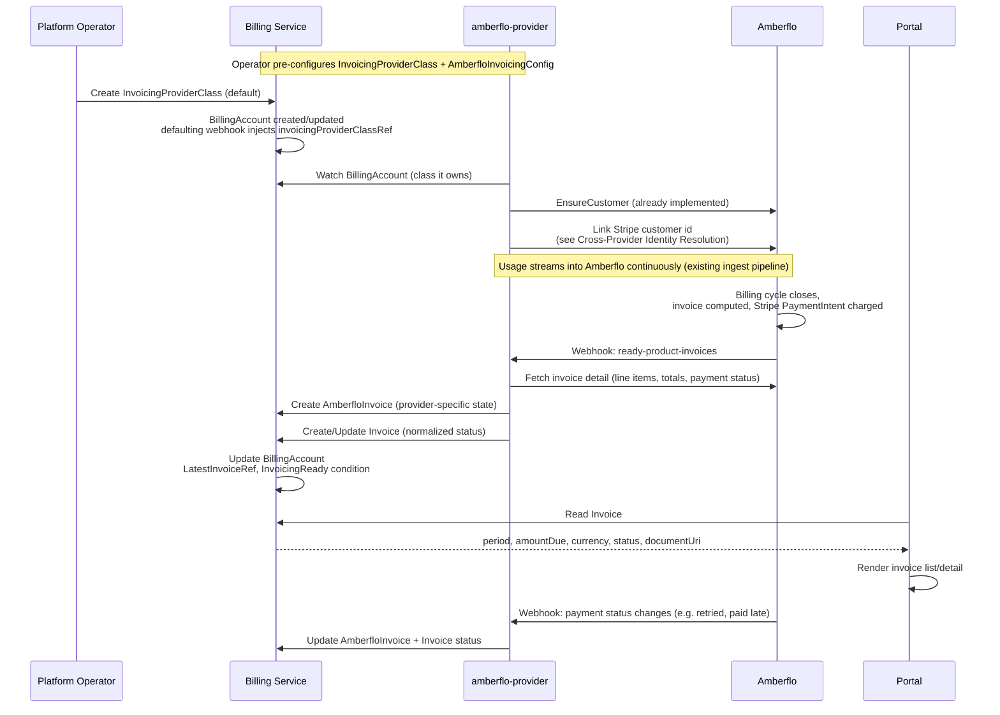

<!-- omit from toc -->
# Invoicing Providers

- [Summary](#summary)
- [Motivation](#motivation)
  - [Goals](#goals)
  - [Non-Goals](#non-goals)
- [Proposal](#proposal)
  - [How It Works](#how-it-works)
  - [User Stories](#user-stories)
  - [Key Capabilities](#key-capabilities)
  - [Notes and Constraints](#notes-and-constraints)
  - [Risks and Mitigations](#risks-and-mitigations)
- [Design Details](#design-details)
  - [Resource Overview](#resource-overview)
  - [InvoicingProviderClass Resource](#invoicingproviderclass-resource)
  - [Invoice Resource](#invoice-resource)
  - [BillingAccount Changes](#billingaccount-changes)
  - [Provider Controller Pattern](#provider-controller-pattern)
  - [Amberflo Reference Implementation](#amberflo-reference-implementation)
  - [Cross-Provider Identity Resolution](#cross-provider-identity-resolution)
  - [Portal Integration](#portal-integration)
  - [Billing Account Side Effects](#billing-account-side-effects)
  - [Ownership and Deletion](#ownership-and-deletion)
  - [RBAC Boundaries](#rbac-boundaries)
- [Implementation History](#implementation-history)
- [Future Work](#future-work)
- [Drawbacks](#drawbacks)
- [Alternatives](#alternatives)
  - [Consumer-Requested Invoice Generation](#consumer-requested-invoice-generation)
  - [Provider Config on InvoicingProviderClass Spec](#provider-config-on-invoicingproviderclass-spec)
  - [BillingAccount Owns Invoice Line Items Directly](#billingaccount-owns-invoice-line-items-directly)
  - [Vendor Customer ID on BillingAccount Status](#vendor-customer-id-on-billingaccount-status)
  - [Billing Service Polls Provider Invoice APIs Directly](#billing-service-polls-provider-invoice-apis-directly)
- [References](#references)

## Summary

Invoicing providers compute and surface invoices for
[`BillingAccount`][billing-account]s based on metered usage, and — depending on
the provider — may also collect payment against them. This enhancement
introduces the same `parametersRef` extensibility pattern used by [Payment
Methods][payment-methods] to invoicing: a cluster-scoped
`InvoicingProviderClass` configured by operators that names a provider and
references a provider-specific configuration resource; a namespace-scoped
`Invoice` that the billing service surfaces as the normalized, provider-agnostic
record of a billing period's charges; and a provider-specific resource (e.g.
`AmberfloInvoice`) owned by the provider controller that stores all
provider-specific state and drives the reconciliation between the provider's
own invoice lifecycle and the generic resource.

Amberflo is the reference implementation, via the existing `amberflo-provider`
service. Unlike payment methods, invoices are not consumer-initiated —
`Invoice` resources are created by the provider controller as it observes
billing-cycle events from the provider (e.g. Amberflo's `ready-product-invoices`
webhook), not in response to a request from the portal or a consumer.

Milo's current billing-account model already carries invoicing configuration
(`BillingAccount.spec.paymentTerms`, `BillingAccount.spec.contactInfo`) that
providers consume when computing and issuing invoices. This enhancement defines
how the *result* of that process — the invoice itself, and its payment status —
is surfaced back onto the platform in a provider-agnostic way, following the
same class/resource/provider-CRD pattern already established for payment
methods.

## Motivation

`BillingAccount` already carries the configuration an invoicing provider needs
to issue invoices — currency, payment terms, contact and tax information — and,
per [Payment Methods][payment-methods], a `DefaultPaymentMethodReady` condition
intended as the gating signal for "downstream services (invoicing, charge
processing)." Nothing yet defines what those downstream services actually do
with that signal, how they surface the invoices they produce, or how a backend
service (billing dashboards, financial reporting, support tooling) can read
invoice state without importing a specific provider's API client and CRDs.

`amberflo-provider` already syncs `BillingAccount` into an Amberflo `Customer`
and streams metered usage into Amberflo's ingest API. Amberflo computes invoices
from that usage on its own billing cycle and — per a deliberate platform
decision — will also own charging the customer directly through Amberflo's
native Stripe integration, rather than Milo's own `stripe-provider` driving
the charge. Without a generic invoicing pattern, every provider integration
that surfaces invoice state will invent its own resource shape, its own
webhook contract, and its own answer to "how do I know if this billing account
is paid up" — the same inconsistency risk called out as the motivation for the
payment methods pattern, applied one layer downstream.

### Goals

- Introduce an `InvoicingProviderClass` resource that operators configure to
  select an invoicing provider and carry its SDK/API configuration, following
  the same pattern as `PaymentMethodClass`.
- Introduce an `Invoice` resource that surfaces a provider-agnostic, normalized
  record of a billing account's invoice for a given period, without requiring
  callers to know which provider computed it.
- Define a pattern for provider-specific controller services that own the
  invoice computation and payment-collection lifecycle without modifying the
  billing service.
- Support Amberflo as the initial provider via the existing `amberflo-provider`
  service and a new `AmberfloInvoice` CRD.
- Define how a billing account's invoicing readiness and latest invoice status
  are surfaced onto `BillingAccount` status for the portal and other backend
  services.
- Document, explicitly, how an invoicing provider that delegates charging to
  its own native payment integration (Amberflo's built-in Stripe integration)
  resolves the vendor customer identity it needs, given that `PaymentMethod`
  deliberately does not expose provider-specific identifiers.

### Non-Goals

- This enhancement does not mandate whether an invoicing provider must
  delegate charge collection to its own native payment integration or drive
  charges through Milo's `PaymentMethod` providers. Amberflo does the former,
  per the current platform decision (see
  [Notes and Constraints](#notes-and-constraints)); a future provider that only
  computes invoices and expects Milo to collect payment separately is not
  precluded by this design, but is not built out here.
- Tax computation, rate cards, pricing plans, and line-item rating logic remain
  entirely the provider's responsibility. `Invoice` surfaces the provider's
  computed totals; it does not model pricing.
- Invoice PDF rendering and storage are not owned by the billing service.
  `Invoice` surfaces a link to the provider-hosted document.
- Dispute, credit, and refund workflows are out of scope for this enhancement.
- Multi-currency reconciliation across providers is out of scope; a billing
  account has a single `spec.currencyCode` and the provider is expected to
  honor it.
- Retry and dunning logic for failed charges is the invoicing provider's
  responsibility, not the billing service's.

## Proposal

Two new resources are introduced in the `billing.miloapis.com` API group,
following the same pattern as [Payment Methods][payment-methods]:

**`InvoicingProviderClass`** is a cluster-scoped resource configured by
platform operators. It names the invoicing provider responsible for a class of
billing accounts and carries a `parametersRef` to a provider-specific
configuration resource. As with `PaymentMethodClass`, it carries no
provider-specific fields itself.

**`Invoice`** is a namespace-scoped resource, co-located with the
`BillingAccount` it belongs to. Unlike `PaymentMethod`, it is never created by
a consumer or the portal — the provider controller creates one for each billing
period as the provider's own invoicing cycle produces them. Its status carries
the normalized, provider-agnostic invoice state: period, totals, currency, due
date, payment status, and a link to the provider-hosted invoice document.

Provider-specific controller services — such as `amberflo-provider` — watch
`BillingAccount` resources whose injected invoicing class reference points to a
class they own, react to the provider's own invoice-ready signal (a webhook, in
Amberflo's case), and create an `Invoice` plus a provider-specific child
resource (`AmberfloInvoice`) that stores all provider identifiers. As the
provider's invoice moves through its payment lifecycle, the provider controller
keeps both resources in sync.

### How It Works

The following sequence describes the end-to-end flow using Amberflo as the
provider, reflecting the platform decision that Amberflo owns invoice
generation and charging.



**1. Operator configures an InvoicingProviderClass and AmberfloInvoicingConfig.**

```yaml
apiVersion: amberflo.billing.miloapis.com/v1alpha1
kind: AmberfloInvoicingConfig
metadata:
  name: default
spec:
  apiKeySecretRef:
    name: amberflo-api-key
  webhookSecretRef:
    name: amberflo-webhook-secret
```

```yaml
apiVersion: billing.miloapis.com/v1alpha1
kind: InvoicingProviderClass
metadata:
  name: amberflo-default
  annotations:
    billing.miloapis.com/is-default-class: "true"
spec:
  provider: amberflo
  parametersRef:
    group: amberflo.billing.miloapis.com
    kind: AmberfloInvoicingConfig
    name: default
```

**2. Billing service defaulting webhook injects the class onto BillingAccount.**

Analogous to `PaymentMethod.spec.paymentMethodClassRef`, the billing service
defaulting webhook injects `spec.invoicingProviderClassRef` onto every
`BillingAccount` that does not specify one:

```yaml
spec:
  currencyCode: USD
  invoicingProviderClassRef:
    name: amberflo-default   # injected by defaulting webhook
```

**3. amberflo-provider ensures the Amberflo customer is chargeable.**

This step already exists (`BillingAccount` → Amberflo `Customer` sync). What is
new is linking the Stripe customer Milo's `stripe-provider` already
established, so Amberflo charges the same instrument the account owner
confirmed through the portal. See
[Cross-Provider Identity Resolution](#cross-provider-identity-resolution).

**4. Amberflo computes and charges the invoice on its own billing cycle.**

This happens entirely inside Amberflo, driven by the `paymentTerms` already
synced onto the Amberflo customer record. It is opaque to Milo until Amberflo
notifies `amberflo-provider`.

**5. Amberflo notifies amberflo-provider via the `ready-product-invoices` webhook.**

`amberflo-provider` receives the webhook, fetches the full invoice detail from
Amberflo's invoice API, and creates a provider-specific `AmberfloInvoice`:

```yaml
apiVersion: amberflo.billing.miloapis.com/v1alpha1
kind: AmberfloInvoice
metadata:
  name: acme-billing-2026-06
  namespace: acme-corp
  ownerReferences:
    - apiVersion: billing.miloapis.com/v1alpha1
      kind: BillingAccount
      name: acme-billing
      controller: false
spec:
  billingAccountRef:
    name: acme-billing
status:
  invoiceUri: "https://app.amberflo.io/invoices/..."
  invoiceKey:
    accountId: "acme-billing"
    customerId: "acme-billing"
    productId: "default"
    year: 2026
    month: 6
  stripePaymentIntentId: "pi_Abc123"
  paymentStatus: Paid
```

**6. amberflo-provider projects normalized state onto a generic Invoice.**

```yaml
apiVersion: billing.miloapis.com/v1alpha1
kind: Invoice
metadata:
  name: acme-billing-2026-06
  namespace: acme-corp
spec:
  billingAccountRef:
    name: acme-billing
  invoicingProviderClassRef:
    name: amberflo-default
  period:
    start: "2026-06-01T00:00:00Z"
    end: "2026-06-30T23:59:59Z"
status:
  phase: Paid
  currencyCode: USD
  amountDue: "482.19"
  dueDate: "2026-07-15T00:00:00Z"
  paidAt: "2026-07-02T09:14:00Z"
  documentUri: "https://app.amberflo.io/invoices/..."
  conditions:
    - type: Ready
      status: "True"
      reason: Paid
```

No Amberflo- or Stripe-specific identifiers appear on `Invoice` status — only
the normalized fields all backend consumers require, exactly as `PaymentMethod`
excludes Stripe identifiers from its own status.

**7. Billing service reconciles BillingAccount.**

The billing service watches `Invoice` and updates
`BillingAccount.status.latestInvoiceRef` and an `InvoicingReady` condition (see
[Billing Account Side Effects](#billing-account-side-effects)).

### User Stories

**As a platform operator**, I want to configure an `InvoicingProviderClass`
that points to Amberflo so that billing accounts are automatically invoiced
without any billing-service code depending on Amberflo directly.

*Experience:* The operator creates an `AmberfloInvoicingConfig` carrying secret
references, an `InvoicingProviderClass` naming Amberflo and pointing at it, and
annotates the class as the cluster default. No further configuration is
required — every `BillingAccount` picks up the class via the defaulting
webhook.

**As a billing account owner**, I want to see my invoices and their payment
status in the portal without the portal needing to know which invoicing
provider is configured.

*Experience:* The portal lists `Invoice` resources scoped to the account's
namespace and renders period, amount, status, and a link to the
provider-hosted document.

**As a backend service author** (e.g. financial reporting, support tooling), I
want to read invoice state without importing a provider-specific API client so
that my service remains provider-agnostic and unaffected if the invoicing
provider changes.

*Experience:* The service reads `Invoice` resources directly from the cluster.
`status.phase` and `status.amountDue` are normalized regardless of which
provider computed them.

**As a platform operator**, I want to know whether a billing account is
current on its invoices so that I can identify accounts at risk of suspension.

*Experience:* The operator reads `BillingAccount.status.latestInvoiceRef` and
the `InvoicingReady` condition rather than querying the provider directly.

### Key Capabilities

- **Provider transparency for consumers and backend services.** `Invoice`
  resources are created entirely by the provider controller; no billing-service
  code or portal code needs provider-specific knowledge to read them.
- **Operator-controlled provider selection.** Platform operators configure
  `InvoicingProviderClass` resources and designate a cluster default, mirroring
  `PaymentMethodClass`.
- **Normalized outcome state.** `Invoice` status surfaces period, totals,
  currency, due date, and payment phase in a provider-agnostic schema.
- **Provider extensibility without billing service changes.** Adding a new
  invoicing provider requires a new provider service, a new provider config
  resource, and a new `InvoicingProviderClass` — no changes to the billing
  service CRDs, controllers, or webhooks.
- **Idempotent invoice creation.** Provider controllers derive a deterministic
  `Invoice`/provider-CRD name from the billing account and period (e.g.
  `<billing-account>-<year>-<month>`), so retried webhook deliveries or
  reconcile loops do not create duplicate invoices.
- **Explicit charge-ownership boundary.** This pattern surfaces invoice and
  payment *status*; it does not require the billing service, `stripe-provider`,
  or any generic resource to drive the charge itself. An invoicing provider
  that owns charging end-to-end (Amberflo) and one that doesn't are both
  representable without a schema change.

### Notes and Constraints

- `InvoicingProviderClass` and `Invoice` resources must reside in the same
  cluster as `BillingAccount`. Provider-specific CRDs (e.g. `AmberfloInvoice`)
  must be namespace-scoped and co-located with the `BillingAccount` and
  `Invoice` they relate to.
- `BillingAccount.spec.invoicingProviderClassRef` is immutable once set, for
  the same reason `paymentMethodClassRef` is immutable on `PaymentMethod`:
  provider-specific state has already accumulated (Amberflo customer records,
  historical invoices) and cannot be transparently migrated to a different
  provider.
- Only one `InvoicingProviderClass` may be annotated as the cluster default.
- **Amberflo owns charging, not `stripe-provider`.** Per the current platform
  decision, Amberflo generates invoices and charges the customer directly
  through its own native Stripe integration (Stripe PaymentIntents driven
  server-side by Amberflo). `stripe-provider` and the generic `PaymentMethod`
  pattern are used only to collect and confirm the payment instrument; the
  actual charge does not flow through `stripe-provider`. This is a property of
  the Amberflo reference implementation, not a general requirement of this
  enhancement — see [Non-Goals](#non-goals).
- Because Amberflo charges through its own Stripe integration, it needs the
  Stripe customer id that `stripe-provider` already established when the
  payment method was collected. `PaymentMethod` and `StripePaymentMethod`
  deliberately do not expose that identifier generically (see
  [Payment Methods — Key Capabilities][payment-methods]). This enhancement
  resolves that tension with a narrow, explicit, documented exception rather
  than a generic mechanism — see
  [Cross-Provider Identity Resolution](#cross-provider-identity-resolution).

### Risks and Mitigations

| Risk | Mitigation |
|------|------------|
| Duplicate `Invoice`/`AmberfloInvoice` creation from a retried `ready-product-invoices` webhook delivery | Deterministic resource naming from `billingAccountRef` + billing period; creation is a no-op if the resource already exists |
| Provider webhook delivery failure (invoice never surfaced) | Provider controller polls the provider's invoice-list API on an interval as a fallback |
| Invoice generated for a billing account with no active default payment method | Amberflo attempts the charge and reports failure through its own payment status; `amberflo-provider` surfaces `status.phase: PastDue` on `Invoice` rather than failing the reconcile. `BillingAccount.status.DefaultPaymentMethodReady` remains the pre-flight signal operators and the portal use to flag the account before an invoice is even attempted |
| Cross-provider read of `StripePaymentMethod.status.stripeCustomerId` becomes a precedent for broader, uncontrolled coupling between provider CRDs | RBAC grant is scoped to the single field and single CRD kind needed, documented explicitly per provider pairing (see Cross-Provider Identity Resolution), not a generic capability granted to all providers |
| Provider's invoice total diverges from `BillingAccount.spec.currencyCode` | `amberflo-provider` validates currency match before projecting `Invoice` status and sets a `CurrencyMismatch` condition rather than silently surfacing a mismatched value |
| Provider-specific resource (`AmberfloInvoice`) deleted independently of `Invoice` | Provider controller re-creates it on its next reconcile if the underlying provider invoice still exists |

## Design Details

### Resource Overview

| Resource | Scope | Owner | Purpose |
|---|---|---|---|
| `InvoicingProviderClass` | Cluster | Billing service | Operator-configured invoicing provider selector; references provider config via `parametersRef` |
| `Invoice` | Namespace | Billing service | Normalized, provider-agnostic invoice record for a billing account and period |
| `AmberfloInvoicingConfig` | Cluster | amberflo-provider | Amberflo-specific configuration (API key, webhook secret references) |
| `AmberfloInvoice` | Namespace | amberflo-provider | Provider-specific state: Amberflo invoice identifiers, Stripe PaymentIntent id, raw payment status |

`Invoice` is the only invoicing resource consumers and other backend services
read directly. `InvoicingProviderClass` is an operator concern.
Provider-specific resources are internal implementation details.

### InvoicingProviderClass Resource

Mirrors `PaymentMethodClass` exactly in shape and defaulting behavior.

**Spec fields:**

| Field | Type | Description |
|---|---|---|
| `provider` | string | Name of the provider controller that reconciles this class (e.g. `amberflo`) |
| `parametersRef.group` | string | API group of the provider-specific config resource |
| `parametersRef.kind` | string | Kind of the provider-specific config resource |
| `parametersRef.name` | string | Name of the provider-specific config resource |

A class is designated as the cluster default via the annotation
`billing.miloapis.com/is-default-class: "true"`, injected by the billing
service defaulting webhook. Only one class may hold this annotation at a time,
**scoped independently from `PaymentMethodClass`'s default annotation** — a
deployment configures one default payment class and one default invoicing
class; they are not required to name the same provider.

### Invoice Resource

`Invoice` is namespace-scoped, sharing the namespace of the `BillingAccount` it
belongs to. It is created exclusively by the invoicing provider controller —
never by a consumer, the portal, or the billing service itself.

**Spec fields:**

| Field | Type | Description |
|---|---|---|
| `billingAccountRef.name` | string | The `BillingAccount` this invoice belongs to |
| `invoicingProviderClassRef.name` | string | The `InvoicingProviderClass` that produced this invoice. Set once at creation; immutable |
| `period.start` | time | Start of the billing period covered |
| `period.end` | time | End of the billing period covered |

**Status fields:**

| Field | Type | Description |
|---|---|---|
| `phase` | enum | `Open`, `Paid`, `PastDue`, `Void` |
| `currencyCode` | string | ISO 4217 currency code; must match `BillingAccount.spec.currencyCode` |
| `amountDue` | string | Decimal total due, as computed by the provider |
| `dueDate` | time | Payment due date |
| `paidAt` | time | Timestamp payment was confirmed, if `phase: Paid` |
| `documentUri` | string | Link to the provider-hosted invoice document (PDF or web view) |
| `conditions` | list | Standard Kubernetes condition list, including `CurrencyMismatch` when applicable |
| `observedGeneration` | int | Generation last observed by the reconciling controller |

`Invoice` status intentionally excludes line items, tax breakdowns, and any
provider- or vendor-specific identifiers (Amberflo invoice keys, Stripe
PaymentIntent ids). Consumers needing that level of detail follow
`status.documentUri` to the provider's own invoice view. This mirrors
`PaymentMethod` status excluding Stripe identifiers — the generic resource
carries only what a provider-agnostic reader needs to answer "how much, by
when, paid or not."

Resource names are deterministic:
`<billing-account-name>-<period-year>-<period-month>` (e.g.
`acme-billing-2026-06`), giving the provider controller a natural idempotency
key across webhook retries and reconcile loops.

### BillingAccount Changes

`BillingAccountSpec` gains one field, following the same defaulting pattern as
`PaymentMethod.spec.paymentMethodClassRef`:

| Field | Type | Description |
|---|---|---|
| `invoicingProviderClassRef.name` | string | The `InvoicingProviderClass` responsible for this account's invoices. Injected by the defaulting webhook if unset. Immutable once set |

`BillingAccountStatus` gains:

| Field | Type | Description |
|---|---|---|
| `latestInvoiceRef.name` | string | Name of the most recently created `Invoice` for this account |
| Condition `InvoicingReady` | condition | Whether the account's most recent invoice, if any, is `Paid` or `Open` (not `PastDue`) |

### Provider Controller Pattern

An invoicing provider controller is responsible for:

1. Watching `BillingAccount` resources whose
   `spec.invoicingProviderClassRef` points to an `InvoicingProviderClass` the
   controller owns.
2. Ensuring the provider-side customer record for that account exists and is
   chargeable (already implemented for Amberflo via the existing `BillingAccount`
   → `Customer` sync).
3. Reacting to the provider's own invoice-ready signal — a webhook, in
   Amberflo's case — and creating a provider-specific CRD instance (e.g.
   `AmberfloInvoice`) that stores all provider identifiers.
4. Creating or updating the corresponding `Invoice` with normalized status.
5. Keeping both resources in sync as the provider's payment lifecycle
   progresses (e.g. a charge retried after initial failure).

Provider controllers require the following Kubernetes RBAC grants:

- **Read** access to `InvoicingProviderClass` (to discover which classes they
  own).
- **Read** access to `BillingAccount` spec (to discover accounts and read
  billing configuration).
- **Create/Patch** access to `Invoice` in the account's namespace.
- **Full** access to their own provider CRD.

The billing service does not import or reference provider CRD types. Adding a
new invoicing provider — for example, a hypothetical `chargebee-provider` —
requires:

1. A new `chargebee-provider` service with its own `ChargebeeInvoice` and
   `ChargebeeInvoicingConfig` CRDs.
2. A `ChargebeeInvoicingConfig` resource carrying provider-specific
   configuration.
3. A new `InvoicingProviderClass` with `spec.provider: chargebee` and a
   `parametersRef` pointing at the config resource.
4. No changes to the billing service controllers, webhooks, or the `Invoice` or
   `InvoicingProviderClass` schemas.

### Amberflo Reference Implementation

`amberflo-provider` is the reference implementation. It already reconciles
`BillingAccount` into an Amberflo `Customer` and streams usage into Amberflo's
ingest API (see [amberflo-provider][amberflo-provider]); this enhancement adds
the invoicing side.

It introduces two CRDs in the `amberflo.billing.miloapis.com` API group.

**AmberfloInvoicingConfig spec fields:**

| Field | Type | Description |
|---|---|---|
| `apiKeySecretRef` | object | Reference to the Kubernetes secret carrying the Amberflo API key |
| `webhookSecretRef` | object | Reference to the secret used to verify `ready-product-invoices` webhook deliveries |

**AmberfloInvoice spec fields:**

| Field | Type | Description |
|---|---|---|
| `billingAccountRef.name` | string | Name of the parent `BillingAccount` in the same namespace |

**AmberfloInvoice status fields:**

| Field | Type | Description |
|---|---|---|
| `invoiceUri` | string | Amberflo-hosted invoice URI, from the `ready-product-invoices` webhook payload |
| `invoiceKey` | object | Amberflo's own composite invoice key: `accountId`, `customerId`, `productId`, `productPlanId`, `year`, `month`, `day` |
| `stripePaymentIntentId` | string | The Stripe PaymentIntent id Amberflo charged, retrieved from Amberflo's Stripe PaymentIntent API |
| `paymentStatus` | string | Raw payment status as reported by Amberflo/Stripe |

`amberflo-provider` exposes an HTTP webhook endpoint that receives Amberflo's
`ready-product-invoices` events. On receipt, it fetches full invoice detail via
Amberflo's invoice query API, creates or updates `AmberfloInvoice`, and projects
normalized status onto `Invoice`. It also polls Amberflo's invoice-list API on
an interval as a fallback for missed webhook deliveries, consistent with the
polling fallback already established for `stripe-provider`.

### Cross-Provider Identity Resolution

Because Amberflo owns charging directly (see
[Notes and Constraints](#notes-and-constraints)), it must charge the same
Stripe payment instrument the account owner already confirmed through the
existing `stripe-provider` flow — not a separate Stripe customer of its own.
This requires `amberflo-provider` to obtain the Stripe customer id that
`stripe-provider` stores exclusively on `StripePaymentMethod.status`, a
resource owned by a different provider service.

This is a deliberate, narrow exception to the isolation `PaymentMethod`
otherwise guarantees, not a generic mechanism:

- `amberflo-provider` is granted read-only RBAC access to exactly one field —
  `StripePaymentMethod.status.stripeCustomerId` — not general read access to
  `stripe-provider`'s CRDs.
- The lookup path is: `BillingAccount.spec.defaultPaymentMethodRef` →
  `PaymentMethod` (confirm `status.phase: Active`) → its owned
  `StripePaymentMethod` child (via the existing `ownerReference`) →
  `status.stripeCustomerId`.
- `amberflo-provider` only performs this lookup, and only links the Amberflo
  customer to that Stripe customer id, when
  `BillingAccount.status.DefaultPaymentMethodReady` is `True`. Before that,
  Amberflo customers are created without a linked Stripe customer
  (`autoCreateCustomerInStripe: false`, already the current behavior), and
  Amberflo will not be able to charge them — surfaced as `PastDue` on any
  `Invoice` created in that state.
- This coupling is specific to the Amberflo↔Stripe pairing and is documented
  here, not generalized. A future invoicing provider that does not delegate
  charging to a payment-provider-managed Stripe customer would not need this
  grant at all.

If a second invoicing provider needs the same pattern, this section should be
revisited to decide whether a narrow, well-known status field belongs on
`PaymentMethod` (e.g. an opaque, provider-scoped external-reference map) rather
than repeating one-off cross-CRD RBAC grants. That redesign is deferred — see
[Future Work](#future-work) — because a single instance does not yet justify
the added surface area, and the [Vendor Customer ID on BillingAccount
Status](#vendor-customer-id-on-billingaccount-status) alternative below was
rejected for the same reason `PaymentMethod` avoided it in the first place.

### Portal Integration

The portal reads `Invoice` resources directly — it does not need to discover a
provider or load a provider SDK the way it does for payment method collection,
because invoices are read-only projections, not an interactive flow.

| Purpose | Resource | Fields |
|---|---|---|
| List invoices for an account | `Invoice` (list, scoped to namespace) | `spec.period`, `status.phase`, `status.amountDue`, `status.currencyCode` |
| View invoice detail / download | `Invoice` | `status.documentUri` |
| Surface invoicing health | `BillingAccount` | `status.latestInvoiceRef`, `status.conditions[InvoicingReady]` |

The portal has no need to read `InvoicingProviderClass`,
`AmberfloInvoicingConfig`, or `AmberfloInvoice` — those exist purely to let the
provider controller do its job without billing-service coupling.

### Billing Account Side Effects

The billing service controller watches `Invoice` resources and reconciles the
owning `BillingAccount` whenever relevant state changes, mirroring the pattern
`PaymentMethod` already established for `DefaultPaymentMethodReady`.

**`InvoicingReady` condition:**

| Reason | Status | Meaning |
|---|---|---|
| `NoInvoicesYet` | `True` | No `Invoice` has been created for this account yet; not itself a problem |
| `Current` | `True` | The most recent `Invoice` is `Open` (not yet due) or `Paid` |
| `PastDue` | `False` | The most recent `Invoice` is `PastDue` |

`InvoicingReady` does not affect `BillingAccount` phase for the same reason
`DefaultPaymentMethodReady` does not: invoicing state is a configuration/health
signal downstream consumers gate on, not an account lifecycle failure. Whether
a `PastDue` account should eventually drive suspension is a policy decision for
a separate enhancement, not this one.

### Ownership and Deletion

`Invoice` and `AmberfloInvoice` carry a non-controller `ownerReference` to
`BillingAccount` (not `controller: true`, since a `BillingAccount` accumulates
many invoices over its lifetime rather than owning exactly one child). Deleting
a `BillingAccount` cascades deletion of its `Invoice` and provider-specific
history — consistent with Amberflo's own soft-delete behavior, which
deliberately preserves invoice history on the provider side even when the
Milo-side `BillingAccount` is archived (`AllowCustomerDelete` defaults to
`false` in `amberflo-provider` for this reason). Archiving a `BillingAccount`
(rather than deleting it) is the expected path for accounts that need to retain
invoice history, exactly as it is today for Amberflo customer records.

Individual `Invoice` resources are not independently deletable by consumers —
only the billing service and the owning provider controller may delete them,
enforced by RBAC rather than an admission webhook, since there is no
consumer-facing creation path to guard symmetrically.

### RBAC Boundaries

| Service | Resource | Access |
|---|---|---|
| Billing service | `InvoicingProviderClass` | Read (for defaulting webhook) |
| Billing service | `Invoice` | Read (reconciles `BillingAccount` status from it) |
| Billing service | `BillingAccount` | Full (owns the CRD) |
| Billing service | Provider-specific CRDs | None |
| amberflo-provider | `InvoicingProviderClass` | Read |
| amberflo-provider | `BillingAccount` spec | Read |
| amberflo-provider | `Invoice` | Create, Update (owns the resource lifecycle for classes it reconciles) |
| amberflo-provider | `AmberfloInvoicingConfig` | Full (owns the CRD) |
| amberflo-provider | `AmberfloInvoice` | Full (owns the CRD) |
| amberflo-provider | `PaymentMethod` | Read |
| amberflo-provider | `StripePaymentMethod.status.stripeCustomerId` | Read (narrow, see [Cross-Provider Identity Resolution](#cross-provider-identity-resolution)) |
| Portal | `Invoice` | Read |
| Portal | `BillingAccount` | Read |
| Portal | `InvoicingProviderClass`, `AmberfloInvoicingConfig`, `AmberfloInvoice` | None |

`amberflo-provider`'s read grant on `StripePaymentMethod` is the only
cross-provider RBAC grant in this design and is scoped to a single field, as
discussed above.

## Implementation History

- 2026-07-17: Enhancement drafted.

## Future Work

- **Additional invoicing providers.** Any provider that computes invoices from
  metered usage can be added by deploying a new provider service and creating
  an `InvoicingProviderClass` — no billing service changes required.
- **Provider-agnostic external-reference mechanism.** If a second invoicing
  provider needs to resolve a payment provider's vendor customer id the way
  Amberflo needs Stripe's, revisit whether a narrow, well-known field belongs
  on `PaymentMethod` status instead of one-off cross-CRD RBAC grants (see
  [Cross-Provider Identity Resolution](#cross-provider-identity-resolution)).
- **Invoice line-item detail.** If backend services need line-item-level data
  rather than totals, a follow-on enhancement could add a normalized line-item
  schema to `Invoice` status, balanced against the goal of keeping the generic
  resource provider-agnostic.
- **Suspension policy on sustained `PastDue`.** Whether and how a `BillingAccount`
  should be suspended after invoices remain unpaid past a threshold is a policy
  decision for a dedicated enhancement.
- **Reconciliation job for provider/payment divergence.** A periodic job that
  compares Amberflo's reported payment status against Stripe's own record
  (via `stripe-provider`, read-only) to catch cases where the two diverge,
  surfacing a condition on `Invoice` rather than silently trusting Amberflo's
  webhook.

## Drawbacks

Adding an invoicing provider requires shipping a new service with its own CRDs
and RBAC grants alongside a new `InvoicingProviderClass` configuration, same as
payment providers — not a runtime-only configuration change.

The cross-provider RBAC grant needed for Amberflo to resolve a Stripe customer
id is a real crack in the provider-isolation guarantee `PaymentMethod`
otherwise offers. This enhancement treats it as an explicit, narrow, documented
exception rather than solving it generically, which is a deliberate scope
limitation, not a resolved design — a second consumer of the same pattern
should prompt revisiting it (see Future Work).

Surfacing only totals (not line items) on `Invoice` means any backend service
that needs line-item detail must follow `status.documentUri` to the provider,
which is not queryable the way a Kubernetes resource is.

## Alternatives

### Consumer-Requested Invoice Generation

An earlier framing modeled `Invoice` the way `PaymentMethod` is modeled — a
resource the portal or a consumer creates to request that an invoice be
generated. This was rejected because it doesn't reflect reality: invoicing
providers run their own billing cycles on their own schedule
(`paymentTerms.invoiceFrequency`/`invoiceDayOfMonth`), and Milo has no way to
force Amberflo to generate an invoice on demand. Modeling `Invoice` as
provider-created, reactive to the provider's own signal, matches the actual
control flow.

### Provider Config on InvoicingProviderClass Spec

Rejected for the same reason it was rejected for `PaymentMethodClass`: typed,
provider-specific sub-objects on the class spec (`spec.amberflo`,
`spec.chargebee`, ...) turn the class schema into a registry of every provider
ever supported, requiring a billing service schema change per provider. The
`parametersRef` pattern keeps `InvoicingProviderClass` shape-stable.

### BillingAccount Owns Invoice Line Items Directly

An earlier design considered surfacing invoice totals and line items directly
on `BillingAccount.status` rather than as separate `Invoice` resources, since a
billing account's "current bill" is a natural fit for its own status. This was
rejected because a billing account accumulates many invoices over its
lifetime — status is not a natural home for a list that grows unboundedly, and
consumers need to query historical invoices independently of the account's
current state. A separate, listable resource per invoice is the correct shape,
matching how Stripe, Amberflo, and most billing systems model invoices as
first-class, individually addressable objects.

### Vendor Customer ID on BillingAccount Status

To solve the Amberflo/Stripe identity problem, an earlier draft proposed
exposing `stripeCustomerId` (or a generic opaque `externalReferences` map)
directly on `BillingAccount.status`, populated by `stripe-provider`. This was
rejected for the same reason `PaymentMethod` status excludes Stripe
identifiers: `BillingAccount` is read by every backend service on the platform,
and leaking a provider-specific identifier onto it — even in an "opaque" map —
reintroduces the same provider-vocabulary leakage the payment methods design
explicitly avoided. A narrowly-scoped, explicitly-documented RBAC grant between
the two specific provider CRDs that need it is a smaller blast radius than
widening what every reader of `BillingAccount` can see.

### Billing Service Polls Provider Invoice APIs Directly

Having the billing service itself call Amberflo's invoice API and populate
`Invoice` resources was considered, mirroring how a naive implementation might
avoid a separate provider service. This was rejected for the same reason
Stripe integration was kept out of the billing service in the payment methods
design: it makes the billing service responsible for provider-specific API
credentials, webhook endpoints, and rate limits, and makes it impossible to
add or change an invoicing provider without a billing service release.

## References

[billing-account]: ../../api/v1alpha1/billingaccount_types.go
[payment-methods]: ./payment-methods.md
[amberflo-provider]: https://github.com/milo-os/amberflo-provider
