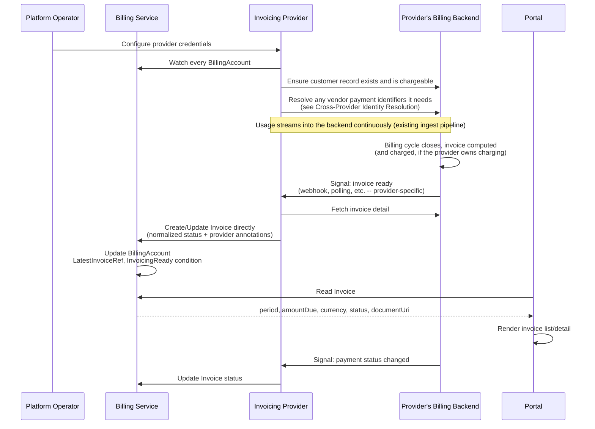

<!-- omit from toc -->
# Invoicing

- [Summary](#summary)
- [Motivation](#motivation)
  - [Goals](#goals)
  - [Non-Goals](#non-goals)
- [Proposal](#proposal)
  - [How It Works](#how-it-works)
  - [User Stories](#user-stories)
  - [Key Capabilities](#key-capabilities)
  - [Notes and Constraints](#notes-and-constraints)
  - [Risks and Mitigations](#risks-and-mitigations)
- [Design Details](#design-details)
  - [Resource Overview](#resource-overview)
  - [Invoice Resource](#invoice-resource)
  - [BillingAccount Changes](#billingaccount-changes)
  - [Provider Implementation Pattern](#provider-implementation-pattern)
  - [Cross-Provider Identity Resolution](#cross-provider-identity-resolution)
  - [Portal Integration](#portal-integration)
  - [Billing Account Side Effects](#billing-account-side-effects)
  - [Ownership and Deletion](#ownership-and-deletion)
  - [RBAC Boundaries](#rbac-boundaries)
- [Implementation History](#implementation-history)
- [Future Work](#future-work)
- [Drawbacks](#drawbacks)
- [Alternatives](#alternatives)
  - [Consumer-Requested Invoice Generation](#consumer-requested-invoice-generation)
  - [BillingAccount Owns Invoice Line Items Directly](#billingaccount-owns-invoice-line-items-directly)
  - [Vendor Customer ID on BillingAccount Status](#vendor-customer-id-on-billingaccount-status)
  - [Billing Service Polls Provider Invoice APIs Directly](#billing-service-polls-provider-invoice-apis-directly)
- [References](#references)

## Summary

An invoicing provider computes invoices for `BillingAccount`s from metered
usage and, depending on the provider, may also collect payment against them.
Right now that process is invisible to Milo — nothing surfaces whether an
account is paid up. This enhancement introduces `Invoice`, a namespace-scoped
resource the invoicing provider writes directly as invoices are computed, so
the portal, support, and finance tooling can see a billing account's invoice
history and payment status without talking to the provider's backend
directly.

This document defines the contract any invoicing provider follows — it does
not describe any one provider's implementation. Amberflo implements this
contract via `amberflo-provider`; its configuration, webhook handling, and
vendor identifiers are documented in [amberflo-provider][amberflo-provider],
not here.

There's no provider-selection layer: a single invoicing provider is assumed
active per cluster, and it reconciles every `BillingAccount` unconditionally.

## Motivation

`BillingAccount` already carries what an invoicing provider needs to issue
invoices — currency, payment terms, contact/tax info — and a
`DefaultPaymentMethodReady` condition meant to gate "downstream services
(invoicing, charge processing)." But nothing today tells a billing account
owner, support engineer, or finance system whether an account's latest
invoice was paid, is overdue, or was even generated — that state lives
entirely inside whichever backend computes it. Without a shared contract,
every provider integration invents its own invoice shape and payment signal,
and every consumer of that state has to special-case whichever provider
happens to be deployed.

### Goals

- Introduce `Invoice`, the generic record of a billing account's invoice for
  a period.
- Define the contract an invoicing provider controller follows to create and
  maintain `Invoice` for the accounts it invoices.
- Surface invoicing readiness and latest-invoice status onto `BillingAccount`.
- Define the general pattern for a provider that needs to resolve a vendor
  customer id established by a different (payment-method) provider, without
  prescribing any one provider's implementation.

### Non-Goals

- Supporting multiple simultaneous invoicing providers is out of scope.
- Tax computation, rate cards, pricing, and line-item rating stay entirely
  the provider's responsibility.
- Invoice PDF rendering/storage stays with the provider; `Invoice` only links
  to it.
- Dispute, credit, and refund workflows are out of scope.
- Multi-currency reconciliation is out of scope.
- Retry/dunning logic for failed charges is the provider's responsibility.
- Documenting any specific provider's configuration, webhook contract, or
  vendor identifiers — that belongs in the provider's own repository.

## Proposal

**`Invoice`** (namespace, co-located with its `BillingAccount`) is created and
updated exclusively by the invoicing provider, never by a consumer or the
portal. Status carries period, totals, currency, due date, payment phase, and
a document link. Vendor identifiers a provider needs for its own
reconciliation (an invoice key, a payment-processor transaction id) are
carried as provider-prefixed annotations, not typed fields — Kubernetes'
existing escape hatch for extension data, rather than a second CRD.

### How It Works



**1. Operator configures the provider's own credentials** — a config CRD in
the provider's own API group. What it contains is provider-specific and
documented in that provider's repository.

**2. The provider ensures its backend customer record exists and is
chargeable**, resolving any vendor payment identifiers it needs (see
[Cross-Provider Identity Resolution](#cross-provider-identity-resolution)).

**3. The provider's backend computes and, if it owns charging, charges the
invoice on its own billing cycle** — opaque to Milo until the provider learns
about it.

**4. On its own invoice-ready signal**, the provider fetches full invoice
detail and writes it directly onto `Invoice`, using a deterministic name
(`<billing-account>-<year>-<month>`) as its idempotency key:

```yaml
apiVersion: billing.miloapis.com/v1alpha1
kind: Invoice
metadata:
  name: acme-billing-2026-06
  namespace: acme-corp
  annotations:
    # provider-prefixed; opaque to every other reader
    <provider-group>.billing.miloapis.com/<field>: "..."
  ownerReferences:
    - apiVersion: billing.miloapis.com/v1alpha1
      kind: BillingAccount
      name: acme-billing
      controller: false
spec:
  billingAccountRef:
    name: acme-billing
  period:
    start: "2026-06-01T00:00:00Z"
    end: "2026-06-30T23:59:59Z"
status: # see Invoice Resource for the full shape
  phase: Paid
  amountDue: "482.19"
```

No vendor-specific identifiers appear in `status` — only normalized fields,
exactly as `PaymentMethod` excludes Stripe identifiers. Readers that don't
recognize a provider's annotation prefix simply ignore it.

**5. The billing service reconciles `BillingAccount`**, updating
`status.latestInvoiceRef` and the `InvoicingReady` condition.

### User Stories

**As a billing account owner**, I want to see whether my account is current
on its invoices in the portal, without knowing anything about which backend
computes them.

**As a support or finance user**, I want to check
`BillingAccount.status.latestInvoiceRef`/`InvoicingReady` to tell whether an
account is at risk, without credentials for whichever provider is deployed.

**As a backend service author**, I want to read `Invoice.status.phase`/
`amountDue` without a provider-specific client, so my service keeps working
if the invoicing provider changes.

### Key Capabilities

- **Invoice and payment visibility without provider access.** Anyone reading
  `BillingAccount`/`Invoice` gets accurate status without provider
  credentials or API calls.
- **Normalized outcome state** — period, totals, currency, due date, payment
  phase — in a schema that doesn't require provider-specific knowledge.
- **Idempotent creation** via deterministic `Invoice` naming.
- **Explicit charge-ownership boundary.** This pattern surfaces invoice/payment
  *status*; it doesn't require the billing service or any payment-method
  provider to drive the charge — the invoicing provider does that on its own
  terms.

### Notes and Constraints

- `Invoice` must reside in the same cluster and namespace as its
  `BillingAccount`.
- This design assumes a single invoicing provider is active per cluster. The
  provider reconciles every `BillingAccount` unconditionally — there's no
  per-account provider selection to configure or default.
- **No intermediate provider-specific CRD** in this repo. A provider may
  still define its own config CRD in its own API group; that CRD and its
  fields are that provider's concern, not this document's.
- A provider that owns charging directly through its own payment integration
  (rather than driving Milo's `PaymentMethod` providers) may need a vendor
  customer id a payment-method provider already established, since
  `PaymentMethod` deliberately doesn't expose provider identifiers generically.
  See [Cross-Provider Identity Resolution](#cross-provider-identity-resolution).

### Risks and Mitigations

| Risk | Mitigation |
|------|------------|
| Duplicate `Invoice` creation from a retried invoice-ready signal | Deterministic naming from account + period; creation is a no-op update if it already exists |
| Provider signal delivery failure (e.g. missed webhook) | Provider polls its own invoice-list API as a fallback |
| Invoice generated with no active default payment method | The provider surfaces `PastDue` on `Invoice` rather than failing the reconcile; `DefaultPaymentMethodReady` remains the pre-flight signal |
| Cross-provider read of another provider's vendor identifier becomes precedent for broader coupling | RBAC grant scoped to one field on one CRD kind, documented explicitly per provider pairing, not a generic capability |
| Provider's invoice total diverges from `BillingAccount.spec.currencyCode` | Provider validates currency match and sets a `CurrencyMismatch` condition rather than surfacing a mismatch silently |
| Vendor-identifier annotations edited or stripped by another actor | Provider rewrites them on every reconcile, so drift self-heals |

## Design Details

### Resource Overview

`Invoice` (namespace-scoped, owned by the invoicing provider) is the only
invoicing resource this document defines, and the only one consumers and
backend services read directly. A provider's own configuration CRDs live in
that provider's own API group and repository — out of scope here.

### Invoice Resource

Namespace-scoped, sharing the `BillingAccount`'s namespace. Created
exclusively by the invoicing provider. Names are deterministic:
`<billing-account-name>-<year>-<month>` (e.g. `acme-billing-2026-06`), giving
the provider a natural idempotency key.

```yaml
apiVersion: billing.miloapis.com/v1alpha1
kind: Invoice
metadata:
  name: acme-billing-2026-06
  namespace: acme-corp
spec:
  billingAccountRef:
    name: acme-billing         # the owning BillingAccount
  period:
    start: "2026-06-01T00:00:00Z"  # billing period covered
    end: "2026-06-30T23:59:59Z"
status:
  phase: Paid                  # Open | Paid | PastDue | Void
  currencyCode: USD             # must match BillingAccount.spec.currencyCode
  amountDue: "482.19"           # decimal total due
  dueDate: "2026-07-15T00:00:00Z"
  paidAt: "2026-07-02T09:14:00Z" # set once phase: Paid
  documentUri: "https://provider.example/invoices/..."  # provider-hosted document
  conditions:
    - type: Ready
      status: "True"
      reason: Paid               # or CurrencyMismatch, if the provider's total
                                  # diverges from spec.currencyCode
  observedGeneration: 3
```

Status intentionally excludes line items, tax breakdowns, and vendor
identifiers. Those live in `status.documentUri` (for humans) or
provider-prefixed annotations (for the provider's own reconciliation and
support tooling) — the typed schema stays limited to what any reader needs,
regardless of which provider is deployed.

### BillingAccount Changes

`BillingAccountStatus` gains two fields; there's no spec change, since
there's no provider to select:

```yaml
status:
  latestInvoiceRef:
    name: acme-billing-2026-06   # most recently created Invoice
  conditions:
    - type: InvoicingReady
      status: "True"
      reason: Current              # NoInvoicesYet | Current | PastDue
```

### Provider Implementation Pattern

An invoicing provider controller is responsible for:

1. Watching every `BillingAccount` in the cluster (per
   [Notes and Constraints](#notes-and-constraints), a single invoicing
   provider is assumed active, so there's no per-account filter to apply).
2. Ensuring its own backend customer/billing record exists and is chargeable,
   by whatever means its backend requires.
3. Detecting when a new invoice has been computed — a webhook, polling, or
   any other mechanism; this contract doesn't prescribe it.
4. Creating or updating `Invoice` directly: normalized status fields, plus
   provider-prefixed annotations (`<provider-group>.billing.miloapis.com/
   <field>`) for anything it needs for its own reconciliation.
5. Keeping `Invoice` in sync as its payment lifecycle progresses.

RBAC: **read** `BillingAccount` spec (cluster-wide); **create/update**
`Invoice` (cluster-wide); **full** access to whatever configuration CRD(s) it
defines in its own API group. The billing service does not import or
reference provider-owned config types.

**Reference implementation.** Amberflo implements this contract via
`amberflo-provider`. Its configuration CRD, webhook contract, and annotation
keys are documented in [amberflo-provider][amberflo-provider] — this document
defines the contract every provider follows, not any one provider's
implementation.

### Cross-Provider Identity Resolution

A provider that charges through its own native payment integration, rather
than driving Milo's `PaymentMethod` providers directly, may need to resolve a
vendor customer id a payment-method provider already established — because
`PaymentMethod` deliberately hides provider-specific identifiers from every
other backend service (see [Payment Methods][payment-methods]).

This is not solved generically by this enhancement. Where it's needed, the
pattern is a narrow, explicit exception:

- Read-only RBAC scoped to exactly the one field needed on the specific
  payment-provider CRD, not general read access to that provider's resources.
- Lookup path: `BillingAccount.spec.defaultPaymentMethodRef` → `PaymentMethod`
  (must be `Active`) → its provider-owned child resource → the vendor
  identifier.
- Only performed once `BillingAccount.status.DefaultPaymentMethodReady` is
  `True`; until then the invoicing provider should not attempt to link or
  charge, and any `Invoice` created in that state should surface `PastDue`.
- Documented per provider pairing, not generalized. If it recurs across
  providers, revisit whether a well-known field belongs on `PaymentMethod`
  instead — see [Future Work](#future-work).

Amberflo's specific grant (reading `StripePaymentMethod.status.stripeCustomerId`
to link its own Stripe integration) is documented in
[amberflo-provider][amberflo-provider], not here.

### Portal Integration

The portal reads `Invoice` directly — no provider discovery or SDK loading,
since invoices are read-only projections, not an interactive flow.

| Purpose | Resource | Fields |
|---|---|---|
| List invoices | `Invoice` (list, scoped to namespace) | `spec.period`, `status.phase`, `status.amountDue`, `status.currencyCode` |
| View/download | `Invoice` | `status.documentUri` |
| Invoicing health | `BillingAccount` | `status.latestInvoiceRef`, `InvoicingReady` |

The portal shouldn't rely on `Invoice`'s provider-prefixed annotations —
those are reconciliation/debug data, not a stable UI contract.

### Billing Account Side Effects

The billing service watches `Invoice` and reconciles the owning
`BillingAccount`, mirroring the `DefaultPaymentMethodReady` pattern.

| Reason | Status | Meaning |
|---|---|---|
| `NoInvoicesYet` | `True` | No `Invoice` created yet; not a problem |
| `Current` | `True` | Latest `Invoice` is `Open` or `Paid` |
| `PastDue` | `False` | Latest `Invoice` is `PastDue` |

`InvoicingReady` doesn't affect `BillingAccount` phase — it's a health signal
downstream consumers gate on, not a lifecycle failure. Whether sustained
`PastDue` should drive suspension is a policy decision for a separate
enhancement.

### Ownership and Deletion

`Invoice` carries a non-controller `ownerReference` to `BillingAccount` (not
`controller: true`, since an account accumulates many invoices). Deleting a
`BillingAccount` cascades deletion of its `Invoice` history. Providers are
expected to preserve their own backend's invoice history even when the
Milo-side account is archived, so archiving (rather than deleting) is the
expected path for accounts that need to retain invoice history — consistent
with how each provider handles its own soft-delete behavior.

`Invoice` isn't independently deletable by consumers — only the billing
service and the owning provider controller may delete it, enforced by RBAC
since there's no consumer-facing creation path to guard symmetrically.

### RBAC Boundaries

| Service | Resource | Access |
|---|---|---|
| Billing service | `Invoice` | Read (reconciles `BillingAccount` from it) |
| Billing service | `BillingAccount` | Full |
| Billing service | Provider config CRDs | None |
| Invoicing provider | `BillingAccount` spec | Read (all accounts) |
| Invoicing provider | `Invoice` | Create, Update (all accounts) |
| Invoicing provider | its own config CRD(s) | Full |
| Invoicing provider | `PaymentMethod` | Read |
| Invoicing provider | a payment provider's vendor-identifier field (e.g. `StripePaymentMethod.status.stripeCustomerId`) | Read (narrow, see [Cross-Provider Identity Resolution](#cross-provider-identity-resolution)) |
| Portal | `Invoice`, `BillingAccount` | Read |
| Portal | Provider config CRDs | None |

The cross-provider vendor-identifier read is the only cross-provider RBAC
grant in this design, and it's scoped to a single field.

## Implementation History

- 2026-07-17: Enhancement drafted.

## Future Work

- **Multi-provider invoicing.** If a second invoicing provider is ever
  needed, introduce a selection mechanism (a `PaymentMethodClass`-style
  `parametersRef` indirection) at that point rather than now.
- **Provider-agnostic external-reference mechanism.** If a second invoicing
  provider needs to resolve a payment provider's vendor customer id, revisit
  whether a well-known field belongs on `PaymentMethod` status instead of
  one-off RBAC grants.
- **Invoice line-item detail.** A normalized line-item schema, if backend
  services need it, balanced against keeping `Invoice` provider-agnostic.
- **Suspension policy on sustained `PastDue`** — a dedicated enhancement.
- **Reconciliation job for provider/payment divergence.** Compare a
  provider's reported payment status against the underlying payment
  processor's own record, surfacing a condition rather than trusting a
  webhook blindly.

## Drawbacks

The cross-provider RBAC grant a charge-owning invoicing provider needs is a
real crack in `PaymentMethod`'s provider-isolation guarantee. It's an
explicit, narrow, documented exception per provider pairing, not a resolved
design — a second consumer of the same pattern should prompt revisiting it.

Carrying vendor identifiers as annotations rather than a typed CRD trades away
schema validation and discoverability — no `kubectl explain`, and a malformed
annotation fails silently rather than being rejected by the API server. An
accepted tradeoff given invoicing has no interactive flow to protect.

Assuming a single invoicing provider means a future second provider requires
a real migration — introducing a selection mechanism and back-filling which
provider owns which existing `BillingAccount` — rather than slotting in via
configuration alone. Given there's no concrete second provider today, this is
judged a better tradeoff than building and maintaining unused indirection.

## Alternatives

### Consumer-Requested Invoice Generation

Modeling `Invoice` like `PaymentMethod` — created by the portal to request
generation — doesn't fit: invoicing providers run their own billing cycles on
their own schedule, and Milo has no way to force a provider to generate an
invoice on demand. Provider-created, reactive to the provider's own signal,
matches the actual control flow.

### BillingAccount Owns Invoice Line Items Directly

Considered surfacing invoice totals/line items on `BillingAccount.status`
directly. Rejected: an account accumulates many invoices over its lifetime,
and status isn't a home for an unboundedly growing list — a separate,
listable resource per invoice is the correct shape.

### Vendor Customer ID on BillingAccount Status

To solve the identity-resolution problem generically, considered exposing a
vendor customer id (or an opaque `externalReferences` map) directly on
`BillingAccount.status`. Rejected for the same reason `PaymentMethod` excludes
provider identifiers: `BillingAccount` is read by every backend service, and
leaking a provider identifier onto it — even "opaquely" — reintroduces the
leakage the payment methods design avoided. A narrow RBAC grant between the
two specific CRDs that need it is a smaller blast radius.

### Billing Service Polls Provider Invoice APIs Directly

Considered having the billing service call a provider's invoice API directly.
Rejected for the same reason Stripe was kept out of the billing service: it
makes the billing service responsible for provider-specific credentials,
webhooks, and rate limits, and blocks changing providers without a billing
service release.

## References

[billing-account]: ../../api/v1alpha1/billingaccount_types.go
[payment-methods]: ./payment-methods.md
[amberflo-provider]: https://github.com/milo-os/amberflo-provider
