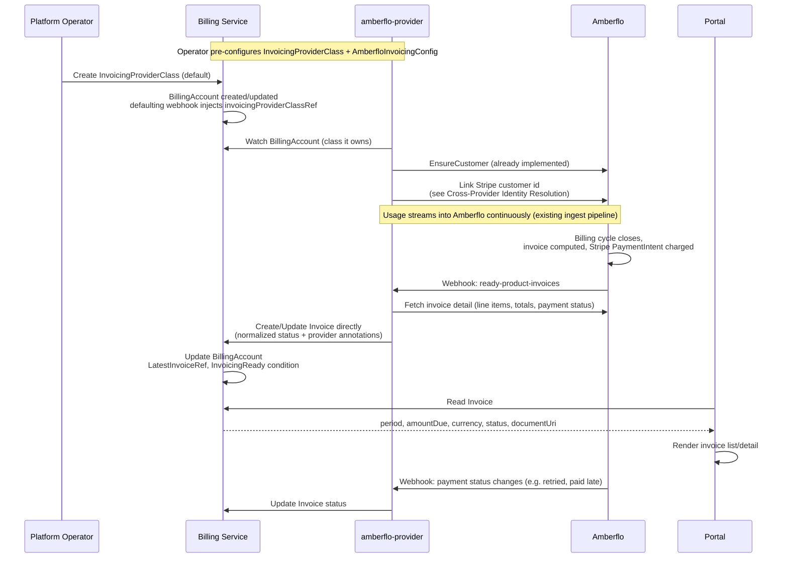

<!-- omit from toc -->
# Invoicing

- [Summary](#summary)
- [Motivation](#motivation)
  - [Goals](#goals)
  - [Non-Goals](#non-goals)
- [Proposal](#proposal)
  - [How It Works](#how-it-works)
  - [User Stories](#user-stories)
  - [Key Capabilities](#key-capabilities)
  - [Notes and Constraints](#notes-and-constraints)
  - [Risks and Mitigations](#risks-and-mitigations)
- [Design Details](#design-details)
  - [Resource Overview](#resource-overview)
  - [InvoicingProviderClass Resource](#invoicingproviderclass-resource)
  - [Invoice Resource](#invoice-resource)
  - [BillingAccount Changes](#billingaccount-changes)
  - [Provider Controller Pattern](#provider-controller-pattern)
  - [Amberflo Reference Implementation](#amberflo-reference-implementation)
  - [Cross-Provider Identity Resolution](#cross-provider-identity-resolution)
  - [Portal Integration](#portal-integration)
  - [Billing Account Side Effects](#billing-account-side-effects)
  - [Ownership and Deletion](#ownership-and-deletion)
  - [RBAC Boundaries](#rbac-boundaries)
- [Implementation History](#implementation-history)
- [Future Work](#future-work)
- [Drawbacks](#drawbacks)
- [Alternatives](#alternatives)
  - [Consumer-Requested Invoice Generation](#consumer-requested-invoice-generation)
  - [Provider-Specific Invoice CRD](#provider-specific-invoice-crd)
  - [Provider Config on InvoicingProviderClass Spec](#provider-config-on-invoicingproviderclass-spec)
  - [BillingAccount Owns Invoice Line Items Directly](#billingaccount-owns-invoice-line-items-directly)
  - [Vendor Customer ID on BillingAccount Status](#vendor-customer-id-on-billingaccount-status)
  - [Billing Service Polls Provider Invoice APIs Directly](#billing-service-polls-provider-invoice-apis-directly)
- [References](#references)

## Summary

This enhancement extends the `parametersRef` pattern from [Payment
Methods][payment-methods] to invoicing: a cluster-scoped
`InvoicingProviderClass` names a provider and points to its config; a
namespace-scoped `Invoice` is the normalized, provider-agnostic record of a
billing period's charges. Amberflo (via the existing `amberflo-provider`
service) is the reference implementation.

Two differences from payment methods: `Invoice` is provider-created, not
consumer-requested — it's created reactively when the provider's own billing
cycle produces an invoice (Amberflo's `ready-product-invoices` webhook), not
in response to a portal action. And there is no intermediate provider-specific
CRD (`AmberfloInvoice`) — the provider controller writes `Invoice` directly.
The `PaymentMethod`/`StripePaymentMethod` split exists to protect a live
credential (a SetupIntent client secret) during an interactive setup flow;
invoicing has neither a live flow nor a credential, so that split isn't earned
here. See [Provider-Specific Invoice CRD](#provider-specific-invoice-crd).

## Motivation

`BillingAccount` already carries what an invoicing provider needs (currency,
payment terms, contact/tax info) and a `DefaultPaymentMethodReady` condition
meant to gate "downstream services (invoicing, charge processing)" — but
nothing defines what those services do with it, or how a backend service can
read invoice state without a provider-specific client. `amberflo-provider`
already syncs `BillingAccount` → Amberflo `Customer` and streams usage;
Amberflo computes invoices from that usage and, per platform decision, charges
the customer directly through its own Stripe integration. Without a shared
pattern, every provider integration invents its own invoice shape and payment
signal.

### Goals

- Introduce `InvoicingProviderClass` (cluster) for operators to select a
  provider and its config, mirroring `PaymentMethodClass`.
- Introduce `Invoice` (namespace) as the normalized record of a billing
  account's invoice for a period, provider-agnostic to callers.
- Define the provider controller pattern for invoice computation and payment
  status without billing-service changes.
- Support Amberflo as the initial provider, writing `Invoice` directly.
- Surface invoicing readiness and latest-invoice status onto `BillingAccount`.
- Document how a provider that delegates charging to its own payment
  integration (Amberflo/Stripe) resolves the vendor customer id it needs,
  given `PaymentMethod` deliberately hides provider identifiers.

### Non-Goals

- Whether a provider must delegate charging to its own integration or drive
  Milo's `PaymentMethod` providers is not mandated — Amberflo does the former
  (see [Notes and Constraints](#notes-and-constraints)); a provider that
  expects Milo to collect payment separately isn't precluded.
- Tax computation, rate cards, pricing, and line-item rating stay entirely the
  provider's responsibility.
- Invoice PDF rendering/storage stays with the provider; `Invoice` only links
  to it.
- Dispute, credit, refund workflows are out of scope.
- Multi-currency reconciliation across providers is out of scope.
- Retry/dunning logic for failed charges is the provider's responsibility.

## Proposal

**`InvoicingProviderClass`** (cluster) names a provider and carries a
`parametersRef` to its config resource — no provider-specific fields itself,
same as `PaymentMethodClass`.

**`Invoice`** (namespace, co-located with its `BillingAccount`) is created and
updated exclusively by the provider controller, never by a consumer or the
portal. Status carries period, totals, currency, due date, payment phase, and
a document link. Vendor identifiers a provider needs for its own
reconciliation (Amberflo's invoice key, a Stripe PaymentIntent id) are carried
as provider-prefixed annotations, not typed fields — Kubernetes' existing
escape hatch for extension data, rather than a second CRD.

### How It Works



**1. Operator configures the class and provider config**, e.g.
`AmberfloInvoicingConfig` (API key/webhook secret refs) and an
`InvoicingProviderClass` naming `amberflo` and annotated as cluster default.

**2. The defaulting webhook injects `invoicingProviderClassRef`** onto every
`BillingAccount` that doesn't specify one, same pattern as
`paymentMethodClassRef` on `PaymentMethod`.

**3. `amberflo-provider` ensures the Amberflo customer is chargeable** —
already implemented via the `BillingAccount` → `Customer` sync, plus linking
the Stripe customer id `stripe-provider` already established (see
[Cross-Provider Identity Resolution](#cross-provider-identity-resolution)).

**4. Amberflo computes and charges the invoice on its own billing cycle**,
opaque to Milo until it notifies `amberflo-provider`.

**5. On the `ready-product-invoices` webhook**, `amberflo-provider` fetches
full invoice detail and writes it directly onto `Invoice`, using a
deterministic name (`<billing-account>-<year>-<month>`) as its idempotency key:

```yaml
apiVersion: billing.miloapis.com/v1alpha1
kind: Invoice
metadata:
  name: acme-billing-2026-06
  namespace: acme-corp
  annotations:
    amberflo.billing.miloapis.com/invoice-uri: "https://app.amberflo.io/invoices/..."
    amberflo.billing.miloapis.com/invoice-key: "accountId=acme-billing,customerId=acme-billing,productId=default,year=2026,month=6"
    stripe.billing.miloapis.com/payment-intent-id: "pi_Abc123"
  ownerReferences:
    - apiVersion: billing.miloapis.com/v1alpha1
      kind: BillingAccount
      name: acme-billing
      controller: false
spec:
  billingAccountRef:
    name: acme-billing
  invoicingProviderClassRef:
    name: amberflo-default
  period:
    start: "2026-06-01T00:00:00Z"
    end: "2026-06-30T23:59:59Z"
status:
  phase: Paid
  currencyCode: USD
  amountDue: "482.19"
  dueDate: "2026-07-15T00:00:00Z"
  paidAt: "2026-07-02T09:14:00Z"
  documentUri: "https://app.amberflo.io/invoices/..."
  conditions:
    - type: Ready
      status: "True"
      reason: Paid
```

No Amberflo- or Stripe-specific identifiers appear in `status` — only
normalized fields, exactly as `PaymentMethod` excludes Stripe identifiers.
Readers that don't recognize a provider's annotation prefix simply ignore it.

**6. The billing service reconciles `BillingAccount`**, updating
`status.latestInvoiceRef` and the `InvoicingReady` condition.

### User Stories

**As a platform operator**, I configure an `InvoicingProviderClass` pointing
to Amberflo, and every `BillingAccount` is automatically invoiced with no
billing-service code depending on Amberflo directly.

**As a backend service author** (financial reporting, support tooling), I read
`Invoice.status.phase`/`amountDue` without a provider-specific client, and my
service is unaffected if the invoicing provider changes.

**As a platform operator**, I read `BillingAccount.status.latestInvoiceRef`
and the `InvoicingReady` condition to identify accounts at risk, without
querying the provider directly.

### Key Capabilities

- **Provider transparency.** `Invoice` is created entirely by the provider
  controller; no billing-service or portal code needs provider knowledge.
- **Operator-controlled provider selection**, mirroring `PaymentMethodClass`.
- **Normalized outcome state** — period, totals, currency, due date, payment
  phase — in a provider-agnostic schema.
- **Provider extensibility without billing-service changes.**
- **Idempotent creation** via deterministic `Invoice` naming.
- **Explicit charge-ownership boundary.** This pattern surfaces invoice/payment
  *status*; it doesn't require the billing service or `stripe-provider` to
  drive the charge. A provider that owns charging end-to-end (Amberflo) and
  one that doesn't are both representable without a schema change.

### Notes and Constraints

- `InvoicingProviderClass` and `Invoice` must reside in the same cluster as
  `BillingAccount`; `Invoice` is namespace-scoped, co-located with it.
- `BillingAccount.spec.invoicingProviderClassRef` is immutable once set, same
  reason as `paymentMethodClassRef`: provider-specific state has already
  accumulated and can't be transparently migrated.
- Only one `InvoicingProviderClass` may be the cluster default.
- **No intermediate provider-specific CRD** — see
  [Provider-Specific Invoice CRD](#provider-specific-invoice-crd).
- **Amberflo owns charging, not `stripe-provider`.** Per platform decision,
  Amberflo charges directly via its own Stripe integration (PaymentIntents).
  `stripe-provider`/`PaymentMethod` are used only to collect and confirm the
  instrument. This is a property of the Amberflo implementation, not a general
  requirement — see [Non-Goals](#non-goals).
- Because of that, Amberflo needs the Stripe customer id `stripe-provider`
  already established, which `PaymentMethod`/`StripePaymentMethod`
  deliberately don't expose generically. Resolved via a narrow, explicit
  exception — see
  [Cross-Provider Identity Resolution](#cross-provider-identity-resolution).

### Risks and Mitigations

| Risk | Mitigation |
|------|------------|
| Duplicate `Invoice` creation from a retried webhook delivery | Deterministic naming from account + period; creation is a no-op update if it already exists |
| Provider webhook delivery failure | Provider controller polls the provider's invoice-list API as a fallback |
| Invoice generated with no active default payment method | Amberflo reports charge failure via its own payment status; `amberflo-provider` surfaces `PastDue` rather than failing the reconcile; `DefaultPaymentMethodReady` remains the pre-flight signal |
| Cross-provider read of `StripePaymentMethod.status.stripeCustomerId` becomes precedent for broader coupling | RBAC grant scoped to one field on one CRD kind, documented per provider pairing, not a generic capability |
| Provider's invoice total diverges from `BillingAccount.spec.currencyCode` | `amberflo-provider` validates currency match and sets a `CurrencyMismatch` condition rather than surfacing a mismatch silently |
| Vendor-identifier annotations edited or stripped by another actor | Provider rewrites them on every reconcile, so drift self-heals |

## Design Details

### Resource Overview

| Resource | Scope | Owner | Purpose |
|---|---|---|---|
| `InvoicingProviderClass` | Cluster | Billing service | Operator-configured provider selector; `parametersRef` to provider config |
| `Invoice` | Namespace | Invoicing provider controller (per class) | Normalized invoice record; vendor identifiers carried as provider-prefixed annotations |
| `AmberfloInvoicingConfig` | Cluster | amberflo-provider | Amberflo-specific config (API key, webhook secret refs) |

`Invoice` is the only invoicing resource consumers and backend services read
directly. Unlike `PaymentMethod`, there is no intermediate provider-specific
resource — the provider controller has create/update access to `Invoice`
itself.

### InvoicingProviderClass Resource

Mirrors `PaymentMethodClass` exactly.

| Field | Type | Description |
|---|---|---|
| `provider` | string | Provider controller name (e.g. `amberflo`) |
| `parametersRef.group/kind/name` | string | Reference to the provider config resource |

A class is the cluster default via
`billing.miloapis.com/is-default-class: "true"`, injected by the defaulting
webhook. Scoped independently from `PaymentMethodClass`'s default — a
deployment's default payment provider and default invoicing provider need not
match.

### Invoice Resource

Namespace-scoped, sharing the `BillingAccount`'s namespace. Created
exclusively by the provider controller.

**Spec:**

| Field | Type | Description |
|---|---|---|
| `billingAccountRef.name` | string | The owning `BillingAccount` |
| `invoicingProviderClassRef.name` | string | Class that produced this invoice; immutable |
| `period.start` / `period.end` | time | Billing period covered |

**Status:**

| Field | Type | Description |
|---|---|---|
| `phase` | enum | `Open`, `Paid`, `PastDue`, `Void` |
| `currencyCode` | string | Must match `BillingAccount.spec.currencyCode` |
| `amountDue` | string | Decimal total due |
| `dueDate` / `paidAt` | time | Due date / payment confirmation time |
| `documentUri` | string | Link to the provider-hosted invoice document |
| `conditions` | list | Includes `CurrencyMismatch` when applicable |
| `observedGeneration` | int | Generation last observed |

Status intentionally excludes line items, tax breakdowns, and vendor
identifiers. Those live in `status.documentUri` (for humans) or
provider-prefixed annotations (e.g. `amberflo.billing.miloapis.com/invoice-key`,
for provider/support tooling) — the typed schema stays limited to what a
provider-agnostic reader needs.

Names are deterministic: `<billing-account-name>-<year>-<month>` (e.g.
`acme-billing-2026-06`), giving the provider a natural idempotency key.

### BillingAccount Changes

`BillingAccountSpec` gains:

| Field | Type | Description |
|---|---|---|
| `invoicingProviderClassRef.name` | string | Injected by the defaulting webhook if unset; immutable once set |

`BillingAccountStatus` gains:

| Field | Type | Description |
|---|---|---|
| `latestInvoiceRef.name` | string | Most recently created `Invoice` |
| Condition `InvoicingReady` | condition | Whether the latest invoice is `Paid`/`Open` (not `PastDue`) |

### Provider Controller Pattern

An invoicing provider controller:

1. Watches `BillingAccount`s whose `spec.invoicingProviderClassRef` names a
   class it owns.
2. Ensures the provider-side customer exists and is chargeable (already
   implemented for Amberflo).
3. Reacts to the provider's invoice-ready signal and fetches full detail.
4. Creates/updates `Invoice` directly — normalized status plus
   provider-prefixed annotations for its own identifiers.
5. Keeps `Invoice` in sync as the payment lifecycle progresses.

RBAC: **read** `InvoicingProviderClass`; **read** `BillingAccount` spec;
**create/update** `Invoice` scoped to classes it owns; **full** access to its
own provider config CRD.

Adding a new provider (e.g. `chargebee-provider`) requires only a new service,
its own config CRD, and a new `InvoicingProviderClass` — no billing service
changes.

### Amberflo Reference Implementation

`amberflo-provider` already reconciles `BillingAccount` → Amberflo `Customer`
and streams usage; this enhancement adds the invoicing side. It introduces one
CRD, `AmberfloInvoicingConfig` (`apiKeySecretRef`, `webhookSecretRef`) — no
`AmberfloInvoice` CRD.

On receiving Amberflo's `ready-product-invoices` webhook, it fetches full
invoice detail and writes:

- **Status:** the normalized `Invoice` fields above.
- **Annotations:** `amberflo.billing.miloapis.com/invoice-uri`,
  `amberflo.billing.miloapis.com/invoice-key` (Amberflo's composite key:
  account/customer/product/plan/year/month/day), and
  `stripe.billing.miloapis.com/payment-intent-id` — for `amberflo-provider`'s
  own reconciliation and support debugging; no other consumer is expected to
  parse them.

It also polls Amberflo's invoice-list API on an interval as a fallback for
missed webhooks, consistent with `stripe-provider`'s existing polling fallback.

### Cross-Provider Identity Resolution

Because Amberflo charges directly, it must charge the same Stripe instrument
already confirmed via `stripe-provider`, not a Stripe customer of its own.
This requires reading `StripePaymentMethod.status.stripeCustomerId`, a field
owned by a different provider service — a deliberate, narrow exception to
`PaymentMethod`'s isolation, not a generic mechanism:

- `amberflo-provider` gets read-only RBAC on exactly that one field, not
  general read access to `stripe-provider`'s CRDs.
- Lookup path: `BillingAccount.spec.defaultPaymentMethodRef` → `PaymentMethod`
  (must be `Active`) → its owned `StripePaymentMethod` child →
  `status.stripeCustomerId`.
- Only performed when `BillingAccount.status.DefaultPaymentMethodReady` is
  `True`. Until then, Amberflo customers have no linked Stripe customer
  (`autoCreateCustomerInStripe: false`, current behavior) and can't be
  charged — surfaced as `PastDue`.
- Specific to the Amberflo↔Stripe pairing, not generalized. If a second
  provider needs the same pattern, revisit whether a well-known field belongs
  on `PaymentMethod` instead — see [Future Work](#future-work).

### Portal Integration

The portal reads `Invoice` directly — no provider discovery or SDK loading,
since invoices are read-only projections, not an interactive flow.

| Purpose | Resource | Fields |
|---|---|---|
| List invoices | `Invoice` (list, scoped to namespace) | `spec.period`, `status.phase`, `status.amountDue`, `status.currencyCode` |
| View/download | `Invoice` | `status.documentUri` |
| Invoicing health | `BillingAccount` | `status.latestInvoiceRef`, `InvoicingReady` |

The portal has no need to read `InvoicingProviderClass` or
`AmberfloInvoicingConfig`, and shouldn't rely on `Invoice`'s provider-prefixed
annotations — those are reconciliation/debug data, not a stable UI contract.

### Billing Account Side Effects

The billing service watches `Invoice` and reconciles the owning
`BillingAccount`, mirroring the `DefaultPaymentMethodReady` pattern.

| Reason | Status | Meaning |
|---|---|---|
| `NoInvoicesYet` | `True` | No `Invoice` created yet; not a problem |
| `Current` | `True` | Latest `Invoice` is `Open` or `Paid` |
| `PastDue` | `False` | Latest `Invoice` is `PastDue` |

`InvoicingReady` doesn't affect `BillingAccount` phase — it's a health signal
downstream consumers gate on, not a lifecycle failure. Whether sustained
`PastDue` should drive suspension is a policy decision for a separate
enhancement.

### Ownership and Deletion

`Invoice` carries a non-controller `ownerReference` to `BillingAccount` (not
`controller: true`, since an account accumulates many invoices). Deleting a
`BillingAccount` cascades deletion of its `Invoice` history — consistent with
Amberflo's own soft-delete behavior, which preserves invoice history even when
the Milo-side account is archived (`AllowCustomerDelete` defaults to `false`
in `amberflo-provider` for this reason). Archiving, not deleting, is the
expected path for accounts that need to retain invoice history.

`Invoice` isn't independently deletable by consumers — only the billing
service and the owning provider controller may delete it, enforced by RBAC
since there's no consumer-facing creation path to guard symmetrically.

### RBAC Boundaries

| Service | Resource | Access |
|---|---|---|
| Billing service | `InvoicingProviderClass` | Read (defaulting webhook) |
| Billing service | `Invoice` | Read (reconciles `BillingAccount` from it) |
| Billing service | `BillingAccount` | Full |
| Billing service | Provider config CRDs | None |
| amberflo-provider | `InvoicingProviderClass` | Read |
| amberflo-provider | `BillingAccount` spec | Read |
| amberflo-provider | `Invoice` | Create, Update, scoped to classes it reconciles |
| amberflo-provider | `AmberfloInvoicingConfig` | Full |
| amberflo-provider | `PaymentMethod` | Read |
| amberflo-provider | `StripePaymentMethod.status.stripeCustomerId` | Read (narrow, see above) |
| Portal | `Invoice`, `BillingAccount` | Read |
| Portal | `InvoicingProviderClass`, `AmberfloInvoicingConfig` | None |

The `StripePaymentMethod` read grant is the only cross-provider RBAC grant in
this design, and it's scoped to a single field.

## Implementation History

- 2026-07-17: Enhancement drafted.
- 2026-07-17: Revised to drop the provider-specific `AmberfloInvoice` CRD;
  `amberflo-provider` writes `Invoice` directly, with vendor identifiers as
  annotations.
- 2026-07-17: Renamed from "Invoicing Providers" to "Invoicing".

## Future Work

- **Additional invoicing providers** — new provider service + config CRD +
  `InvoicingProviderClass`, no billing service changes.
- **Provider-agnostic external-reference mechanism** — if a second invoicing
  provider needs to resolve a payment provider's vendor customer id, revisit
  whether a well-known field belongs on `PaymentMethod` status instead of
  one-off RBAC grants.
- **Invoice line-item detail** — a normalized line-item schema, if backend
  services need it, balanced against keeping `Invoice` provider-agnostic.
- **Suspension policy on sustained `PastDue`** — a dedicated enhancement.
- **Reconciliation job for provider/payment divergence** — compare Amberflo's
  reported payment status against Stripe's own record, surfacing a condition
  rather than trusting the webhook blindly.

## Drawbacks

Adding an invoicing provider requires shipping a new service with its own
config CRD and RBAC grants, same as payment providers — not a runtime-only
change.

The cross-provider RBAC grant for Amberflo to resolve a Stripe customer id is
a real crack in `PaymentMethod`'s provider-isolation guarantee. It's an
explicit, narrow, documented exception, not a resolved design — a second
consumer of the same pattern should prompt revisiting it.

Carrying vendor identifiers as annotations rather than a typed CRD trades away
schema validation and discoverability — no `kubectl explain`, and a malformed
annotation fails silently rather than being rejected by the API server. An
accepted tradeoff given invoicing has no interactive flow to protect, but a
real cost compared to the payment methods pattern.

## Alternatives

### Consumer-Requested Invoice Generation

An earlier framing modeled `Invoice` like `PaymentMethod` — created by the
portal to request generation. Rejected: invoicing providers run their own
billing cycles on their own schedule, and Milo has no way to force Amberflo to
generate an invoice on demand. Provider-created, reactive to the provider's
own signal, matches the actual control flow.

### Provider-Specific Invoice CRD

The initial draft mirrored `PaymentMethod`/`StripePaymentMethod` exactly, with
a provider-owned `AmberfloInvoice` storing all identifiers. Reconsidered and
rejected: that split is earned for payment methods by a live, credential-
bearing setup flow (the SetupIntent `clientSecret`) that invoicing has no
equivalent of — `amberflo-provider` is reporting facts about an already-closed
billing cycle, not driving an interactive session. A second CRD is a heavier
mechanism than the problem calls for when annotations already serve as
Kubernetes' extension-data escape hatch, and it adds an RBAC surface and a
reconcile loop for a provider that nothing ever reads mid-flow. A future
provider with a genuine credential-bearing invoicing flow can still introduce
its own provider CRD without changing this decision for Amberflo.

### Provider Config on InvoicingProviderClass Spec

Rejected for the same reason as `PaymentMethodClass`: typed, provider-specific
sub-objects on the class spec would turn it into a registry of every provider
ever supported, requiring a schema change per provider. `parametersRef` keeps
the class shape-stable.

### BillingAccount Owns Invoice Line Items Directly

Considered surfacing invoice totals/line items on `BillingAccount.status`
directly. Rejected: an account accumulates many invoices over its lifetime,
and status isn't a home for an unboundedly growing list — a separate,
listable resource per invoice is the correct shape.

### Vendor Customer ID on BillingAccount Status

To solve the Amberflo/Stripe identity problem, considered exposing
`stripeCustomerId` (or an opaque `externalReferences` map) on
`BillingAccount.status`. Rejected for the same reason `PaymentMethod` excludes
Stripe identifiers: `BillingAccount` is read by every backend service, and
leaking a provider identifier onto it — even "opaquely" — reintroduces the
leakage the payment methods design avoided. A narrow RBAC grant between the
two specific CRDs that need it is a smaller blast radius.

### Billing Service Polls Provider Invoice APIs Directly

Considered having the billing service call Amberflo's invoice API directly.
Rejected for the same reason Stripe was kept out of the billing service: it
makes the billing service responsible for provider-specific credentials,
webhooks, and rate limits, and blocks changing providers without a billing
service release.

## References

[billing-account]: ../../api/v1alpha1/billingaccount_types.go
[payment-methods]: ./payment-methods.md
[amberflo-provider]: https://github.com/milo-os/amberflo-provider
