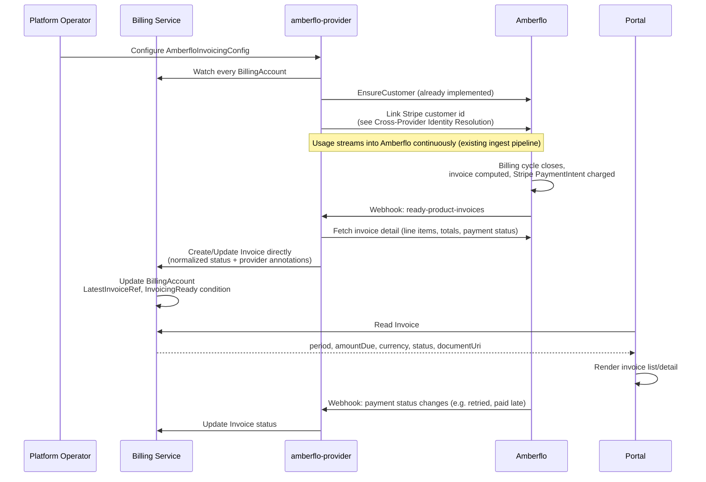

<!-- omit from toc -->
# Invoicing

- [Summary](#summary)
- [Motivation](#motivation)
  - [Goals](#goals)
  - [Non-Goals](#non-goals)
- [Proposal](#proposal)
  - [How It Works](#how-it-works)
  - [User Stories](#user-stories)
  - [Key Capabilities](#key-capabilities)
  - [Notes and Constraints](#notes-and-constraints)
  - [Risks and Mitigations](#risks-and-mitigations)
- [Design Details](#design-details)
  - [Resource Overview](#resource-overview)
  - [Invoice Resource](#invoice-resource)
  - [BillingAccount Changes](#billingaccount-changes)
  - [Amberflo Implementation](#amberflo-implementation)
  - [Cross-Provider Identity Resolution](#cross-provider-identity-resolution)
  - [Portal Integration](#portal-integration)
  - [Billing Account Side Effects](#billing-account-side-effects)
  - [Ownership and Deletion](#ownership-and-deletion)
  - [RBAC Boundaries](#rbac-boundaries)
- [Implementation History](#implementation-history)
- [Future Work](#future-work)
- [Drawbacks](#drawbacks)
- [Alternatives](#alternatives)
  - [Consumer-Requested Invoice Generation](#consumer-requested-invoice-generation)
  - [Provider-Specific Invoice CRD](#provider-specific-invoice-crd)
  - [Generic InvoicingProviderClass](#generic-invoicingproviderclass)
  - [BillingAccount Owns Invoice Line Items Directly](#billingaccount-owns-invoice-line-items-directly)
  - [Vendor Customer ID on BillingAccount Status](#vendor-customer-id-on-billingaccount-status)
  - [Billing Service Polls Provider Invoice APIs Directly](#billing-service-polls-provider-invoice-apis-directly)
- [References](#references)

## Summary

Amberflo computes invoices for `BillingAccount`s from metered usage and, per
platform decision, charges customers directly through its own Stripe
integration. Right now that entire process is invisible to Milo — nobody but
Amberflo knows whether an account is paid up. This enhancement introduces
`Invoice`, a namespace-scoped resource that `amberflo-provider` writes
directly as invoices are computed, so the portal, support, and finance tooling
can see a billing account's invoice history and payment status without
talking to Amberflo's API.

There's no provider-selection layer here — `amberflo-provider` is the only
invoicing integration in the cluster, and it reconciles every `BillingAccount`
unconditionally. That matches reality: usage metering is already
single-sourced to Amberflo, so there's nothing to route between today. If a
second invoicing provider ever becomes real, a selection mechanism can be
introduced then — see [Generic InvoicingProviderClass](#generic-invoicingproviderclass).

## Motivation

`BillingAccount` already carries what Amberflo needs to invoice an account
(currency, payment terms, contact/tax info) and a `DefaultPaymentMethodReady`
condition meant to gate "downstream services (invoicing, charge processing)."
But nothing today tells a billing account owner, support engineer, or finance
system whether an account's latest invoice was paid, is overdue, or was even
generated — that state exists only inside Amberflo. `amberflo-provider`
already syncs `BillingAccount` → Amberflo `Customer` and streams usage;
Amberflo computes invoices from that usage and charges the customer. This
enhancement closes the loop by surfacing that result back onto the platform.

### Goals

- Introduce `Invoice`, the record of a billing account's invoice for a
  period, readable without an Amberflo-specific client.
- Implement this for Amberflo: `amberflo-provider` writes `Invoice` directly
  from Amberflo's `ready-product-invoices` webhook.
- Surface invoicing readiness and latest-invoice status onto `BillingAccount`,
  so account health is visible without querying Amberflo.
- Document how `amberflo-provider` resolves the Stripe customer id it needs
  to charge the same instrument already collected via `stripe-provider`,
  given `PaymentMethod` deliberately hides provider identifiers.

### Non-Goals

- Supporting multiple simultaneous invoicing providers is out of scope. This
  assumes a single invoicing provider per cluster; see
  [Generic InvoicingProviderClass](#generic-invoicingproviderclass).
- Tax computation, rate cards, pricing, and line-item rating stay entirely
  Amberflo's responsibility.
- Invoice PDF rendering/storage stays with Amberflo; `Invoice` only links to
  it.
- Dispute, credit, and refund workflows are out of scope.
- Multi-currency reconciliation is out of scope.
- Retry/dunning logic for failed charges is Amberflo's responsibility.

## Proposal

**`Invoice`** (namespace, co-located with its `BillingAccount`) is created and
updated exclusively by `amberflo-provider`, never by a consumer or the portal.
Status carries period, totals, currency, due date, payment phase, and a
document link. Vendor identifiers Amberflo needs for its own reconciliation
(its invoice key, a Stripe PaymentIntent id) are carried as provider-prefixed
annotations, not typed fields — Kubernetes' existing escape hatch for
extension data, rather than a second CRD (see
[Provider-Specific Invoice CRD](#provider-specific-invoice-crd)).

### How It Works



**1. Operator configures Amberflo credentials** via a single
`AmberfloInvoicingConfig` (API key/webhook secret refs) — no provider
selection to configure, since `amberflo-provider` handles every account.

**2. `amberflo-provider` ensures the Amberflo customer is chargeable** —
already implemented via the `BillingAccount` → `Customer` sync, plus linking
the Stripe customer id `stripe-provider` already established (see
[Cross-Provider Identity Resolution](#cross-provider-identity-resolution)).

**3. Amberflo computes and charges the invoice on its own billing cycle**,
opaque to Milo until it notifies `amberflo-provider`.

**4. On the `ready-product-invoices` webhook**, `amberflo-provider` fetches
full invoice detail and writes it directly onto `Invoice`, using a
deterministic name (`<billing-account>-<year>-<month>`) as its idempotency key:

```yaml
apiVersion: billing.miloapis.com/v1alpha1
kind: Invoice
metadata:
  name: acme-billing-2026-06
  namespace: acme-corp
  annotations:
    amberflo.billing.miloapis.com/invoice-uri: "https://app.amberflo.io/invoices/..."
    amberflo.billing.miloapis.com/invoice-key: "accountId=acme-billing,customerId=acme-billing,productId=default,year=2026,month=6"
    stripe.billing.miloapis.com/payment-intent-id: "pi_Abc123"
  ownerReferences:
    - apiVersion: billing.miloapis.com/v1alpha1
      kind: BillingAccount
      name: acme-billing
      controller: false
spec:
  billingAccountRef:
    name: acme-billing
  period:
    start: "2026-06-01T00:00:00Z"
    end: "2026-06-30T23:59:59Z"
status:
  phase: Paid
  currencyCode: USD
  amountDue: "482.19"
  dueDate: "2026-07-15T00:00:00Z"
  paidAt: "2026-07-02T09:14:00Z"
  documentUri: "https://app.amberflo.io/invoices/..."
  conditions:
    - type: Ready
      status: "True"
      reason: Paid
```

No Amberflo- or Stripe-specific identifiers appear in `status` — only
normalized fields, exactly as `PaymentMethod` excludes Stripe identifiers.
Readers that don't recognize the annotation prefix simply ignore it.

**5. The billing service reconciles `BillingAccount`**, updating
`status.latestInvoiceRef` and the `InvoicingReady` condition.

### User Stories

**As a billing account owner**, I want to see whether my account is current
on its invoices in the portal, without knowing anything about Amberflo.

**As a support or finance user**, I want to check
`BillingAccount.status.latestInvoiceRef`/`InvoicingReady` to tell whether an
account is at risk, without Amberflo credentials or a support runbook that
logs into Amberflo's dashboard.

**As a backend service author**, I want to read `Invoice.status.phase`/
`amountDue` without an Amberflo-specific client, so my service keeps working
if the invoicing integration changes.

### Key Capabilities

- **Invoice and payment visibility without Amberflo access.** Anyone reading
  `BillingAccount`/`Invoice` gets accurate status without Amberflo
  credentials or API calls.
- **Normalized outcome state** — period, totals, currency, due date, payment
  phase — in a schema that doesn't require Amberflo-specific knowledge.
- **Idempotent creation** via deterministic `Invoice` naming.
- **Explicit charge-ownership boundary.** This pattern surfaces invoice/payment
  *status*; it doesn't require the billing service or `stripe-provider` to
  drive the charge — Amberflo does that on its own.

### Notes and Constraints

- `Invoice` must reside in the same cluster and namespace as its
  `BillingAccount`.
- This design assumes a single invoicing provider is active per cluster.
  `amberflo-provider` reconciles every `BillingAccount` unconditionally —
  there's no per-account provider selection to configure or default. See
  [Generic InvoicingProviderClass](#generic-invoicingproviderclass) for why
  that indirection is deferred rather than built now.
- **No intermediate provider-specific CRD** — see
  [Provider-Specific Invoice CRD](#provider-specific-invoice-crd).
- **Amberflo owns charging, not `stripe-provider`.** Per platform decision,
  Amberflo charges directly via its own Stripe integration (PaymentIntents).
  `stripe-provider`/`PaymentMethod` are used only to collect and confirm the
  instrument.
- Because of that, Amberflo needs the Stripe customer id `stripe-provider`
  already established, which `PaymentMethod`/`StripePaymentMethod`
  deliberately don't expose generically. Resolved via a narrow, explicit
  exception — see
  [Cross-Provider Identity Resolution](#cross-provider-identity-resolution).

### Risks and Mitigations

| Risk | Mitigation |
|------|------------|
| Duplicate `Invoice` creation from a retried webhook delivery | Deterministic naming from account + period; creation is a no-op update if it already exists |
| Provider webhook delivery failure | `amberflo-provider` polls Amberflo's invoice-list API as a fallback |
| Invoice generated with no active default payment method | Amberflo reports charge failure via its own payment status; `amberflo-provider` surfaces `PastDue` rather than failing the reconcile; `DefaultPaymentMethodReady` remains the pre-flight signal |
| Cross-provider read of `StripePaymentMethod.status.stripeCustomerId` becomes precedent for broader coupling | RBAC grant scoped to one field on one CRD kind, documented explicitly, not a generic capability |
| Provider's invoice total diverges from `BillingAccount.spec.currencyCode` | `amberflo-provider` validates currency match and sets a `CurrencyMismatch` condition rather than surfacing a mismatch silently |
| Vendor-identifier annotations edited or stripped by another actor | `amberflo-provider` rewrites them on every reconcile, so drift self-heals |

## Design Details

### Resource Overview

| Resource | Scope | Owner | Purpose |
|---|---|---|---|
| `Invoice` | Namespace | amberflo-provider | Normalized invoice record; vendor identifiers carried as provider-prefixed annotations |
| `AmberfloInvoicingConfig` | Cluster | amberflo-provider | Amberflo-specific config (API key, webhook secret refs) |

`Invoice` is the only invoicing resource consumers and backend services read
directly.

### Invoice Resource

Namespace-scoped, sharing the `BillingAccount`'s namespace. Created
exclusively by `amberflo-provider`.

**Spec:**

| Field | Type | Description |
|---|---|---|
| `billingAccountRef.name` | string | The owning `BillingAccount` |
| `period.start` / `period.end` | time | Billing period covered |

**Status:**

| Field | Type | Description |
|---|---|---|
| `phase` | enum | `Open`, `Paid`, `PastDue`, `Void` |
| `currencyCode` | string | Must match `BillingAccount.spec.currencyCode` |
| `amountDue` | string | Decimal total due |
| `dueDate` / `paidAt` | time | Due date / payment confirmation time |
| `documentUri` | string | Link to the provider-hosted invoice document |
| `conditions` | list | Includes `CurrencyMismatch` when applicable |
| `observedGeneration` | int | Generation last observed |

Status intentionally excludes line items, tax breakdowns, and vendor
identifiers. Those live in `status.documentUri` (for humans) or
provider-prefixed annotations (for provider/support tooling) — the typed
schema stays limited to what any reader needs.

Names are deterministic: `<billing-account-name>-<year>-<month>` (e.g.
`acme-billing-2026-06`), giving the provider a natural idempotency key.

### BillingAccount Changes

`BillingAccountStatus` gains:

| Field | Type | Description |
|---|---|---|
| `latestInvoiceRef.name` | string | Most recently created `Invoice` |
| Condition `InvoicingReady` | condition | Whether the latest invoice is `Paid`/`Open` (not `PastDue`) |

No spec changes — there's no provider to select.

### Amberflo Implementation

`amberflo-provider` already reconciles `BillingAccount` → Amberflo `Customer`
and streams usage; this enhancement adds the invoicing side. It:

1. Watches every `BillingAccount` in the cluster.
2. Ensures the Amberflo customer exists and is chargeable (already
   implemented), linking the Stripe customer id (see
   [Cross-Provider Identity Resolution](#cross-provider-identity-resolution)).
3. On Amberflo's `ready-product-invoices` webhook, fetches full invoice
   detail and writes it directly onto `Invoice` — normalized status plus
   provider-prefixed annotations for its own identifiers.
4. Keeps `Invoice` in sync as the payment lifecycle progresses (e.g. a charge
   retried after initial failure).
5. Polls Amberflo's invoice-list API on an interval as a fallback for missed
   webhooks, consistent with `stripe-provider`'s existing polling fallback.

It introduces one CRD, `AmberfloInvoicingConfig` (`apiKeySecretRef`,
`webhookSecretRef`) — no `AmberfloInvoice` CRD.

RBAC: **read** `BillingAccount` spec (cluster-wide); **create/update**
`Invoice` (cluster-wide); **full** access to `AmberfloInvoicingConfig`.

### Cross-Provider Identity Resolution

Because Amberflo charges directly, it must charge the same Stripe instrument
already confirmed via `stripe-provider`, not a Stripe customer of its own.
This requires reading `StripePaymentMethod.status.stripeCustomerId`, a field
owned by a different provider service — a deliberate, narrow exception to
`PaymentMethod`'s isolation, not a generic mechanism:

- `amberflo-provider` gets read-only RBAC on exactly that one field, not
  general read access to `stripe-provider`'s CRDs.
- Lookup path: `BillingAccount.spec.defaultPaymentMethodRef` → `PaymentMethod`
  (must be `Active`) → its owned `StripePaymentMethod` child →
  `status.stripeCustomerId`.
- Only performed when `BillingAccount.status.DefaultPaymentMethodReady` is
  `True`. Until then, Amberflo customers have no linked Stripe customer
  (`autoCreateCustomerInStripe: false`, current behavior) and can't be
  charged — surfaced as `PastDue`.
- Specific to the Amberflo↔Stripe pairing, not generalized. If a second
  provider needs the same pattern, revisit whether a well-known field belongs
  on `PaymentMethod` instead — see [Future Work](#future-work).

### Portal Integration

The portal reads `Invoice` directly — no provider discovery or SDK loading,
since invoices are read-only projections, not an interactive flow.

| Purpose | Resource | Fields |
|---|---|---|
| List invoices | `Invoice` (list, scoped to namespace) | `spec.period`, `status.phase`, `status.amountDue`, `status.currencyCode` |
| View/download | `Invoice` | `status.documentUri` |
| Invoicing health | `BillingAccount` | `status.latestInvoiceRef`, `InvoicingReady` |

The portal shouldn't rely on `Invoice`'s provider-prefixed annotations —
those are reconciliation/debug data, not a stable UI contract.

### Billing Account Side Effects

The billing service watches `Invoice` and reconciles the owning
`BillingAccount`, mirroring the `DefaultPaymentMethodReady` pattern.

| Reason | Status | Meaning |
|---|---|---|
| `NoInvoicesYet` | `True` | No `Invoice` created yet; not a problem |
| `Current` | `True` | Latest `Invoice` is `Open` or `Paid` |
| `PastDue` | `False` | Latest `Invoice` is `PastDue` |

`InvoicingReady` doesn't affect `BillingAccount` phase — it's a health signal
downstream consumers gate on, not a lifecycle failure. Whether sustained
`PastDue` should drive suspension is a policy decision for a separate
enhancement.

### Ownership and Deletion

`Invoice` carries a non-controller `ownerReference` to `BillingAccount` (not
`controller: true`, since an account accumulates many invoices). Deleting a
`BillingAccount` cascades deletion of its `Invoice` history — consistent with
Amberflo's own soft-delete behavior, which preserves invoice history even when
the Milo-side account is archived (`AllowCustomerDelete` defaults to `false`
in `amberflo-provider` for this reason). Archiving, not deleting, is the
expected path for accounts that need to retain invoice history.

`Invoice` isn't independently deletable by consumers — only the billing
service and `amberflo-provider` may delete it, enforced by RBAC since there's
no consumer-facing creation path to guard symmetrically.

### RBAC Boundaries

| Service | Resource | Access |
|---|---|---|
| Billing service | `Invoice` | Read (reconciles `BillingAccount` from it) |
| Billing service | `BillingAccount` | Full |
| Billing service | `AmberfloInvoicingConfig` | None |
| amberflo-provider | `BillingAccount` spec | Read (all accounts) |
| amberflo-provider | `Invoice` | Create, Update (all accounts) |
| amberflo-provider | `AmberfloInvoicingConfig` | Full |
| amberflo-provider | `PaymentMethod` | Read |
| amberflo-provider | `StripePaymentMethod.status.stripeCustomerId` | Read (narrow, see above) |
| Portal | `Invoice`, `BillingAccount` | Read |
| Portal | `AmberfloInvoicingConfig` | None |

The `StripePaymentMethod` read grant is the only cross-provider RBAC grant in
this design, and it's scoped to a single field.

## Implementation History

- 2026-07-17: Enhancement drafted.
- 2026-07-17: Revised to drop the provider-specific `AmberfloInvoice` CRD;
  `amberflo-provider` writes `Invoice` directly, with vendor identifiers as
  annotations.
- 2026-07-17: Renamed from "Invoicing Providers" to "Invoicing".
- 2026-07-17: Dropped `InvoicingProviderClass` and
  `BillingAccount.spec.invoicingProviderClassRef` — no realistic need for
  multiple simultaneous invoicing providers; `amberflo-provider` reconciles
  every `BillingAccount` directly.

## Future Work

- **Multi-provider invoicing.** If a second invoicing provider is ever
  needed, introduce a selection mechanism (an `InvoicingProviderClass`-style
  `parametersRef` indirection, mirroring `PaymentMethodClass`) at that point
  rather than now.
- **Provider-agnostic external-reference mechanism.** If a second invoicing
  provider needs to resolve a payment provider's vendor customer id, revisit
  whether a well-known field belongs on `PaymentMethod` status instead of
  one-off RBAC grants.
- **Invoice line-item detail.** A normalized line-item schema, if backend
  services need it, balanced against keeping `Invoice` provider-agnostic.
- **Suspension policy on sustained `PastDue`** — a dedicated enhancement.
- **Reconciliation job for provider/payment divergence.** Compare Amberflo's
  reported payment status against Stripe's own record, surfacing a condition
  rather than trusting the webhook blindly.

## Drawbacks

The cross-provider RBAC grant for Amberflo to resolve a Stripe customer id is
a real crack in `PaymentMethod`'s provider-isolation guarantee. It's an
explicit, narrow, documented exception, not a resolved design — a second
consumer of the same pattern should prompt revisiting it.

Carrying vendor identifiers as annotations rather than a typed CRD trades away
schema validation and discoverability — no `kubectl explain`, and a malformed
annotation fails silently rather than being rejected by the API server. An
accepted tradeoff given invoicing has no interactive flow to protect.

Assuming a single invoicing provider means a future second provider requires
a real migration — introducing a selection mechanism and back-filling which
provider owns which existing `BillingAccount` — rather than slotting in via
configuration alone. Given there's no concrete second provider today, this is
judged a better tradeoff than building and maintaining unused indirection.

## Alternatives

### Consumer-Requested Invoice Generation

An earlier framing modeled `Invoice` like `PaymentMethod` — created by the
portal to request generation. Rejected: invoicing providers run their own
billing cycles on their own schedule, and Milo has no way to force Amberflo to
generate an invoice on demand. Provider-created, reactive to the provider's
own signal, matches the actual control flow.

### Provider-Specific Invoice CRD

An earlier draft mirrored `PaymentMethod`/`StripePaymentMethod` exactly, with
a provider-owned `AmberfloInvoice` storing all identifiers. Rejected: that
split is earned for payment methods by a live, credential-bearing setup flow
(the SetupIntent `clientSecret`) that invoicing has no equivalent of —
`amberflo-provider` is reporting facts about an already-closed billing cycle.
A second CRD is a heavier mechanism than the problem calls for when
annotations already serve as Kubernetes' extension-data escape hatch.

### Generic InvoicingProviderClass

An earlier draft introduced `InvoicingProviderClass`, mirroring
`PaymentMethodClass`'s `parametersRef` pattern, so a `BillingAccount` could be
routed to a specific invoicing provider. Rejected: `PaymentMethodClass` earns
its complexity by routing anonymous, consumer-created `PaymentMethod`
requests to a provider without leaking provider vocabulary into what the
consumer creates. `Invoice` is never consumer-created, so there's no request
to route. The remaining justification — supporting multiple invoicing
providers active in the same cluster at once — isn't realistic today: usage
metering is already single-sourced to Amberflo, so there's nothing to route
between. A cluster-wide provider swap doesn't need per-account routing either
— a new provider service just starts covering every account. Building the
indirection now would be complexity carried for a scenario with no concrete
driver; it can be introduced when a second provider is real (see
[Future Work](#future-work)).

### BillingAccount Owns Invoice Line Items Directly

Considered surfacing invoice totals/line items on `BillingAccount.status`
directly. Rejected: an account accumulates many invoices over its lifetime,
and status isn't a home for an unboundedly growing list — a separate,
listable resource per invoice is the correct shape.

### Vendor Customer ID on BillingAccount Status

To solve the Amberflo/Stripe identity problem, considered exposing
`stripeCustomerId` (or an opaque `externalReferences` map) on
`BillingAccount.status`. Rejected for the same reason `PaymentMethod` excludes
Stripe identifiers: `BillingAccount` is read by every backend service, and
leaking a provider identifier onto it — even "opaquely" — reintroduces the
leakage the payment methods design avoided. A narrow RBAC grant between the
two specific CRDs that need it is a smaller blast radius.

### Billing Service Polls Provider Invoice APIs Directly

Considered having the billing service call Amberflo's invoice API directly.
Rejected for the same reason Stripe was kept out of the billing service: it
makes the billing service responsible for provider-specific credentials,
webhooks, and rate limits, and blocks changing providers without a billing
service release.

## References

[billing-account]: ../../api/v1alpha1/billingaccount_types.go
[payment-methods]: ./payment-methods.md
[amberflo-provider]: https://github.com/milo-os/amberflo-provider
