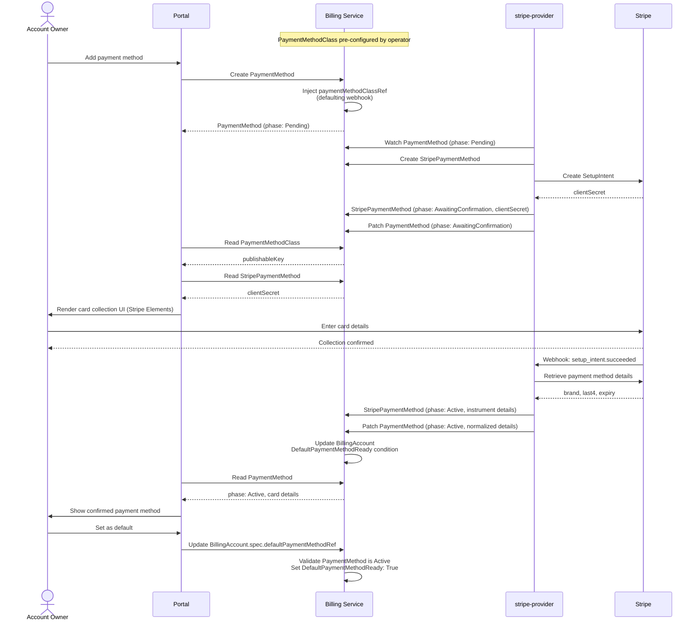

<!-- omit from toc -->
# Payment Methods

- [Summary](#summary)
- [Motivation](#motivation)
  - [Goals](#goals)
  - [Non-Goals](#non-goals)
- [Proposal](#proposal)
  - [How It Works](#how-it-works)
  - [User Stories](#user-stories)
  - [Key Capabilities](#key-capabilities)
  - [Notes and Constraints](#notes-and-constraints)
  - [Risks and Mitigations](#risks-and-mitigations)
- [Design Details](#design-details)
  - [Resource Overview](#resource-overview)
  - [PaymentMethodClass Resource](#paymentmethodclass-resource)
  - [PaymentMethod Resource](#paymentmethod-resource)
  - [Provider Controller Pattern](#provider-controller-pattern)
  - [Stripe Reference Implementation](#stripe-reference-implementation)
  - [Portal Integration](#portal-integration)
  - [Default Payment Method](#default-payment-method)
  - [Billing Account Side Effects](#billing-account-side-effects)
  - [Ownership and Deletion](#ownership-and-deletion)
  - [RBAC Boundaries](#rbac-boundaries)
- [Implementation History](#implementation-history)
- [Future Work](#future-work)
- [Drawbacks](#drawbacks)
- [Alternatives](#alternatives)
  - [Provider Field as Enum on PaymentMethod](#provider-field-as-enum-on-paymentmethod)
  - [Single CRD with Provider Config](#single-crd-with-provider-config)
  - [Billing Service Owns All Provider Integrations](#billing-service-owns-all-provider-integrations)
  - [Generic Setup Token on PaymentMethod Status](#generic-setup-token-on-paymentmethod-status)
- [References](#references)

## Summary

Payment methods enable billing accounts to be associated with a payment
instrument so that charges can be processed on their behalf. This enhancement
introduces three cooperating resources: a cluster-scoped `PaymentMethodClass`
configured by operators that selects a provider and carries its SDK
configuration; a namespace-scoped `PaymentMethod` that consumers create to
associate a payment instrument with a billing account; and a provider-specific
resource (e.g. `StripePaymentMethod`) owned by the provider controller that
drives the collection flow and stores all provider-specific state.

Stripe is the reference implementation. The design is intentionally extensible:
adding a new payment provider requires no changes to the billing service or the
`PaymentMethod` API.

## Motivation

[`BillingAccount`][billing-account] represents the entity responsible for paying
for service consumption. Today, there is no way to associate a payment instrument
with a billing account — nothing connects a billing account to an actual charge
mechanism.

Without payment methods, the billing service cannot process charges, generate
invoices backed by a real payment source, or communicate to an external billing
provider which instrument to debit. Every provider integration that is built
without a shared pattern will make different choices about how to store provider
identifiers, how to drive the collection flow, and what data to surface back to
the platform — resulting in inconsistency as providers are added over time.

### Goals

- Introduce a `PaymentMethodClass` resource that operators configure to select a
  payment provider and carry its SDK configuration.
- Introduce a `PaymentMethod` resource that consumers use to associate a payment
  instrument with a billing account, without requiring knowledge of the
  underlying provider.
- Define a pattern for provider-specific controller services that own the
  collection and confirmation lifecycle without modifying the billing service.
- Support Stripe as the initial provider via a `stripe-provider` service and a
  `StripePaymentMethod` CRD.
- Allow the portal to drive the provider-specific collection UI using
  configuration read from `PaymentMethodClass`, while reading normalized outcome
  state from the generic `PaymentMethod` resource.
- Enable billing accounts to designate a default payment method for charge
  processing.

### Non-Goals

- Charge processing and invoice generation are out of scope for this enhancement.
- Support for multiple simultaneous active providers is not addressed; one
  `PaymentMethodClass` is designated as the cluster default per deployment.
- Payment method update flows (e.g. updating an expiring card) are deferred to a
  follow-on enhancement.
- Subscription or recurring billing schedules are out of scope.

## Proposal

Two new resources are introduced in the `billing.miloapis.com` API group:

**`PaymentMethodClass`** is a cluster-scoped resource configured by platform
operators. It names the payment provider responsible for handling payment methods
of that class and carries any provider-specific configuration the portal needs to
initialize the collection SDK (e.g. the Stripe publishable key). Consumers never
interact with `PaymentMethodClass` directly — the billing service defaulting
webhook injects the cluster default class into any `PaymentMethod` at creation
time.

**`PaymentMethod`** is a namespace-scoped resource consumers create to associate
a payment instrument with a billing account. Its spec carries only a billing
account reference, a display name, and an (injected) class reference. Its status
carries the normalized, provider-agnostic outcome once the instrument is
confirmed. The billing service owns this resource and never integrates with a
payment provider directly.

Provider-specific controller services — such as `stripe-provider` — watch
`PaymentMethod` resources whose injected class reference points to a class they
own. Each provider service introduces its own CRD (e.g. `StripePaymentMethod`)
that stores all provider-specific identifiers and drives the collection flow.
Once the instrument is confirmed, the provider projects normalized details back
onto `PaymentMethod` status.

### How It Works

The following sequence describes the full end-to-end flow using Stripe as the
provider.



**1. Operator configures a PaymentMethodClass.**

A platform operator creates a `PaymentMethodClass` that names the Stripe provider
and carries the Stripe publishable key. The class is annotated as the cluster
default so the billing service webhook can inject it automatically.

```yaml
apiVersion: billing.miloapis.com/v1alpha1
kind: PaymentMethodClass
metadata:
  name: stripe-default
  annotations:
    billing.miloapis.com/is-default-class: "true"
spec:
  provider: stripe
  stripe:
    publishableKey: "pk_live_..."
```

**2. Portal creates a PaymentMethod.**

The portal creates a `PaymentMethod` with only a billing account reference and a
display name. No provider or class is specified — the consumer does not need to
know which provider is in use.

```yaml
apiVersion: billing.miloapis.com/v1alpha1
kind: PaymentMethod
metadata:
  name: corp-visa
  namespace: acme-corp
spec:
  billingAccountRef:
    name: acme-billing
  displayName: "Corporate Visa"
```

**3. Billing service defaulting webhook injects the class.**

Before the resource is persisted, the billing service defaulting webhook locates
the `PaymentMethodClass` annotated as the cluster default and injects it into the
spec. The billing service also validates the `billingAccountRef` and sets the
initial phase to `Pending`.

```yaml
spec:
  billingAccountRef:
    name: acme-billing
  displayName: "Corporate Visa"
  paymentMethodClassRef:
    name: stripe-default   # injected by defaulting webhook
status:
  phase: Pending
```

**4. Stripe-provider creates a StripePaymentMethod.**

The stripe-provider watches `PaymentMethod` resources whose
`spec.paymentMethodClassRef` points to a `PaymentMethodClass` it owns. On
detecting `corp-visa` in `Pending` with no corresponding `StripePaymentMethod`,
it creates one as an owner-referenced child in the same namespace:

```yaml
apiVersion: stripe.billing.miloapis.com/v1alpha1
kind: StripePaymentMethod
metadata:
  name: corp-visa
  namespace: acme-corp
  ownerReferences:
    - apiVersion: billing.miloapis.com/v1alpha1
      kind: PaymentMethod
      name: corp-visa
      controller: true
      blockOwnerDeletion: true
spec:
  paymentMethodRef:
    name: corp-visa
status:
  phase: Initializing
```

**5. Stripe-provider initiates the setup flow.**

The stripe-provider reconciles `StripePaymentMethod`. It ensures a Stripe
customer exists for the billing account (creating one if needed), then creates a
Stripe SetupIntent. All Stripe-specific identifiers live exclusively on
`StripePaymentMethod` status:

```yaml
status:
  phase: AwaitingConfirmation
  stripeCustomerId: "cus_Abc123"
  setupIntent:
    id: "seti_Xyz789"
    clientSecret: "seti_Xyz789_secret_abc..."
    expiresAt: "2026-05-12T15:00:00Z"
```

The stripe-provider also advances `PaymentMethod` phase to `AwaitingConfirmation`
to signal to other observers that a setup is in progress.

**6. Portal reads PaymentMethodClass, then StripePaymentMethod.**

The portal reads `spec.paymentMethodClassRef` from the `PaymentMethod` to
discover which class is in use, then reads that `PaymentMethodClass` to get the
provider name and SDK configuration:

```json
{
  "spec": {
    "provider": "stripe",
    "stripe": { "publishableKey": "pk_live_..." }
  }
}
```

With the publishable key, the portal initializes Stripe.js. It then watches
`StripePaymentMethod` for `corp-visa` until `status.phase == AwaitingConfirmation`
and reads `status.setupIntent.clientSecret` to render the card collection UI.
Card data flows directly from the user's browser to Stripe — it never passes
through the billing service or stripe-provider.

**7. Stripe confirms the setup via webhook.**

Stripe sends a `setup_intent.succeeded` event to the stripe-provider's webhook
endpoint. The stripe-provider finds the `StripePaymentMethod` that owns the
matching SetupIntent ID, retrieves the confirmed instrument details from Stripe,
and updates its own resource. The completed SetupIntent is cleared from status:

```yaml
status:
  phase: Active
  stripeCustomerId: "cus_Abc123"
  stripePaymentMethodId: "pm_Def456"
  confirmedAt: "2026-05-12T14:32:00Z"
  instrument:
    type: card
    card:
      brand: visa
      last4: "4242"
      expiryMonth: 12
      expiryYear: 2028
```

**8. Stripe-provider projects normalized state.**

With `StripePaymentMethod` confirmed, the stripe-provider patches `PaymentMethod`
status with provider-agnostic data. No Stripe identifiers are included — only
the normalized fields all backend consumers require:

```yaml
status:
  phase: Active
  details:
    type: card
    card:
      brand: visa
      last4: "4242"
      expiryMonth: 12
      expiryYear: 2028
```

**9. Portal sets the default on BillingAccount.**

The portal designates the confirmed payment method as the default on the billing
account:

```yaml
spec:
  defaultPaymentMethodRef:
    name: corp-visa
```

The billing service admission webhook validates that `corp-visa` exists and is
`Active` before accepting the update.

### User Stories

**As a platform operator**, I want to configure a `PaymentMethodClass` that
points to our payment provider so that consumers can add payment methods without
knowing which provider is in use.

*Experience:* The operator creates a `PaymentMethodClass` with the provider name
and SDK credentials, annotates it as the cluster default, and deploys the
corresponding provider controller service. No further configuration is required
for consumers to begin adding payment methods.

**As a billing account owner**, I want to add a payment method to my account so
that charges can be processed against it.

*Experience:* The user opens the portal, enters their card details in the payment
collection UI, and sees the confirmed card appear in their billing account. They
never select a provider or interact with any provider-specific concepts.

**As a billing account owner**, I want to designate a default payment method so
that charges are automatically directed to the correct instrument.

*Experience:* After adding a payment method, the user selects it as the default
in the portal. Subsequent charges against the billing account use that instrument
without further input.

**As a backend service author**, I want to read payment method state without
knowing which provider is configured so that my service remains provider-agnostic.

*Experience:* The service reads `PaymentMethod` status. The `details` field
contains normalized instrument data regardless of which provider collected it.

### Key Capabilities

- **Provider transparency for consumers.** Consumers create `PaymentMethod`
  resources with no knowledge of the underlying provider. The class is injected
  automatically and the provider-specific flow is entirely hidden.
- **Operator-controlled provider selection.** Platform operators configure
  `PaymentMethodClass` resources and designate a cluster default. Switching
  providers is a configuration change, not an API change.
- **Normalized outcome state.** `PaymentMethod` status surfaces instrument
  details in a provider-agnostic schema that all backend services can read
  without importing provider-specific types.
- **Provider extensibility without billing service changes.** Adding a new
  payment provider requires a new provider service and a new `PaymentMethodClass`
  — no changes to the billing service CRD, controllers, or webhooks.
- **Cascading deletion.** Deleting a `PaymentMethod` cascades to the
  provider-specific resource via Kubernetes ownerReferences, giving the provider
  controller the opportunity to clean up provider-side state via a finalizer.

### Notes and Constraints

- `PaymentMethodClass` and `PaymentMethod` resources must reside in the same
  cluster. Provider-specific CRDs (e.g. `StripePaymentMethod`) must be
  namespace-scoped and co-located with the `PaymentMethod` they reference, as
  Kubernetes ownerReferences require same-namespace placement for namespace-scoped
  resources.
- `spec.paymentMethodClassRef` is immutable once set. Changing the class a
  payment method uses would invalidate the provider-specific state already
  accumulated. Consumers who need a different provider must create a new
  `PaymentMethod`.
- Only one `PaymentMethodClass` may be annotated as the cluster default. The
  billing service webhook rejects creation of a second default class while one
  already exists.

### Risks and Mitigations

| Risk | Mitigation |
|------|------------|
| No default `PaymentMethodClass` exists when a `PaymentMethod` is created | Billing service defaulting webhook rejects the request with a clear error message instructing the operator to create and annotate a default class |
| SetupIntent expires before the user completes collection | Provider controller detects expiry via `status.setupIntent.expiresAt` and creates a new SetupIntent, advancing the provider-specific resource back to `AwaitingConfirmation` |
| Provider webhook delivery failure | Provider controller reconciles on a polling interval as a fallback; SetupIntent status is retrieved directly from the provider API if the webhook is missed |
| Provider-specific resource deleted independently of `PaymentMethod` | Provider controller re-creates the provider-specific resource on its next reconcile cycle |
| Multiple provider controllers writing to `PaymentMethod` status simultaneously | `spec.paymentMethodClassRef` is immutable and names exactly one class; only the controller owning that class reconciles the resource |
| Stripe customer duplication for concurrent payment methods on the same account | The stripe-provider uses the billing account name as an idempotency key when creating Stripe customers; duplicate creation calls return the existing customer |
| Finalizer deadlock if provider API is unavailable during deletion | Provider controllers implement a maximum retry window; after expiry the finalizer is cleared and a condition is set on the resource recording the incomplete cleanup |

## Design Details

### Resource Overview

Three resource types cooperate to implement the payment method lifecycle:

| Resource | Scope | Owner | Purpose |
|---|---|---|---|
| `PaymentMethodClass` | Cluster | Billing service | Operator-configured provider selector and SDK config |
| `PaymentMethod` | Namespace | Billing service | Consumer-facing payment instrument interface |
| `StripePaymentMethod` | Namespace | stripe-provider | Provider-specific state and setup flow |

`PaymentMethod` is the only resource consumers interact with directly.
`PaymentMethodClass` is an operator concern. Provider-specific resources are
internal implementation details not exposed to consumers.

This mirrors the pattern used by the Kubernetes Gateway API, where operators
configure `GatewayClass` resources and consumers create `Gateway` and
`HTTPRoute` resources without needing to know which gateway implementation is
running.

### PaymentMethodClass Resource

`PaymentMethodClass` is cluster-scoped and created by platform operators. It
carries two things: the name of the provider controller responsible for
reconciling payment methods of this class, and the provider-specific
configuration the portal needs to initialize the collection SDK.

**Spec fields:**

| Field | Type | Description |
|---|---|---|
| `provider` | string | Name of the provider controller that reconciles this class (e.g. `stripe`) |
| `stripe.publishableKey` | string | Stripe publishable API key for portal SDK initialization. Required when `provider` is `stripe` |

**Default class selection:**

A `PaymentMethodClass` is designated as the cluster default by setting the
annotation `billing.miloapis.com/is-default-class: "true"`. The billing service
defaulting webhook injects this class into any `PaymentMethod` that does not
specify one. Only one class may hold this annotation at a time.

**Example:**

```yaml
apiVersion: billing.miloapis.com/v1alpha1
kind: PaymentMethodClass
metadata:
  name: stripe-default
  annotations:
    billing.miloapis.com/is-default-class: "true"
spec:
  provider: stripe
  stripe:
    publishableKey: "pk_live_..."
```

### PaymentMethod Resource

`PaymentMethod` is namespace-scoped, sharing the namespace of the `BillingAccount`
it belongs to. Consumers create it with only a billing account reference and a
display name. The billing service defaulting webhook injects
`spec.paymentMethodClassRef` before the resource is persisted.

**Spec fields:**

| Field | Type | Description |
|---|---|---|
| `billingAccountRef.name` | string | The `BillingAccount` this payment method belongs to |
| `displayName` | string | Human-readable label shown in the portal and on invoices |
| `paymentMethodClassRef.name` | string | The `PaymentMethodClass` that selects the provider. Injected by the defaulting webhook if not set. Immutable once set. |

**Status fields:**

| Field | Type | Description |
|---|---|---|
| `phase` | enum | `Pending`, `AwaitingConfirmation`, `Active`, `Failed` |
| `details.type` | enum | `card` or `usBankAccount` |
| `details.card.*` | object | Normalized card details: `brand`, `last4`, `expiryMonth`, `expiryYear` |
| `details.usBankAccount.*` | object | Normalized bank account details: `bankName`, `last4`, `accountType` |
| `conditions` | list | Standard Kubernetes condition list |
| `observedGeneration` | int | Generation last observed by the reconciling controller |

`PaymentMethod` status carries only the normalized outcome of a confirmed payment
instrument. Setup flow details — provider credentials, intermediate identifiers,
client secrets — live exclusively on the provider-specific CRD and are not
visible to consumers or backend services.

### Provider Controller Pattern

A provider controller is a standalone service responsible for:

1. Watching `PaymentMethod` resources whose `spec.paymentMethodClassRef` points
   to a `PaymentMethodClass` the controller owns.
2. Creating and managing a provider-specific CRD instance (e.g.
   `StripePaymentMethod`) for each matching `PaymentMethod`, in the same
   namespace, with an ownerReference back to the `PaymentMethod`.
3. Driving the full provider API lifecycle — customer creation, setup session
   initiation, webhook-based confirmation — through the provider-specific CRD.
4. Patching `PaymentMethod` status with normalized outcome data once the
   instrument is confirmed.

Provider controllers require the following Kubernetes RBAC grants:

- **Read** access to `PaymentMethodClass` (to discover which classes they own).
- **Read** access to `PaymentMethod` spec (to discover new resources and read
  the billing account reference).
- **Patch** access to `PaymentMethod` status subresource (to advance phase and
  write normalized details).
- **Full** access to their own provider CRD.

The billing service does not import or reference provider CRD types. Provider
CRD schemas are defined and evolved independently by each provider service.

Adding a new provider — for example, Braintree — requires:

1. A new `braintree-provider` service with its own `BraintreePaymentMethod` CRD.
2. A new `PaymentMethodClass` resource configured with `spec.provider: braintree`
   and any Braintree-specific SDK configuration fields added to
   `PaymentMethodClassSpec`.
3. No changes to the billing service controllers, webhooks, or the `PaymentMethod`
   or `PaymentMethodClass` schemas.

### Stripe Reference Implementation

The `stripe-provider` service is the reference implementation of the provider
controller pattern. It introduces the `StripePaymentMethod` CRD in the
`stripe.billing.miloapis.com` API group.

**StripePaymentMethod spec fields:**

| Field | Type | Description |
|---|---|---|
| `paymentMethodRef.name` | string | Name of the parent `PaymentMethod` in the same namespace |

**StripePaymentMethod status fields:**

| Field | Type | Description |
|---|---|---|
| `phase` | enum | `Initializing`, `AwaitingConfirmation`, `Active`, `Failed` |
| `stripeCustomerId` | string | Stripe customer ID for the billing account. Reused across all payment methods for the same account. |
| `stripePaymentMethodId` | string | Stripe payment method ID (`pm_*`). Populated after confirmation. |
| `setupIntent.id` | string | Stripe SetupIntent ID (`seti_*`) for the active setup session |
| `setupIntent.clientSecret` | string | Client secret read by the portal to initialize Stripe.js |
| `setupIntent.expiresAt` | time | Expiry of the current SetupIntent. Controller creates a new session if this passes before confirmation. |
| `confirmedAt` | time | Timestamp when Stripe confirmed the SetupIntent |
| `instrument.type` | enum | `card` or `usBankAccount` |
| `instrument.card.*` | object | Card details from Stripe: `brand`, `last4`, `expiryMonth`, `expiryYear` |
| `instrument.usBankAccount.*` | object | Bank account details from Stripe: `bankName`, `last4`, `accountType` |

The stripe-provider maintains one Stripe customer per billing account. The
customer ID is stored in `StripePaymentMethod` status and reused when additional
payment methods are added to the same account. The stripe-provider uses the
billing account name as an idempotency key when creating Stripe customers to
prevent duplication under concurrent reconciles.

The stripe-provider exposes an HTTP webhook endpoint that receives Stripe events.
`setup_intent.succeeded` is the primary event that drives a
`StripePaymentMethod` from `AwaitingConfirmation` to `Active` and triggers the
normalized state projection to `PaymentMethod` status. The stripe-provider also
reconciles on a polling interval as a fallback for missed webhook deliveries.

### Portal Integration

The portal has two distinct read paths depending on which phase of the flow it
is in:

| Phase | Resource | Purpose |
|---|---|---|
| Initializing SDK | `PaymentMethodClass` | Read `spec.provider` and `spec.stripe.publishableKey` to load the correct SDK |
| During setup | `StripePaymentMethod` | Read `status.setupIntent.clientSecret` to initialize Stripe Elements |
| After confirmation | `PaymentMethod` | Read `status.details` to display the confirmed instrument |

The portal is explicitly provider-aware — it must load the provider's SDK and
render provider-specific collection UI. The abstraction boundary between
`StripePaymentMethod` and `PaymentMethod` exists to protect backend services
from provider coupling, not the portal.

The portal discovers which SDK to load by reading the `PaymentMethodClass`
referenced in `PaymentMethod.spec.paymentMethodClassRef`. This is the only
coordination point between the portal and the class system — all other portal
interactions are with `PaymentMethod` and the provider-specific CRD directly.

```
Portal                   PaymentMethodClass     PaymentMethod      StripePaymentMethod
│                             │                      │                    │
│ read paymentMethodClassRef  │                      │                    │
│ ────────────────────────────────────────────────▶  │                    │
│                             │                      │                    │
│ read class spec             │                      │                    │
│ ──────────────────────────▶ │                      │                    │
│ ◀── provider: stripe        │                      │                    │
│     publishableKey: pk_...  │                      │                    │
│                             │                      │                    │
│ [initialize Stripe.js]      │                      │                    │
│                             │                      │                    │
│ watch StripePaymentMethod   │                      │                    │
│ ──────────────────────────────────────────────────────────────────────▶ │
│ ◀── clientSecret            │                      │                    │
│                             │                      │                    │
│ [render Stripe Elements,    │                      │                    │
│  user enters card details]  │                      │                    │
│                             │                      │                    │
│ watch PaymentMethod         │                      │                    │
│ ────────────────────────────────────────────────▶  │                    │
│ ◀── phase: Active           │                      │                    │
│     details.card.*          │                      │                    │
```

### Default Payment Method

The default payment method is a property of the `BillingAccount`, not of
`PaymentMethod`. This avoids the race condition that arises when individual
`PaymentMethod` resources each carry a `default: true` flag, which can
transiently hold for two resources simultaneously if two writes occur before
either controller reconciles.

`BillingAccount.spec.defaultPaymentMethodRef` holds a reference to the
`PaymentMethod` to use by default for charge processing. The billing service
admission webhook validates that the referenced payment method exists and is in
the `Active` phase before accepting the update.

### Billing Account Side Effects

Payment methods have direct consequences on the health and capabilities of the
`BillingAccount` they belong to. The billing service controller watches
`PaymentMethod` resources and reconciles the owning `BillingAccount` whenever
relevant state changes.

**`DefaultPaymentMethodReady` condition:**

The billing service maintains a `DefaultPaymentMethodReady` condition on
`BillingAccount` status that reflects whether the account has a usable default
payment instrument. This is the primary signal for the portal to surface
payment method health to the account owner, and for downstream services
(invoicing, charge processing) to gate operations that require a working payment
source.

| Reason | Status | Meaning |
|---|---|---|
| `NotConfigured` | `False` | No `defaultPaymentMethodRef` is set on the account |
| `PaymentMethodNotFound` | `False` | The referenced `PaymentMethod` no longer exists |
| `PaymentMethodDegraded` | `False` | The referenced `PaymentMethod` exists but is not `Active` |
| `Ready` | `True` | The referenced `PaymentMethod` is `Active` |

**Example — account with no payment method configured:**

```yaml
status:
  phase: Ready
  conditions:
    - type: DefaultPaymentMethodReady
      status: "False"
      reason: NotConfigured
      message: "No default payment method has been configured for this billing account."
```

**Example — account with an active default payment method:**

```yaml
status:
  phase: Ready
  conditions:
    - type: DefaultPaymentMethodReady
      status: "True"
      reason: Ready
      message: "Default payment method is active."
```

**Example — default payment method has degraded:**

```yaml
status:
  phase: Ready
  conditions:
    - type: DefaultPaymentMethodReady
      status: "False"
      reason: PaymentMethodDegraded
      message: "Default payment method 'corp-visa' is in Failed phase. Update defaultPaymentMethodRef to an active payment method."
```

**Phase implications:**

The `DefaultPaymentMethodReady` condition does not directly affect the
`BillingAccount` phase. An account without a payment method can still be
`Ready` and accept project bindings — the absence of a payment method is a
configuration gap, not a lifecycle failure. Downstream services that require a
payment source (e.g. invoice payment) gate on the condition directly rather
than on account phase.

**Stale reference handling:**

When a `PaymentMethod` transitions out of `Active` (e.g. card declined or
expired), the billing service controller detects the change and updates the
`DefaultPaymentMethodReady` condition to `False` with reason
`PaymentMethodDegraded`. The `defaultPaymentMethodRef` is not automatically
cleared — the account owner must explicitly designate a new default payment
method. This preserves intent: the owner chose that instrument and should
consciously replace it rather than having it silently removed.

### Ownership and Deletion

Provider-specific resources (e.g. `StripePaymentMethod`) carry an
`ownerReference` with `controller: true` and `blockOwnerDeletion: true` pointing
to their parent `PaymentMethod`. When a `PaymentMethod` is deleted, Kubernetes
garbage collection cascades the deletion to the provider-specific resource.

Provider controllers register a finalizer on their provider-specific resources.
When deletion is triggered, the finalizer fires before the resource is removed,
giving the provider controller the opportunity to detach the instrument from the
provider-side customer record via the provider API. If the provider API is
unavailable, the controller retries with exponential backoff up to a configurable
maximum window, after which the finalizer is cleared and a condition is recorded
on the resource noting that provider-side cleanup was incomplete.

Deleting a `PaymentMethod` that is currently referenced by
`BillingAccount.spec.defaultPaymentMethodRef` is rejected by the billing service
admission webhook. The consumer must first update `defaultPaymentMethodRef` to
another `Active` payment method or clear it before deletion is permitted.

### RBAC Boundaries

| Service | Resource | Access |
|---|---|---|
| Billing service | `PaymentMethodClass` | Read (for defaulting webhook) |
| Billing service | `PaymentMethod` | Full (owns the CRD) |
| Billing service | Provider-specific CRDs | None |
| stripe-provider | `PaymentMethodClass` | Read |
| stripe-provider | `PaymentMethod` spec | Read |
| stripe-provider | `PaymentMethod` status | Patch (status subresource) |
| stripe-provider | `StripePaymentMethod` | Full (owns the CRD) |
| Portal | `PaymentMethodClass` | Read |
| Portal | `PaymentMethod` | Create, Read, Delete |
| Portal | `StripePaymentMethod` | Read |

The billing service has no access to provider CRDs. Provider controllers have no
write access to `PaymentMethod` spec. Backend services that consume payment method
state should be granted read access to `PaymentMethod` only — they have no need
to read provider-specific CRDs.

## Implementation History

- 2026-05-12: Enhancement drafted.

## Future Work

- **Payment method updates.** Allow consumers to update an expiring card without
  creating a new `PaymentMethod`. This requires the provider controller to
  initiate a new setup session on an `Active` payment method and transition it
  through `AwaitingConfirmation` again.
- **Additional providers.** Braintree and other processors can be added by
  deploying a new provider service and creating a `PaymentMethodClass`. No
  billing service changes are required.
- **Multiple active classes.** Deployments that need to route different billing
  accounts to different providers (e.g. regional processors) can expose multiple
  `PaymentMethodClass` resources. Consumers or operators would select the
  appropriate class at `PaymentMethod` creation time rather than relying on the
  default injection.
- **Stale default payment method handling.** Automated detection and surfacing
  of billing accounts whose `defaultPaymentMethodRef` points to a degraded or
  expired payment method, with portal-driven remediation flows.

## Drawbacks

Adding a payment provider requires shipping a new service with its own CRD and
RBAC grants alongside a new `PaymentMethodClass` configuration. This is not a
purely runtime configuration change — it requires a deployment. For platforms
that need to support many providers simultaneously, this multiplies operational
surface area proportionally.

The portal's dual read path (provider-specific CRD during setup, generic CRD
after confirmation) adds coordination complexity compared to reading a single
resource throughout. This is an acceptable tradeoff given that the portal must
engage with the provider SDK regardless.

## Alternatives

### Provider Field as Enum on PaymentMethod

An earlier design placed a `spec.provider` enum directly on `PaymentMethod`:

```yaml
spec:
  provider: stripe   # +kubebuilder:validation:Enum=stripe
```

This was rejected for two reasons. First, adding a new provider requires
extending the enum, which is a billing service schema change and release —
contradicting the goal that providers can be added without billing service
changes. Second, it conflates provider selection (an operator concern) with
payment method creation (a consumer concern), exposing provider vocabulary to
consumers who should not need to know which provider is configured.
`PaymentMethodClass` cleanly separates these two concerns.

### Single CRD with Provider Config

An earlier design placed provider-specific configuration directly on
`PaymentMethod` spec using a discriminated union:

```yaml
spec:
  provider:
    name: stripe
    stripe:
      paymentMethodId: pm_xxx
```

This was rejected because it couples the `PaymentMethod` API schema to each
provider. Every new provider requires a schema change and a billing service
release. Provider-specific fields also leak provider vocabulary into a resource
that backend services depend on for provider-agnostic reads.

### Billing Service Owns All Provider Integrations

Integrating Stripe directly into the billing service was considered. This was
rejected because it makes the billing service responsible for provider-specific
API credentials, webhook endpoints, and SDK behavior — concerns that belong in a
dedicated service. It also makes it impossible to update or replace a provider
integration without a billing service release.

### Generic Setup Token on PaymentMethod Status

An earlier iteration projected the Stripe SetupIntent `clientSecret` onto
`PaymentMethod` status as an opaque `setup.token` field so the portal could read
a single resource throughout the setup flow. This was rejected for two reasons.
First, the `clientSecret` is a sensitive credential that should not be stored on
a resource readable by all backend services — least-privilege access to
`StripePaymentMethod` is the correct control. Second, the portal must engage with
the provider SDK regardless, making the abstraction hollow: the portal would
still need to know it is talking to Stripe to initialize Stripe.js and render
Stripe Elements.

## References

[billing-account]: ../../api/v1alpha1/billingaccount_types.go
