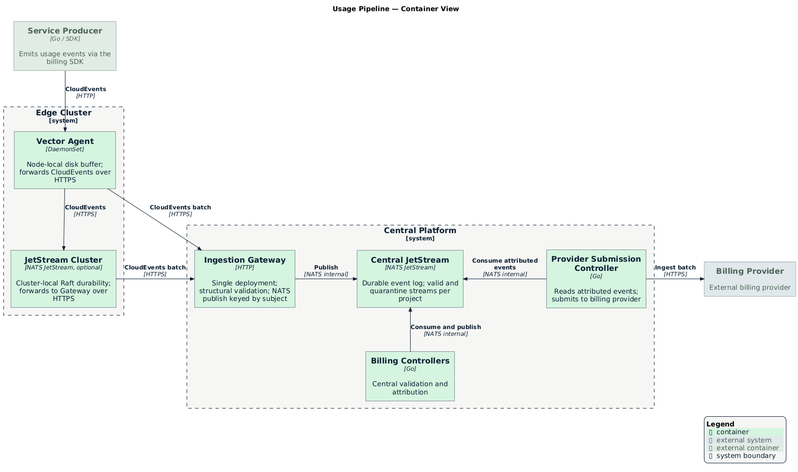

<!-- omit from toc -->
# Durable Usage Pipeline

- [Summary](#summary)
- [Motivation](#motivation)
  - [Goals](#goals)
  - [Non-Goals](#non-goals)
- [Proposal](#proposal)
  - [How It Works](#how-it-works)
  - [User Stories](#user-stories)
  - [Key Capabilities](#key-capabilities)
  - [Notes / Constraints / Caveats](#notes--constraints--caveats)
  - [Risks and Mitigations](#risks-and-mitigations)
- [Design Details](#design-details)
  - [Architecture](#architecture)
  - [Standards Alignment](#standards-alignment)
  - [Event Envelope](#event-envelope)
  - [Emission SDK](#emission-sdk)
  - [Ingestion Gateway](#ingestion-gateway)
  - [Durable Log](#durable-log)
  - [Attribution](#attribution)
  - [Provider Submission](#provider-submission)
  - [Observability](#observability)
- [Implementation History](#implementation-history)
- [Drawbacks](#drawbacks)
- [Alternatives](#alternatives)
  - [CloudEvents via OTLP](#cloudevents-via-otlp)
- [References](#references)

## Summary

The durable usage pipeline is a platform-owned path that moves usage events from
services to an external billing provider. It sits between the [meter
catalog][metering-definitions] and [billing accounts][billing-accounts]: the
meter catalog declares what can be metered, billing accounts declare who pays,
and this pipeline faithfully carries the signal between them.

When a service emits a usage event, the pipeline accepts it at the edge,
deduplicates it end-to-end using a stable event ID, attributes it to the correct
billing account, and submits it to the external billing provider. Events that fail business rule checks
are quarantined for operator review and replay — nothing is silently dropped.

This document covers the path from event emission to provider submission.
Reconciliation against provider-side totals, pricing, and invoice generation are
covered in separate enhancements.

## Motivation

[`MeterDefinition`][metering-definitions] declares what can be metered.
[`BillingAccountBinding`][billing-api] declares who pays for a project. Today,
nothing moves a usage event from a service to an invoice line — and no service
is billing usage yet.

Without a shared pipeline, the first team that needs to bill will call a provider
API directly from application code, the second will copy and diverge, and by the
third there are three incomplete pipelines to unwind. Defining this layer once —
before any team ships usage billing — is materially cheaper than rationalising
later.

### Goals

- Provide a single, shared path from usage event emission to provider submission
  that any service team can adopt without building their own pipeline.
- Guarantee no silent drops: events that cannot be processed are quarantined and
  surfaced for operator action, not discarded.
- Attribute usage to the correct billing account using the
  [`BillingAccountBinding`][billing-api] graph, so services cannot self-declare
  who pays for their usage.
- Maintain end-to-end idempotency so that retries and replays never result in
  double billing.
- Support late-arriving events within a 30-day window via operator-triggered
  replay.

### Non-Goals

- **Calculating money.** The pipeline transports usage quantities. Rates,
  currencies, tiers, and invoice generation live in the pricing engine.
- **Owning the meter catalog.** [`MeterDefinition`][metering-definitions] and
  [`MonitoredResourceType`][monitored-resource-types] are owned by the service
  infrastructure team. This pipeline consumes them.
- **Replacing observability metrics.** Usage events for billing are distinct from
  operational metrics. The pipeline does not ingest [OTLP][otlp] streams or
  replace existing telemetry.
- **Provider-side reconciliation.** Verifying that the provider received and
  processed submissions correctly is a separate enhancement.
- **Multi-provider routing.** v0 targets a single provider. A second provider
  ships as a new Submission Controller deployment, not a runtime configuration
  change.

## Proposal

### How It Works

A service emits a usage event using the platform billing SDK. The SDK validates
the event, wraps it in a [CloudEvents v1.0][cloudevents] envelope with a stable
[ULID][ulid] identifier, and writes it synchronously to the local
[Vector][vector] Agent. The SDK retries on transient failures and returns an
error to the caller if the Agent remains unreachable. Vector commits the event to
its disk buffer and forwards batches to a centrally-deployed Ingestion Gateway
over HTTPS.

The Gateway performs structural validation and publishes the event to a
project-scoped stream in the central durable log ([NATS JetStream][jetstream]).
From there, the Billing Controllers validate it against the meter catalog,
attribute it to the correct billing account using the
[`BillingAccountBinding`][billing-api] history, and publish it to the validated
event stream. The Provider Submission Controller reads from that stream and
submits events to the provider.

Events that fail any business rule check — unknown meter, unsupported aggregation
type, invalid dimensions, missing billing account — are routed to a quarantine
stream and never dropped. An alert fires when quarantine depth is non-zero so an
operator can investigate and replay once the underlying issue is resolved.

<p align="center">
  
</p>

> [!IMPORTANT]
>
> The JetStream cluster pictured in the edge cluster is a forward looking design
> for when we need to harden the deployment between our edge deployments and our
> central data plane.

### User Stories

#### Story 1: Service Team Ships Usage Billing

As a service team (e.g., Compute), I want to start billing CPU usage without
building my own pipeline to a billing provider.

**Experience:** The team defines a [`MeterDefinition`][metering-definitions] for
`compute.miloapis.com/instance/cpu-seconds` and integrates the billing SDK with a
few lines of Go. The SDK handles durability, deduplication, and forwarding. The
team never interacts with NATS, JetStream, or the billing provider directly.

#### Story 2: Operator Investigates a Quarantined Event

As a platform operator, I receive a `BillingQuarantineNonZero` alert and need to
understand why events are not reaching the provider.

**Experience:** I inspect the `billing_quarantine_depth` metric, broken down by
reason. The `unknown_meter` label is elevated for a new service. I find that the
service deployed before its [`MeterDefinition`][metering-definitions] was
published. Once I publish the definition, I trigger a replay for the affected
time range and the quarantine clears.

#### Story 3: Operator Replays Events After a Provider Outage

As a platform operator, I need to re-submit a time range of usage after a
multi-hour provider outage caused submission failures.

**Experience:** I trigger a time-range-scoped replay. The pipeline re-reads
attributed events from the durable log and re-submits them with the same
[ULID][ulid]-based idempotency keys. The provider deduplicates on its side;
customers are not double-billed.

#### Story 4: Service Team Adds a New Meter Dimension

As a service team, I want to add a `tier` dimension to an existing meter so
billing can be broken down by service tier.

**Experience:** I update the [`MeterDefinition`][metering-definitions] to add
`tier` to the declared dimensions. Existing events without the dimension continue
to aggregate normally — the dimension is optional. New events that include `tier`
aggregate into their own buckets.

### Key Capabilities

#### End-to-End Idempotency

Every usage event is assigned a [ULID][ulid] by the SDK before any write occurs.
That ULID is the deduplication anchor at every stage — local write, central log,
attribution, and provider submission. A retry after any crash, network failure,
or replay never results in double billing.

#### No Silent Drops

Structurally invalid events are rejected synchronously at the SDK before any
write. Business rule violations — unknown meter, invalid dimensions, missing
binding — are quarantined centrally and surfaced via metrics. Nothing is
discarded without an operator-visible signal.

#### Durable Before Acknowledged

`Record()` returns success only after the local [Vector][vector] Agent has
acknowledged the write to its disk buffer. Once on Vector's disk, the three-tier
durability model ensures the event survives node restarts, transient network
failures, and edge cluster partitions.

#### Attribution from the Binding Graph

Usage is attributed to billing accounts by the platform, not by the emitting
service. The pipeline reads the [`BillingAccountBinding`][billing-api] history
for each project and attributes events to the account that held responsibility at
the time the usage occurred. Rebinding mid-period is fully supported.

#### Quarantine and Replay

Events that fail business rule validation are held in a quarantine stream rather
than dropped. Operators can replay quarantined events once the underlying issue
is resolved — a missing meter definition, a misconfigured producer, or a missing
billing account binding — without losing any data.

### Notes / Constraints / Caveats

#### Integer Values Only

All usage quantities are INT64. Floating-point is not permitted anywhere in the
billing path. The meter's unit handles scale: measure cpu-*seconds* rather than
fractional cpu-hours. This eliminates floating-point drift in financial
calculations and matches [Google's MetricDescriptor][service-control] constraint
(DELTA/INT64).

#### 30-Day Late-Event Window

The pipeline accepts events up to 30 days after they occurred. Events older than
30 days are quarantined. [NATS JetStream][jetstream] retention must be configured
to a minimum of 30 days to support the full replay window. Providers may apply
additional processing delay for late-arriving events — replayed historical data
may not be immediately queryable at the provider side.

#### Single Provider in v0

v0 ships with a single external billing provider. The Provider Submission
Controller is the only component that holds provider credentials or speaks the
provider API. Adding a second provider means deploying a second Submission
Controller, not modifying the existing one.

#### JetStream Is Not a Compliance Audit Trail

[NATS JetStream][jetstream] retention is operator-configurable and does not
provide WORM-equivalent access controls. It serves as the operational source of
truth within its retention window. The compliance-grade submission ledger — a
long-retention record of what was submitted to the provider — is deferred to v1+.

### Risks and Mitigations

- **Gateway authentication undefined.** Without an authentication model, any
  caller could emit arbitrary usage events for any project. Define the model
  (mTLS, Kubernetes ServiceAccount token projection, or SPIFFE/SVID) before v0
  ships. Platform-managed Vector Agents and direct SDK callers require different
  trust levels and must not be conflated.

- **Quarantine with no replay trigger.** Events quarantined for a missing meter
  definition can accumulate indefinitely if no operator action is taken. The
  `BillingQuarantineNonZero` alert fires on any non-zero quarantine depth;
  replay is operator-triggered once the root cause is resolved.

- **Tier 2 storage sizing guidance absent.** Teams deploying optional Tier 2
  clusters have no sizing formula to work from. A reference formula
  (`peak event rate × max expected partition duration × per-event size`) must be
  documented before teams opt in to Tier 2.

## Design Details

### Architecture

The pipeline is composed of five distinct components. The Billing Controllers and
Provider Submission Controller are kept separate: Billing Controllers are entirely
provider-agnostic, while the Submission Controller is the only component that
holds provider credentials or speaks the provider API. Replacing the provider in
a future release means deploying a new Submission Controller, not modifying the
Billing Controllers.

- **[Vector][vector] Agent** (DaemonSet) — node-local disk buffer; forwards
  CloudEvents to the Gateway or optional Tier 2 cluster over HTTPS.
- **Tier 2 [JetStream][jetstream] Cluster** (optional) — edge-cluster-local
  durability for environments with unreliable central connectivity.
- **Ingestion Gateway** (`billing gateway` subcommand) — structural validation;
  publishes to project-scoped NATS subjects; sole HTTP entry point to the central
  log.
- **Billing Controllers** — central validation and attribution; entirely
  provider-agnostic.
- **Provider Submission Controller** — reads attributed events from the validated
  stream and submits them to the billing provider; the only component that holds
  provider credentials.

### Standards Alignment

The pipeline aligns with four standards to avoid costly migration later and give
service teams familiar contracts.

**Event envelope — [CloudEvents v1.0][cloudevents]** (CNCF, graduated). All
usage events use CloudEvents as the wire format. The Go SDK uses the native
[JetStream binding][cloudevents-nats]; HTTP and Kafka bindings are available if
the transport layer changes. Producers import a well-known SDK rather than a
custom Milo library.

**Meter catalog — [Google Service Control / MetricDescriptor][service-control]
pattern.** [`MeterDefinition`][metering-definitions] and
[`MonitoredResourceType`][monitored-resource-types] follow Google's model:
reverse-DNS meter names, declared dimensions as label keys, and
`monitoredResourceTypes` linking meters to resource kinds. Billing values are
INT64 only, matching Google's DELTA/INT64 constraint.

**Units — [UCUM][ucum]** (Unified Code for Units of Measure). `MeterDefinition`
uses UCUM strings for `measurement.unit` (e.g., `"s"`, `"By"`, `"GBy.h"`),
shared with Google Cloud MetricDescriptor and OpenTelemetry semantic conventions.

**Billing export — [FinOps FOCUS v1.3][focus]** (Dec 2025). `MeterDefinition.billing`
uses FOCUS terminology (`consumedUnit`, `pricingUnit`) for clean downstream
exports. FOCUS uses human-readable unit strings rather than UCUM, so a mapping
layer is needed when exporting (v1+).

The usage-based billing ecosystem has converged on a canonical pipeline shape —
`Produce → Ingest → Validate → Dedup → Store → Attribute → Aggregate → Rate →
Invoice`. The table below positions this pipeline against peer implementations.

| Capability | This pipeline | Amberflo | Stripe+Metronome | Orb | OpenMeter |
|------------|---------------|----------|-------------------|-----|-----------|
| Event format | CloudEvents | Proprietary | Proprietary | Proprietary | CloudEvents |
| Dedup mechanism | ULID eventID, end-to-end | Ingest-time | Event ID | Idempotency key + DB | Kafka stream (32d window) |
| Aggregation | Provider-side (v0); platform-side future work | Real-time | Real-time | Query-time | 1-min tumbling windows |
| Durable log | NATS JetStream (v0) | Managed | Managed | Managed | Kafka + ClickHouse |
| Late events | 30-day window + replay | Supported | Supported | Backfill API | Dedup window |

### Event Envelope

Services emit usage events as [CloudEvents v1.0][cloudevents] over HTTP.
Producers use the emission SDK rather than constructing CloudEvents directly.

#### Example Payload

```json
{
  "specversion": "1.0",
  "id": "01HQ3XTA4WV6E2C0Y7KQRBZ9MN",
  "type": "compute.miloapis.com/instance/cpu-seconds",
  "source": "//compute.miloapis.com/controllers/instance-reconciler",
  "subject": "projects/p-abc",
  "time": "2026-04-14T14:30:00.000Z",
  "datacontenttype": "application/json",
  "data": {
    "value": "42",
    "dimensions": {
      "region": "us-east-1",
      "tier": "standard"
    },
    "resource": {
      "group": "compute.miloapis.com",
      "kind": "Instance",
      "namespace": "default",
      "name": "instance-123",
      "uid": "a8f3a1b2-..."
    }
  }
}
```

#### Design Decisions

- **`value` is INT64, string-encoded in JSON.** String encoding avoids JSON
  number precision loss for large int64 values. The unit handles scale: measure
  cpu-*seconds* rather than fractional cpu-hours.
- **`subject` identifies the billing target (project), not `source`.** `source`
  identifies the producing service. The Gateway uses `subject` for NATS
  subject-based routing. This follows [OpenMeter's convention][openmeter-events].
- **`resource` is an optional Kubernetes object reference.** Not all billable
  events originate from a single Kubernetes object (e.g., network egress, API
  request counts). When present, `resource` identifies the originating object
  (group, kind, namespace, name, uid) for drill-down provenance. Labels are not
  carried in the event — downstream systems look them up from the resource
  directly.
- **Dedup key is `id` alone.** `id` is a [ULID][ulid] — globally unique by
  construction. A single-field key simplifies dedup across all pipeline stages
  and at the provider.

### Emission SDK

The platform provides a typed emission SDK that abstracts the
[CloudEvents][cloudevents] envelope and forwarding from service teams. Producers
interact with a domain-typed `UsageEvent` struct; the SDK handles CloudEvents
transformation, buffering, and forwarding to the local [Vector][vector] Agent.

```go
type UsageEvent struct {
    // Meter matches a Published MeterDefinition.spec.meterName.
    Meter      string
    // Project identifies the project being billed.
    Project    ProjectRef
    // Source is a URI identifying the emitting service.
    Source     string
    // Quantity is the usage amount. INT64 — no floating point in the billing path.
    Quantity   int64
    // Dimensions is an optional set of key-value labels matching the meter's declared dimensions.
    Dimensions map[string]string
    // Resource is an optional reference to the Kubernetes object that generated the usage.
    Resource   *ResourceRef
    // OccurredAt is when the usage occurred. Defaults to now if zero.
    OccurredAt time.Time
}

// ProjectRef identifies the project responsible for the usage.
type ProjectRef struct {
    Name string
}

// ResourceRef identifies the Kubernetes object that generated the usage.
type ResourceRef struct {
    Group     string
    Kind      string
    Namespace string
    Name      string
    UID       types.UID
}

// Recorder is the entry point for emitting usage events.
type Recorder interface {
    Record(ctx context.Context, event UsageEvent) error
}
```

**Example usage:**

```go
err := recorder.Record(ctx, billing.UsageEvent{
    Meter:      "compute.miloapis.com/instance/cpu-seconds",
    Project:    billing.ProjectRef{Name: "p-abc"},
    Source:     "//compute.miloapis.com/controllers/instance-reconciler",
    Quantity:   42,
    Dimensions: map[string]string{"region": "us-east-1"},
    Resource: &billing.ResourceRef{
        Group:     "compute.miloapis.com",
        Kind:      "Instance",
        Namespace: "default",
        Name:      "instance-123",
        UID:       instance.UID,
    },
})
if err != nil {
    return fmt.Errorf("recording usage: %w", err)
}
```

**SDK behavior:**

1. **Structural validation (synchronous, before any write).** The SDK validates
   required field presence, `Subject` format (`projects/...`), and `Source` URI
   format. These are producer bugs — the SDK returns an error immediately and
   nothing is written.

2. **Transform to CloudEvents.** A [ULID][ulid] is generated for `id`.
   `Meter` maps to `type`; `Project` maps to `subject`; `Source` and `OccurredAt`
   map to their CloudEvents attributes. `Quantity`, `Dimensions`, and `Resource`
   populate `data`.

3. **Write to the local [Vector][vector] Agent.** The CloudEvent is POSTed to
   the Vector Agent over HTTP (localhost). The SDK retries with bounded
   exponential backoff on transient failures (connection refused, 5xx). It never
   falls back to calling the Gateway directly — bypassing Vector would remove
   Tier 1 disk durability. If the Vector Agent remains unavailable after the
   retry budget is exhausted, `Record()` returns an error to the caller.

4. **Vector forwards to the Gateway.** The Vector Agent reads from its disk
   buffer and POSTs CloudEvents batches to the Ingestion Gateway over HTTPS.
   Transient Gateway failures are handled by Vector's built-in retry. Permanent
   structural rejections (4xx) are surfaced via `billing_sdk_dead_letter_total`.

### Ingestion Gateway

The Ingestion Gateway runs as the `billing gateway` subcommand of the billing
binary. A single centrally-deployed instance (horizontally scalable) serves all
projects. It is the only HTTP surface that writes to the central log. NATS is
never exposed outside the central platform — all edge-to-central transport is
HTTPS to the Gateway.

The Gateway determines the target project from the `subject` field of the
incoming CloudEvent. It has no dependency on project API servers or project-local
state.

#### API Surface

| Endpoint | Method | Description |
|----------|--------|-------------|
| `/v1/usage/events` | `POST` | Submit a single CloudEvents usage event |
| `/v1/usage/events:batchIngest` | `POST` | Submit a batch of CloudEvents (JSON array, up to 100 events) |

**Success:** `200 OK` with `{"accepted": <count>}`, returned only after all
events are durably committed to the log.

**Partial rejection:** `207 Multi-Status` with per-event results for structural
failures:

```json
{
  "accepted": 9,
  "rejected": [
    {"id": "01HQ3XTA4WV6E2C0Y7KQRBZ9MN", "reason": "INVALID_ULID", "detail": "id field does not parse as a valid ULID"},
    {"id": "", "reason": "MISSING_REQUIRED_FIELD", "detail": "required attribute 'subject' is absent"}
  ]
}
```

**Backpressure:** `429 Too Many Requests` with `Retry-After` when the durable
log is full or write latency exceeds thresholds.

#### Validation

The Gateway enforces **structural validity only**: `id` must be a valid
[ULID][ulid]; `data.value` must parse as INT64; all required CloudEvents
attributes must be present; `datacontenttype` must be `"application/json"`.

Business rule validation (meter existence, dimension conformance) is deferred to
the central Billing Controllers. Because the SDK returns success on in-memory
buffer write, the original caller has already received success before the Gateway
sees the event — a synchronous Gateway rejection is unreachable by the caller.
Quarantining business rule failures centrally preserves the event and makes
recovery operator-accessible.

#### Project Isolation

Each project's events are published to a project-scoped [NATS
JetStream][jetstream] subject (`billing.usage.{project}.>`). The Gateway holds a
single central NATS credential permitted to publish to `billing.usage.*.>` but
not to consume or manage streams. Isolation between projects is enforced by NATS
subject-level ACLs.

### Durable Log

[NATS JetStream][jetstream] in v0. All pipeline stages downstream of the Gateway
read from and write to this log. Events live here, not in etcd — storing billing
events in etcd is a known failure mode documented in the [Operator Metering
post-mortem][metering-postmortem].

#### Three-Tier Durability

Events flow through three durability tiers before reaching the central pipeline
stages. A crash or partition at any tier does not lose events committed at a lower
tier.

| Tier | Scope | Technology | Required | What it survives |
|------|-------|------------|----------|-----------------|
| **1 — Node-local** | Single node | [Vector][vector] Agent DaemonSet, [disk buffer][vector-disk-buffer] | Always | Process restart; transient network to Gateway |
| **2 — Cluster-local** | Edge cluster | [NATS JetStream][jetstream], 3-node Raft | Forward-looking | Node failure during extended central partition |
| **3 — Central platform** | Platform | NATS JetStream (v0); Kafka/Redpanda at scale | Always | Edge cluster failure |

Tier 2 is not deployed in v0 — it is a forward-looking design for edge
environments with unreliable central connectivity. When adopted, storage must be
sized for `peak event rate × maximum expected partition duration`.

When the pipeline migrates to Kafka/Redpanda (triggered by sustained
>100k events/sec), only the transport binding changes — the CloudEvents envelope
and all pipeline stages remain identical.

#### Subject Schema

| Subject | Population | Consumers |
|---------|------------|-----------|
| `billing.usage.{project}.>` | All structurally valid events written by the Gateway | Billing Controllers (validation) |
| `billing.usage.{project}.valid.>` | Events passing business rule validation | Billing Controllers (attribution), Provider Submission Controller |
| `billing.usage.{project}.quarantine.>` | Events failing business rule validation | Operator tooling, replay workflow |

JetStream retention must be configured to a minimum of 30 days to support the
full late-event replay window.

### Attribution

#### Central Validation

Before attribution, the Billing Controllers apply business rule checks to every
event on `billing.usage.{project}.>`:

- `type` matches a Published [`MeterDefinition`][metering-definitions].
- `data.dimensions` keys are a subset of the meter's declared dimensions.

Events failing any check are routed to `billing.usage.{project}.quarantine.>`
with a structured reason (`UNKNOWN_METER`, `INVALID_DIMENSIONS`). Events passing
all checks proceed to attribution.

#### Attribution Logic

For every valid event, the pipeline reads all
[`BillingAccountBinding`][billing-api] resources for the event's project — both
`Active` and `Superseded` — sorted by
`status.billingResponsibility.establishedAt`. That sequence forms a timeline of
who owed the bill when. The event is attributed to whichever binding's interval
contains the event's `time`. Rebinding mid-period is fully supported.

Events with no matching binding, or whose binding points at an archived account,
are quarantined with a structured reason and surfaced via `billing_quarantine_depth`.

A pipeline-owned finalizer on `BillingAccountBinding` prevents garbage collection
of bindings that still have events referencing their interval.

### Provider Submission

The Provider Submission Controller is the only component that holds provider
credentials or speaks the provider API. It reads attributed events from
`billing.usage.{project}.valid.>`, batches them, and submits them to the external
billing provider. The provider performs aggregation server-side in v0.

Provider configuration is supplied as deployment-time environment variables and a
mounted `Secret` reference — not a CRD. There is one provider in v0; a
runtime-reconfigurable abstraction adds complexity before there is a second
provider to justify it. The provider API endpoint, credentials, batch size, flush
interval, and rate ceiling are supplied via environment variables with documented
defaults.

Provider-specific implementation details — batch semantics, dedup window
guarantees, customer mapping lifecycle, and API error handling — are covered in
the provider's own enhancement document.

### Observability

Pipeline components are instrumented using the [OpenTelemetry][otel-metrics] Go
metrics SDK. Metrics are exported via the OTel Prometheus exporter, which exposes
a standard `/metrics` scrape endpoint compatible with existing Kubernetes
monitoring stacks. Swapping to an OTLP push exporter is a configuration change,
not a code change. Alerting rules are defined alongside the deployment manifests.

**Core metrics:**

| Metric | Type | Description |
|--------|------|-------------|
| `billing_ingestion_events_total` | Counter | Events accepted at the Gateway, by meter |
| `billing_ingestion_rejections_total` | Counter | Events rejected at the Gateway for structural failures, by reason |
| `billing_validation_rejections_total` | Counter | Events routed to quarantine by the central validation stage, by reason |
| `billing_pipeline_backlog_depth` | Gauge | Events accepted but not yet submitted to the provider |
| `billing_pipeline_oldest_unsubmitted_seconds` | Gauge | Age of the oldest unsubmitted event |
| `billing_submission_requests_total` | Counter | Provider submission requests, by status code |
| `billing_quarantine_depth` | Gauge | Events in quarantine, by reason (`unknown_meter`, `invalid_dimensions`, `attribution_failure`) |
| `billing_replication_lag_seconds` | Gauge | Replication lag between durability tiers, by tier (`tier1_to_2`, `tier2_to_3`) |
| `billing_sdk_record_errors_total` | Counter | `Record()` calls that failed after the retry budget was exhausted, by reason |
| `billing_sdk_dead_letter_total` | Counter | Events permanently rejected by the Vector Agent for structural reasons |

**Core alert rules:**

| Alert | Condition | Severity |
|-------|-----------|----------|
| `BillingSDKRecordErrors` | `billing_sdk_record_errors_total` rate > 0 | Critical |
| `BillingBacklogGrowing` | `billing_pipeline_backlog_depth` increasing over 3 consecutive 1-min intervals | Warning |
| `BillingSubmissionDegraded` | Provider error rate >5% over 5 minutes | Critical |
| `BillingQuarantineNonZero` | `billing_quarantine_depth > 0` for any reason | Warning |
| `BillingEventStaleness` | `billing_pipeline_oldest_unsubmitted_seconds > 3600` | Critical |
| `BillingReplicationLagHigh` | `billing_replication_lag_seconds{tier="tier2_to_3"} > 300` | Warning |

CRD conditions on `BillingAccount` and `BillingAccountBinding` reflect resource
lifecycle state only. Pipeline operational failures are surfaced as metrics and
alerts, not resource conditions.

## Future Work

- **Platform-side aggregation.** v0 relies on the provider for server-side
  aggregation. A future enhancement will introduce a platform-managed aggregation
  layer, enabling provider-agnostic rollups, richer per-resource breakdowns, and
  a submission ledger for auditability. The aggregation design should evaluate
  pre-aggregated windows (matching the hyperscaler model) against query-time
  aggregation (as used by [Orb][orb]), which handles late events and corrections
  as read-path overlays without re-submission.
- **Submission ledger.** A durable, long-retention record of what was submitted
  to the provider — one entry per event per billing account. Required for
  compliance (6–10 year retention) and provider-side reconciliation. Until the
  ledger ships, JetStream (minimum 30-day retention) is the operational source of
  truth.
- **Cross-project billing.** Shared services billed to a central account (e.g.,
  platform networking costs pro-rated across tenants) cannot be modelled in v0.
  `subject` must match the resource's own project. Cross-project attribution is a
  deliberate v0 simplification and will be addressed in a separate enhancement.
- **UCUM-to-[FOCUS][focus] unit mapping.** [UCUM][ucum] unit strings (`"s"`,
  `"By"`, `"GBy.h"`) do not map 1:1 to FOCUS human-readable strings (`"Hours"`,
  `"GB-Hours"`). The mapping layer is required before the first enterprise
  customer needing FOCUS exports.

## Implementation History

- 2026-04-28: Initial enhancement proposal

## Drawbacks

- **Operational complexity of three-tier durability.** The [Vector][vector]
  Agent DaemonSet, optional Tier 2 [JetStream][jetstream] cluster, and central
  JetStream cluster are three distinct failure domains to operate. Teams with
  simple reliability requirements may find the Tier 1 + Tier 3 model sufficient,
  but the additional component surface is real.
- **Single platform dependency for attribution.** All usage must flow through the
  central pipeline for attribution. Services cannot self-declare billing accounts,
  which is the correct security property but means the platform is on the critical
  path for every billable operation.

## Alternatives

### CloudEvents via OTLP

Emit usage as [OTLP][otlp] metric data points and transform to
[CloudEvents][cloudevents] at a downstream collection layer.

**Rejected because:** OTLP does not structurally enforce the ULID dedup key or
the billing entity (`subject`). These fields would become opaque string attributes
that must survive the OTLP round-trip intact. The pipeline's dedup, validation,
and attribution semantics depend on these fields being first-class — not
attributes in a generic metric stream.

## References

- [Metering Definitions enhancement][metering-definitions]
- [Monitored Resource Types enhancement][monitored-resource-types]
- [BillingAccountBinding API type][billing-api]
- [BillingAccountBinding controller][billing-controller]
- [CloudEvents v1.0 specification][cloudevents]
- [CloudEvents Go SDK — NATS JetStream binding][cloudevents-nats]
- [FinOps FOCUS v1.3][focus]
- [Google Service Control — MetricDescriptor][service-control]
- [OpenMeter — usage event conventions][openmeter-events]
- [Orb — query-based billing architecture][orb]
- [Stripe — billing meter events API][stripe]
- [Metronome — usage ingest API][metronome]
- [Vector][vector]
- [Vector — disk buffer architecture][vector-disk-buffer]
- [NATS JetStream][jetstream]
- [ULID specification][ulid]
- [OpenTelemetry metrics specification][otel-metrics]
- [Prometheus][prometheus]

<!-- Internal references -->
[metering-definitions]: ../../../service-infrastructure/docs/enhancements/metering-definitions.md
[monitored-resource-types]: ../../../service-infrastructure/docs/enhancements/monitored-resource-types.md
[billing-accounts]: ../design.md
[billing-api]: ../../api/v1alpha1/billingaccountbinding_types.go
[billing-controller]: ../../internal/controller/billingaccountbinding_controller.go
[metering-postmortem]: https://github.com/kube-reporting/metering-operator

<!-- Standards references -->
[cloudevents]: https://github.com/cloudevents/spec
[cloudevents-nats]: https://pkg.go.dev/github.com/cloudevents/sdk-go/protocol/nats_jetstream/v2
[service-control]: https://cloud.google.com/service-infrastructure/docs/service-control/reference/rest
[ucum]: https://ucum.org/
[focus]: https://focus.finops.org
[openmeter-events]: https://openmeter.io/docs/metering/events/usage-events
[orb]: https://docs.withorb.com/architecture/query-based-billing
[ulid]: https://github.com/ulid/spec
[jetstream]: https://docs.nats.io/nats-concepts/jetstream
[vector]: https://vector.dev
[vector-disk-buffer]: https://vector.dev/docs/about/under-the-hood/architecture/buffering-model/
[otlp]: https://opentelemetry.io/docs/specs/otlp/
[prometheus]: https://prometheus.io/
[otel-metrics]: https://opentelemetry.io/docs/specs/otel/metrics/
[stripe]: https://docs.stripe.com/api/billing/meter-event
[metronome]: https://docs.metronome.com/api/#tag/usage/POST/ingest
